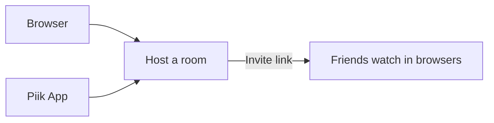

# Piik

English | [简体中文](./README.zh-CN.md)

Share your screen. Bring your friends.

Piik is private screen sharing for one Host and up to 20 invited friends.
Friends watch in their browsers, with no installation.

## Join a friend

1. Open the invitation your friend sent.
2. Press Play if your browser asks. Use the video's sound and fullscreen controls.

Got a room code instead? Open the same Piik site and choose **Join a room**.
Site access and the room's password settings still apply.

## Share from your browser

1. Open the Piik site your group uses. Enter its site password if asked.
2. Choose **Start sharing**, pick a screen, window or tab, and check the sound switch.
3. Send the room's invitation link to your friends. Keep the sharing tab open.

Capture needs HTTPS or `localhost`; available sources and sound depend on the
browser and platform. English, Chinese and an illustrated visual mode share the
same controls, with light and dark themes.

## Start your own room with Piik App

With the Piik App package for your platform:

1. Extract the whole package, keeping `runtime` beside the executable.
2. Open `piik-app.exe` on Windows, `Piik App.app` on macOS, or
   `./piik-app` on Linux.
3. Choose a mode, pick what to share, and send the invitation. Keep the app running.

| Mode | Use it for |
| --- | --- |
| **Local room** | Friends on the same local network. An optional site password controls access. |
| **Public invite** | A temporary Internet invitation. The link lasts for this App run; media remains P2P. |
| **Connect to Site** | An existing Piik site, with App capture and media capabilities available in the same browser UI. |

Piik App opens your system browser. Its package includes the Go application and
capture/link helpers; running it needs no Node.js, npm or Go installation.
Linux native capture uses the system Portal, PipeWire and GStreamer stack.
See the [App guide](./cmd/piik-app/README.md) for platform details.

Temporary public links use Cloudflare Quick Tunnel, which has no uptime guarantee.
Media needs a working UDP path; restrictive networks or browser/OS suspension
can interrupt sharing. Windows App and Browser are the current acceptance
focus; macOS/Linux physical capture checks remain separate. See
[current status](./docs/status.md) for candidate and release readiness.

## Host a site or contribute

The Server package is one Go executable with the Web UI embedded. It owns room
signaling, STUN and optional embedded SFU fallback. Follow the
[self-hosting guide](./docs/operations/self-hosting.md) to set up your own site.

For source builds, tests and architecture, start with the
[documentation map](./docs/README.md). [Contributing](./CONTRIBUTING.md) covers the workflow.

## Something went wrong?

Include your version, OS/browser, expected result and steps to reproduce.
For a local report, start Piik App with `--debug` and press `D`, or add `?debug=1`
before any `#` in the Browser page URL and use its header download button. Review reports before
sharing; see [diagnostics and export](./docs/reference/configuration.md#diagnostics).
Connection trouble? Try the [Chromium WebRTC FAQ](./cmd/piik-app/README.md#chromium-webrtc-connections).

## License

Piik-owned code is [MIT licensed](./LICENSE). Third-party components retain
their own licenses and notices: [licensing guide](./licenses/README.md).
