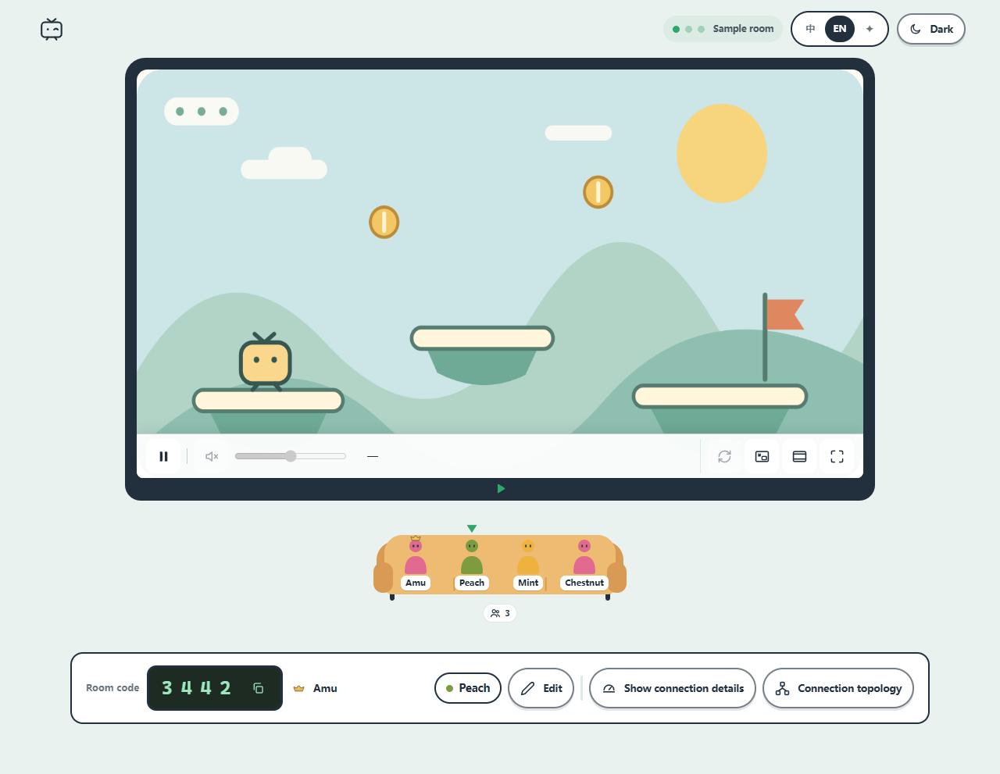

<p align="center"></p>
<h1 align="center">Piik</h1>
<p align="center"><strong>Share the good stuff.</strong><br>Private screen sharing for you and up to 20 friends.</p>
<p align="center">
  <a href="https://piik.tv">Website</a> ·
  <a href="https://github.com/TNTcraftHIM/Piik/releases">Download</a> ·
  <a href="https://gitee.com/TNTcraftHIM/Piik/releases">Gitee mirror</a> ·
  <a href="https://demo.piik.tv">Try the demo</a> ·
  <a href="./docs/README.md">Documentation</a>
</p>
<p align="center">
  <a href="./LICENSE"></a>
  
  
</p>
<p align="center">English · <a href="./README.zh-CN.md">简体中文</a></p>

Piik is a free, open-source screen sharing tool for games, movie nights,
drawings and photos. Choose what to share and send an invitation. Your friends
watch in their browsers.

<details open>
<summary>A little room · Show / hide animation</summary>

<p align="center"></p>

</details>

[Features](#features) · [Get started](#get-started) · [Self-hosting](#self-hosting) · [Contributing](#contributing)

## Features

- **Watch without installing.** Friends join by invitation in a desktop or mobile browser.
- **Share from Piik App or an existing Piik site.** Capture a screen, window or browser tab; available sources and audio depend on the platform.
- **Direct connections first.** Media travels between participants where possible (P2P). A self-hosted server can provide automatic media forwarding (SFU) as a fallback.
- **Rooms you control.** Invitations, room codes and optional room passwords, for one host and up to 20 viewers.
- **Flexible viewing.** Light and dark themes, playback controls, picture-in-picture and a connection topology view.
- **One program to host a site.** Web UI, room management and optional media forwarding are packaged together.

<p align="center">
  <picture>
    <source media="(prefers-color-scheme: dark)" srcset="./docs/assets/room-en-dark.png">
    
  </picture><br>
  <sub>Interface preview · Sample room with a generated game scene</sub>
</p>

## Get started

**To watch:** open the invitation your friend sends you. Select **Play** if the
picture does not start automatically.

**To share:**

| Start here | What you need to do |
| --- | --- |
| [Try the online demo](https://demo.piik.tv) | Open it in a desktop browser and start sharing. |
| [Download Piik App](https://piik.tv/#download) | Extract and open the App, choose **Public invite**, then **Open Piik** to create a temporary room. |
| Use an existing Piik site | Open the address your friend or administrator provides. [Hosting your own](./docs/operations/self-hosting.md) is an advanced option. |

<p align="center"></p>

1. Select **Start sharing**, then choose the picture and audio to share.
2. Select **Copy invite link** and send it to your friends. Keep the sharing tab open.

Piik uses icon controls by default; select **EN** in the header to show labels.
The App offers a local room, a temporary public link, or a connection to your own
site. Keep the App running while sharing through it.

Download a ZIP beginning with **`piik-app`**. The filename also identifies the platform:

| Filename contains | Platform |
| --- | --- |
| `windows-amd64` | Windows x64 |
| `darwin-arm64` | Apple silicon; native capture requires macOS 13+ |
| `linux-amd64` | Linux x64 |

[**Full setup guide →**](./docs/guide/getting-started.md) · [**Open the demo →**](https://demo.piik.tv)

Browser capture requires HTTPS or `localhost`. Windows App and desktop browser
sharing are the primary tested paths. The macOS and Linux apps have not yet been
tested on physical devices; [test results and feedback are welcome](https://github.com/TNTcraftHIM/Piik/issues).
P2P-only modes, including the App's temporary public
link and the demo, may not connect on restrictive networks.

## Self-hosting

Piik Server is a standalone binary with the web interface built in.
Download the Linux x64 Server package, extract it, and run:

```sh
./piik-server
```

Open `http://localhost:8787` to try it locally. For a public site, configure your
domain, HTTPS reverse proxy and STUN address. Room data is stored in SQLite.

[**Deploy your own site →**](./docs/operations/self-hosting.md) · [Configuration](./docs/reference/configuration.md) · [Run from source](./docs/README.md#run-from-source)

## Contributing

Bug reports, documentation improvements and pull requests are welcome.
Start with [CONTRIBUTING.md](./CONTRIBUTING.md), or see the
[repository layout](./docs/reference/engineering.md#repository-layout) to find your way around.

## License

Piik-owned code is [MIT licensed](./LICENSE). Dependencies retain their own
[licenses and notices](./licenses/README.md).
