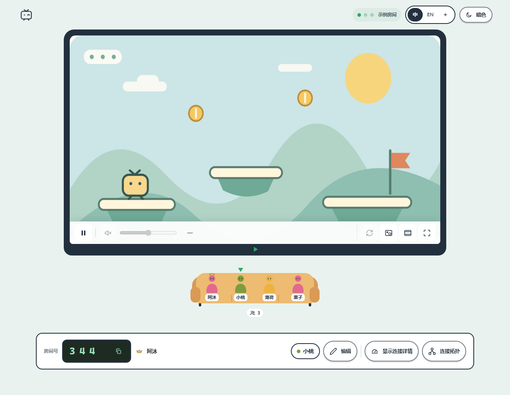

<p align="center"></p>
<h1 align="center">Piik</h1>
<p align="center"><strong>来，看点<br>好康的。</strong><br>私密屏幕共享，邀请最多 20 位朋友观看。</p>
<p align="center">
  <a href="https://piik.tv/?lang=zh-CN">官网</a> ·
  <a href="https://github.com/TNTcraftHIM/Piik/releases">下载</a> ·
  <a href="https://gitee.com/TNTcraftHIM/Piik/releases">Gitee 镜像</a> ·
  <a href="https://demo.piik.tv">在线版</a> ·
  <a href="https://piik.tv/docs/zh/">文档中心</a>
</p>
<p align="center">
  <a href="./LICENSE"></a>
  
  
</p>
<p align="center"><a href="./README.md">English</a> · 简体中文</p>

Piik 是一个免费开源的屏幕共享工具，适合游戏围观、一起看电影、展示绘画或分享照片。
选择画面，把邀请链接发给朋友，对方用浏览器即可观看。

<details open>
<summary>客厅小剧场 · 展开 / 收起动画</summary>

<p align="center"></p>

</details>

[功能](#功能) · [开始使用](#开始使用) · [自行部署](#自行部署) · [参与贡献](#参与贡献)

## 功能

- **观看无须安装。** 朋友通过邀请链接，用电脑或手机浏览器加入。
- **用 Piik App 或已有 Piik 站点分享。** 支持屏幕、窗口和浏览器标签页；可选来源与音频能力取决于平台。
- **优先直接连接。** 画面优先在设备之间传输（P2P），自建站点可启用媒体转发（SFU）自动兜底。
- **房间由你管理。** 支持邀请链接、房间号和可选的房间密码，一位房主、最多 20 位观众。
- **灵活的观看方式。** 支持深浅主题、播放控制、画中画和连接拓扑查看。
- **一个程序就能建站。** 网页、房间管理和可选的媒体转发打包在同一服务端程序中。

<p align="center">
  <picture>
    <source media="(prefers-color-scheme: dark)" srcset="./docs/assets/room-zh-dark.png">
    
  </picture><br>
  <sub>界面预览 · 示例房间与生成的游戏画面</sub>
</p>

## 开始使用

**观看分享：** 打开朋友发来的邀请链接。画面没有自动播放时，点击**播放**即可。

**分享画面：** 推荐下载 **Piik App**。想免安装，也可以打开在线版直接创建房间。

| 从这里开始 | 需要做什么 |
| --- | --- |
| [使用在线版](https://demo.piik.tv) | 在电脑浏览器打开，直接创建房间并分享。 |
| [下载 Piik App](https://piik.tv/?lang=zh-CN#download) | 解压并启动 Piik App，选择**公网邀请**，点击**进入 Piik**，创建临时房间。 |
| [部署自己的站点](./docs/operations/self-hosting.zh-CN.md) | 进阶使用：在 Linux x64 服务器上部署 Piik Server、配置自己的域名，再用 Piik App 或浏览器连接。 |

<p align="center"></p>

1. 点击**开始分享**，选择要分享的画面和声音。
2. 点击**复制邀请链接**，发给朋友。分享期间保持标签页打开。

Piik 默认跟随系统语言，中文系统显示简体中文，其他语言显示英文。
顶部的 **中 / EN / ✦** 可切换中英文或体验纯视觉模式。
Piik App 提供本地房间、临时公网邀请和连接已有站点三种模式，分享期间需保持 App 运行。

下载以 **`piik-app`** 开头的 ZIP 压缩包，再按文件名中的平台标识选择：

| 文件名包含 | 适用平台 |
| --- | --- |
| `windows-amd64` | Windows x64 |
| `darwin-arm64` | Apple 芯片；原生采集需 macOS 13 及以上 |
| `linux-amd64` | Linux x64 |

[**完整使用教程 →**](./docs/guide/getting-started.zh-CN.md) · [**打开在线版 →**](https://demo.piik.tv)

浏览器采集需要 HTTPS 或 `localhost`。目前主要测试 Windows 版 Piik App 和桌面浏览器分享。
macOS 和 Linux 版 Piik App 尚未经过实机测试，欢迎有设备的朋友试用并[反馈问题](https://github.com/TNTcraftHIM/Piik/issues)。
Piik App 的公网邀请和在线版使用纯 P2P 连接，
在受限网络下可能无法连通。

## 自行部署

Piik Server 是一个内置网页界面的独立程序。
下载 Linux x64 服务端程序包 `piik-<revision>-runtime.tar.gz`，解压后运行：

```sh
./piik-server
```

打开 `http://localhost:8787` 即可在本机试用。对外提供服务时，
再配置域名、HTTPS 反向代理和 STUN 地址。房间数据保存在 SQLite 中。
也可以使用 [Docker Compose 部署](./docs/operations/self-hosting.zh-CN.md#使用-docker-compose)。

[**部署自己的站点 →**](./docs/operations/self-hosting.zh-CN.md) · [配置参考](./docs/standards/configuration.md) · [从源码运行](./docs/README.md#run-from-source)

## 参与贡献

欢迎反馈问题、参与翻译、改进文档或贡献代码。
从[社区参与方式](./CONTRIBUTING.md#ways-to-help)或
[翻译教程](./docs/guide/translating.zh-CN.md)开始，也可以从
[项目目录说明](./docs/standards/engineering.md#repository-layout)了解代码结构。

## 许可

Piik 自有代码采用 [MIT 许可](./LICENSE)，依赖保留各自的[许可与声明](./licenses/README.md)。
