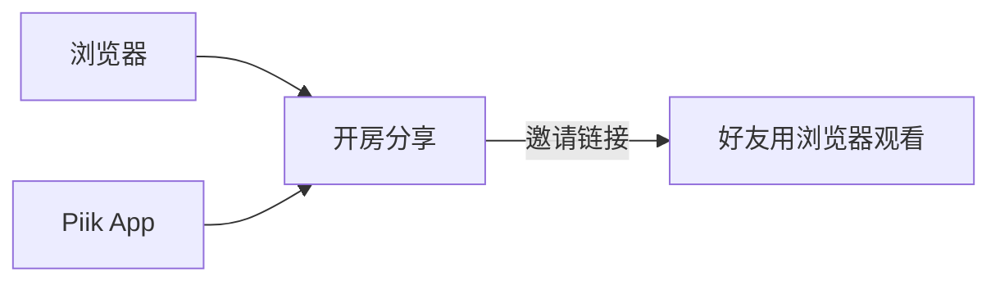

# Piik

[English](./README.md) | 简体中文

分享你的屏幕，叫上朋友一起看。

Piik 是一个私密屏幕分享工具：一位房主，最多 20 位受邀好友。
朋友用浏览器就能观看，无须安装。

## 去朋友的房间

1. 打开朋友发来的邀请链接。
2. 如果浏览器提示，点击播放。声音和全屏由视频控件控制。

只有房间号？打开同一个 Piik 站点，选择 **加入房间**。
站点访问权限和房间密码设置仍然适用。

## 用浏览器分享

1. 打开你们使用的 Piik 站点，按提示输入站点密码。
2. 点击 **开始分享**，选择屏幕、窗口或标签页，并检查声音开关。
3. 把房间邀请链接发给朋友，保持分享标签页打开。

浏览器采集需要 HTTPS 或 `localhost`；可选来源和声音支持取决于浏览器与平台。
界面提供中文、英文和图示模式，以及明暗主题。

## 用 App 自己开房

拿到对应平台的 App 程序包后：

1. 完整解压，保留可执行文件旁的 `runtime` 目录。
2. Windows 打开 `piik-app.exe`，macOS 打开 `Piik App.app`，
   Linux 运行 `./piik-app`。
3. 选择模式和分享来源，发出邀请。分享期间保持 App 运行。

| 模式 | 适合什么情况 |
| --- | --- |
| **本地房间** | 与同一局域网内的好友分享，可设置站点访问密码。 |
| **公网邀请** | 生成本次 App 运行期间有效的临时邀请链接；媒体仍走 P2P。 |
| **连接站点** | 使用已有 Piik 站点，并在同一浏览器界面使用 App 的采集与媒体能力。 |

App 会打开系统浏览器。程序包包含 Go 应用和采集、临时链接辅助程序，
运行时无须安装 Node.js、npm 或 Go。Linux 原生采集使用系统的 Portal、PipeWire
和 GStreamer，平台细节见 [App 指南](./cmd/piik-app/README.md)。

临时公网链接使用 Cloudflare Quick Tunnel，不保证持续可用。
媒体需要可用的 UDP 路径；网络限制、浏览器或系统挂起都可能中断分享。
当前以 Windows App 和浏览器为验收重点，macOS/Linux 原生采集的实机验证另行进行。
候选版本与发布准备情况见 [当前状态](./docs/status.md)。

## 自建站点或参与开发

Server 是一个内嵌 Web 界面的 Go 可执行文件，负责房间信令、STUN 和可选的内置
SFU 后备路径。搭建自己的站点，请看 [自托管指南](./docs/operations/self-hosting.md)。

源码运行、测试和架构从 [文档地图](./docs/README.md) 开始；
[贡献指南](./CONTRIBUTING.md) 说明协作流程。

## 遇到问题？

反馈时附上版本、系统与浏览器、预期结果和复现步骤。
App 可用 `--debug` 启动后按 `D` 导出本地报告；浏览器网址加上 `?debug=1`
后（放在 `#` 之前），可点击顶部下载按钮。分享前请检查报告内容，详见
[诊断与导出](./docs/reference/configuration.md#diagnostics)。
连接不上时，也可以查看 [Chromium WebRTC 常见问题](./cmd/piik-app/README.md#chromium-webrtc-connections)。

## 许可

Piik 自有代码采用 [MIT 许可](./LICENSE)，提供 [中文参考译文](./LICENSE.zh-CN.md)。
第三方组件保留各自的许可与声明，详见 [许可说明](./licenses/README.md)。
