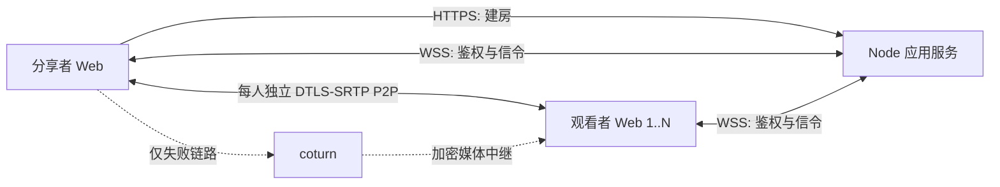

# 屏幕共享 WebRTC PoC 方案设计

## 2026-08-18 14:45

状态：已接受，可进入实现。本文约束首个可测 PoC，不代表全部 P0 已完成。

## 目标与边界

首个 PoC 验证一名分享者向小范围朋友进行低延迟游戏画面分享。观看端使用普通桌面或手机浏览器；媒体对每名观看者独立进行 ICE，能直连时走 P2P，只有失败的链路使用 coturn。房间默认最多八名观看者，可配置范围为 1 至 16；八人是接入默认值，不是未经真实 1:8 测试即可宣称的性能能力。

本阶段必须形成完整的最小纵向链路：

- 分享者主动选择屏幕、窗口或标签页，并请求可用音频；
- 创建有时限的数字房间，并用可选全站密码统一保护分享和观看入口；
- 每名观看者拥有独立的 `RTCPeerConnection`；
- 生产基线支持 STUN、TURN/UDP 和 TURN/TCP，并允许可选 TURN/TLS 配置；
- 展示连接状态、direct/relay、RTT、实际码率、帧率和丢包等数据；
- 超过部署配置上限的观看者被明确拒绝，不静默超载；
- 在代码、测试和真实浏览器验证完成前，不宣称达到延迟或画质目标。

本阶段不实现账号、数据库、Redis、SFU、simulcast/SVC、观看者转发树、语音聊天、Electron、原生捕获、PWA、录制、遥测平台或多地区调度。

## 技术栈决策

| 层 | 选择 | 原因 |
| --- | --- | --- |
| Web 客户端 | React 19、TypeScript、Vite 8 | 同一套响应式界面覆盖分享者与桌面/移动观看者；官方模板成熟 |
| 媒体 | 浏览器原生 WebRTC 与 Screen Capture API | 不引入 PeerJS/simple-peer，保留对 ICE、sender 参数和 stats 的直接控制 |
| 应用服务 | Node.js 24 LTS、TypeScript、原生 HTTP、`ws` | 服务只负责小流量控制面；前后端可共享协议类型和校验 |
| 运行时校验 | Zod | WebSocket 和 HTTP 输入不可信，需要与 TypeScript 类型一致的运行时边界 |
| 静态文件 | `sirv` | 生产环境由同一 Node 进程提供前端构建结果，避免引入完整 Web 框架 |
| NAT 中继 | coturn 4.17.2 或更新补丁版本 | 成熟的 STUN/TURN 实现，支持 WebRTC 短期凭据 |
| 测试 | Vitest | 覆盖纯逻辑和 Node 集成测试；真实媒体能力另做浏览器/网络矩阵 |
| TLS 入口 | Caddy 或 nginx，由部署者选择 | 统一 HTTPS/WSS；不把证书管理写进应用进程 |

不选 Go 的原因是 Node 不承载正常情况下的媒体流量，换语言不会减少分享者上行或 TURN 中继成本。不选 C++ 的原因是浏览器能力尚未被实测证明不足；只有捕获、应用音频或硬件编码出现明确瓶颈时才增加原生 helper。

## 系统结构



每个观看者的候选检查和最终路径互不影响。同一房间可以同时存在 direct 和 relay 连接。中心房间服务不复制、解码或转发媒体。

## 代码布局

```text
src/
  client/       React 页面、捕获、PeerConnection、stats 和样式
  server/       HTTP/WS 入口、配置、房间和 TURN 凭据
  shared/       信令 schema 与跨端类型
tests/          RoomStore、TURN、协议和 WebSocket 集成测试
```

保持单个 npm package。出现第二个可独立发布的程序前，不建立 monorepo 或 workspace。

## 房间与访问控制

`ACCESS_PASSWORD` 是可选的全站开关。为空时网站公开；生产配置接受 12 至 128 位可见 ASCII 字符。配置时，分享者访问根页面、观看者访问 `/join` 或 `/r/{code}` 都先进入同一个登录 gate。`POST /api/session` 校验密码后签发 12 小时的无状态 cookie：值只包含版本、到期时间和 HMAC-SHA256 签名，不创建账号、数据库、JWT 或服务端 session Map，也不提供 logout 流程。cookie 使用 `HttpOnly`、`SameSite=Strict`、`Path=/` 与有限 `Max-Age`；HTTPS 生产环境再使用 `Secure` 和 `__Host-` 前缀。WebSocket 异常断开后会用 `/api/session` 检查一次当前 cookie；仅在确认失效时停止重连并返回 gate，网络故障仍走原重连流程。

建房 `POST /api/rooms` 和 WebSocket upgrade 在启用密码时都只验证该 cookie。密码只以 `Authorization: Bearer` 提交给登录接口，建房 API 不接受相同的 Bearer 旁路。密码模式下 HTTP 建房还要求精确 Origin；公开模式也会拒绝不在 allowlist 中的已提供 Origin。WebSocket 在握手完成前同时校验 Origin、容量和 access cookie。

房间服务生成：

- 12 位随机纯数字 `roomId`，并在当前内存房间集合中检查碰撞；
- 256-bit 随机 `hostToken`，仅用于当前 host 信令认证；
- 默认四小时、由部署配置限制的房间过期时间。

服务端只保存 host token 的 SHA-256 摘要，host token 只保留在分享者当前页面内存中。观看者没有独立 token：邀请为 `/r/{roomId}`，也可访问 `/join` 并只输入房间码。在密码模式中，两种入口都必须先通过全站 gate；公开模式中，房间码是唯一观看 capability，因此不保证强隐私，面向互联网的私密部署应配置 `ACCESS_PASSWORD`。账号、逐人邀请、逐人撤销和持久会话不在当前需求内。

房间规则：

- 一名在线分享者、默认最多八名在线观看者；部署配置只接受 1 至 16；
- 房间过期、分享者主动关闭或捕获结束时拒绝新连接并通知现有观看者；
- 定时清理过期房间，并设置全局房间上限防止匿名内存耗尽；
- 不记录 token、SDP、ICE candidate、IP 地址或 TURN 密钥。

客户端用 `sessionStorage` 保存随机的 128-bit `clientId`，作为当前标签页内稳定的参与者 key。同一 role/clientId 的新 WebSocket 会原子替换旧 socket；观看者断线后保留五秒 grace，期间不发送 `peer-left` 且 `peerId` 不变，重新鉴权时重发幂等的 `peer-joined`，超时才释放名额。host 鉴权或重连后，`authenticated` 携带包含 grace 成员的权威 viewer ID 列表供客户端删除已离开的 peer，服务端再重放当前在线观看者的 `peer-joined`，因此观看者可以先于 host 打开邀请，host 离线期间的离开也不会遗留幽灵连接。

## 信令协议

WebSocket 使用同源 `/signal`。启用全站密码时，upgrade 必须先携带有效 access cookie；连接后五秒内第一条消息仍必须是房间级 `authenticate`。host 消息携带内部 host token，viewer 只携带房间码、role 与 clientId，不存在 viewer token，也不把凭据放 query string。服务端设置 64 KiB `maxPayload`、关闭 `perMessageDeflate`，并以 ping/pong 清理失效连接。单进程固定限制 2048 条总连接和 256 条未鉴权连接，容量在 WebSocket upgrade 前预留，超限直接返回 HTTP 503 并销毁 socket；这只是 PoC 的资源边界，不是容量承诺。

主要消息：

| 方向 | 消息 | 作用 |
| --- | --- | --- |
| client -> server | `authenticate` | host 以 room、role、内部 host token 和 clientId 建立会话；viewer 只使用 room、role 和 clientId |
| server -> client | `authenticated` | 返回角色、peerId、房间期限、容量、host 状态、该 viewer 的历史 connectionId、host 的权威 viewer 列表和 ICE 配置 |
| server -> host | `peer-joined` / `peer-left` | 建立或关闭该观看者的独立连接 |
| host -> viewer | `offer` / `candidate` | 带 `peerId` 与 `connectionId` 的定向信令 |
| viewer -> host | `answer` / `candidate` | 只能回给本房间分享者 |
| viewer -> host | `restart-request` | 以 `rebuild` 标志请求 ICE restart 或完整重建该 peer |
| client -> server | `refresh-ice` | 鉴权会话内刷新即将到期的 TURN 凭据 |
| host -> server | `close-room` | 结束房间并使邀请失效 |

Zod 在服务边界拒绝未知类型、超长字符串、非法 SDP/candidate 结构和越权目标。服务端根据已认证会话决定路由：观看者不能给另一名观看者发信令，分享者也不能向本房间以外的 peerId 发送。

## WebRTC 协商

分享者是唯一 offerer。每名观看者对应一个 `RTCPeerConnection`，以独立 `connectionId` 区分重建代次：

1. 分享者在开始按钮的同一用户手势内先成功调用 `getDisplayMedia()`。
2. 只有捕获 track 已存在时才请求创建房间、连接 host WebSocket 并显示邀请；若用户在建房响应返回前取消，迟到的房间由独立、限时的鉴权连接立即关闭，且不得覆盖后续分享会话。
3. 观看者认证后，服务端向在线分享者发送 `peer-joined`；host 晚上线或重连时收到完整观看者快照。
4. 分享者创建连接、加入当前视频 track，并以现有音轨或空 sender 预留 audio transceiver，设置 sender 参数，然后创建 offer。
5. 观看者收到 offer 后创建连接、设置 remote description、创建 answer。
6. 双方持续通过信令服务交换 trickle ICE candidates。
7. remote description 尚未设置时，客户端仅缓存有界数量的 candidates；旧 `connectionId` 消息直接丢弃。

这种单一 offerer 模式满足当前单向媒体需求，不引入 perfect-negotiation 状态机。同一页面中的不健康连接发送 `rebuild: false`，host 先尝试 `restartIce()`，非稳定信令状态或恢复失败时重建该 peer。新标签页没有旧 `RTCPeerConnection`，或页面 peer 与 `authenticated.connectionId` 代次不一致时，viewer 发送 `rebuild: true`，host 直接换代。健康且代次一致的媒体在单纯信令重连时保持不变；所有异步启动结果以 host 会话 generation 隔离，viewer 的异步 answer、candidate 和 stats 结果也必须同时匹配当前 connection 对象与 connectionId，旧代次不得改写新状态或发出信令。

信令 WebSocket 暂时中断时，不立即关闭仍健康的 P2P 媒体；客户端指数退避恢复控制通道。明确不可重连的会话替换会释放旧页面的 peer、统计定时器和媒体引用，host 也停止旧捕获。首版只保证同一页面生命周期内恢复，不承诺浏览器进程被系统挂起后的连续播放。

## 捕获、编码与质量

捕获只能由按钮产生的用户手势调用 `getDisplayMedia()`。三档目标为：

| 档位 | 约束目标 | 初始码率上限 |
| --- | --- | ---: |
| 1080p60 | 1920x1080、60 fps | 8 Mbps/peer |
| 720p60 | 1280x720、60 fps | 5 Mbps/peer |
| 720p30 | 1280x720、30 fps | 3 Mbps/peer |

浏览器可返回更低设置，界面以 `track.getSettings()` 显示实际结果。视频 track 设置 `contentHint = "motion"`；sender 尝试设置 `maxBitrate`、`maxFramerate` 与 `degradationPreference = "maintain-framerate"`，不支持时只记录警告。

PoC 不强制 codec，也不做 SDP munging。先通过 stats 记录实际协商 codec、`encoderImplementation` 和 `powerEfficientEncoder`，再依据目标机器测量决定是否优先 H.264。这样避免静态 codec 偏好意外触发软件编码。

`audio: true` 只是请求。若 `getAudioTracks()` 为空，分享者界面必须显示“当前来源没有可共享音频”。纯 Web 首版接受浏览器提供的标签页或系统音频，不承诺仅捕获某个游戏进程。

直播中切换来源仍由明确的按钮手势重新调用 `getDisplayMedia()`，不改变房间、host generation 或媒体拓扑。选源取消或失败时继续发送旧流；成功后为每个现有 sender 调用 `replaceTrack()`，健康连接不重新协商。初始 offer 预留 send-only audio transceiver，使音频可以在 `null -> track -> null` 间切换。若某个 peer 的替换或回滚失败，只重建该 peer；新流提交后才停止旧流，并以当前 stream 身份保护旧 track 的迟到 `ended` 事件。统计码率累加器在换源后重置，避免把不同 track 的计数器混算。

`frameRate` 约束和 sender 的 `maxFramerate` 都是目标或上限；浏览器仍控制实际捕获、重复帧处理、编码和拥塞降级。静态画面可能由浏览器减少实际编码数据，但标准没有保证每个实现以同一种方式节省采集或 GPU 开销。本 PoC 不添加画面差分、定时改约束或自定义动态 FPS 状态机，先用 `framesEncoded`、实际发送码率、`totalEncodeTime`、质量受限原因和主机资源占用测量真实问题。

自动全房间降档同样需要可信的聚合策略，放在测量后的下一阶段；本 PoC 提供手动档位和明确的受限原因，不伪装成已经解决自适应问题。

## TURN 配置与轮换

应用服务在房间鉴权后生成 coturn REST 凭据：

```text
expiry = floor(unix_seconds) + ttl
username = expiry + ":" + opaque_room_and_peer_subject
credential = base64(HMAC-SHA1(shared_secret, username))
```

`TURN_SHARED_SECRET` 只存在于应用服务和 coturn。浏览器只收到短期 username/credential、STUN/TURN URLs 和 `expiresAt`。生产环境缺少 STUN、TURN secret、显式 TURN/UDP URL 或显式 TURN/TCP URL 时应用启动失败；开发环境允许 STUN-only，但界面必须标记 TURN 未配置。

TURN/TLS 是可选能力，不是生产启动门槛。启用时默认使用 RFC 7065 的标准 TCP 5349；若为了受限网络改用 443，则 TURN 主机必须有独立公网 IP，或通过明确支持 TURN 的 L4/SNI 入口分流，不能与普通 HTTPS 进程直接争用同一 IP:443。普通 Cloudflare HTTP 代理只处理 HTTP/HTTPS，不转发 TURN；需要 Cloudflare 四层代理时必须单独评估 Spectrum 等支持该协议的服务。

凭据过期前，客户端通过已认证 WebSocket 请求新配置，并对现有连接调用 `setConfiguration()`。已有 TURN allocation 通常不会因凭据时间点到达而立即终止，但后续 ICE restart 必须使用新凭据。

候选由 ICE 按优先级和连通性检查选择，不承诺 JavaScript 严格串行执行 UDP、TCP 或可选 TLS 尝试。界面报告最终选中的 candidate type、ICE protocol，以及本地为 relay 时的 TURN protocol，而不是推测回退步骤。`turn:` over TCP 没有客户端至 TURN 的 TLS 封装，但被中继的 WebRTC 媒体仍由 DTLS-SRTP 保护。

## 可观测性

每两秒在本地采集一次 `getStats()`。首版不上传原始统计，也不展示候选地址。

分享者逐观看者显示：

- `connectionState` / `iceConnectionState`；
- 选中候选对的 local/remote candidate type 与 ICE `protocol`，任一端为 `relay` 即标记中继；
- 本地 relay candidate 的 `relayProtocol`；规范禁止远端 candidate 暴露该字段，因此不推断远端使用 TURN/UDP、TCP 还是 TLS；
- `currentRoundTripTime`、发送码率和 `availableOutgoingBitrate`；
- 实际帧率、分辨率和丢包；
- codec、编码实现、每帧平均编码耗时和 `qualityLimitationReason`。

观看者显示接收码率、帧率、分辨率、丢包、jitter、解码/丢帧和当前路径。字段不可用时显示“未知”。RTT 只标为网络往返时间，不能冒充玻璃到玻璃延迟。

## 界面结构

首屏就是工具，不做营销页。视觉采用中性深灰工作台，绿色表示 direct、琥珀色表示 relay/警告、红色表示失败，避免单一蓝紫色主题。

- 全站 gate：仅在配置 `ACCESS_PASSWORD` 且 cookie 无效时显示一个密码输入窗口；验证后返回原目标路径。
- 分享者根页面：顶部房间状态；主区域为 16:9 本地预览；底部为开始/停止、质量档位和复制邀请；侧栏以紧凑列表显示配置范围内的观看者及统计。
- `/join`：只输入 12 位数字房间码，成功后进入 `/r/{code}`。
- `/r/{code}` 观看者：主区域最大化远端视频；顶部显示房间与连接状态；提供声音、全屏和重试控制，不要求额外邀请码或 viewer token。
- 移动端：视频保持稳定宽高比，控制与状态移到视频下方，任何文字和按钮不得溢出或遮挡。

按钮使用 `lucide-react` 图标并提供可访问名称和 tooltip。动态状态区域固定最小尺寸，避免连接状态变化导致布局跳动。

## 安全与故障边界

- 生产仅允许 HTTPS/WSS，并校验 WebSocket `Origin` allowlist。
- 全站密码以定长摘要配合常量时间比较；access cookie 由服务端 HMAC 签名且不含账号或可查询的 session ID。host token 只保存摘要并以常量时间验证；TURN secret 仅作为 HMAC key 存在于服务端；认证和建房响应设置 `Cache-Control: no-store`。
- HTTP body、WebSocket payload、总连接数、未鉴权连接数、输出缓冲、房间总数、观看人数和 candidate 缓存都有硬上限；无法解析的 upgrade request-target 在未鉴权边界返回 HTTP 400，不允许异常逃逸到进程顶层。
- 应用日志不得主动记录 IP；反向代理和 coturn 为提供网络服务必然可见源地址，部署时需设置最短必要留存与访问控制。
- TURN 应配置 `use-auth-secret`、`realm`、`fingerprint`、`no-multicast-peers`、私网/loopback peer 拒绝、配额和出口监控；禁止匿名 relay。
- 分享者直连会向可信观看者暴露网络地址。需要隐藏 IP 时才提供强制 relay 诊断选项，并明确其服务器带宽成本。

## 验证计划

自动测试：

- AccessSession 的密码开关、12 小时签名 cookie、过期、篡改、cookie 属性和无服务端 session 状态；
- RoomStore 的 12 位数字房间码、host token 摘要验证、过期、关闭、默认八人上限、自定义 1 至 16 边界和超额拒绝；
- TURN HMAC 固定向量、TTL、生产环境缺少 STUN 或 TURN/UDP+TCP 覆盖时启动失败，并接受可选 TURN/TLS；
- 协议非法 JSON、未知消息、错误方向、跨房间目标和 payload 限制；
- HTTP/WS 集成：密码模式下 host/viewer gate、建房和 upgrade 只认 cookie 且无建房 Bearer 旁路；一名 host、多名 viewer、定向 offer/answer/candidate、连接上限、grace 内恢复、显式 restart/rebuild、离开和关闭房间；
- 客户端策略与 stats 解析：会话替换不重连，本地 TURN protocol 与 ICE protocol 分离，远端 TURN transport 保持未知；
- TypeScript 类型检查、Vite production build 和仓库 hygiene。

人工矩阵：

- 同机双标签页与同 LAN direct；
- 真实跨网络、强制 relay、同房间 direct + relay；
- 封 UDP 后验证必需的 TURN/TCP；若部署启用 TURN/TLS，再分别验证默认 5349 或可选 443；
- Windows Chrome/Edge 的音轨有/无；
- Android Chrome 与 iOS Safari 的播放手势、旋转、前后台和网络切换；
- 一名分享者、八名异构观看者连续 30 分钟，同时记录较低人数基线、实际上行、编码负载和首帧时间。真实 1:8 未完成前不得把默认上限写成性能承诺。

真实矩阵未完成前，状态文档必须把这些列为待验证，而不是把设计目标写成产品能力。

## 实施顺序

1. 建立单 package 工程、共享 schema、配置与 CI。
2. 完成 RoomStore、建房 API、WebSocket 鉴权和定向信令。
3. 完成屏幕捕获、逐观看者 PeerConnection、观看播放和手动质量档。
4. 完成 TURN 短期凭据、ICE 配置刷新、连接恢复和 stats 面板。
5. 完成自动测试、真实浏览器烟测、部署说明、状态与记忆更新。

任何一步只实现当前消费者需要的接口。不得为未来账号、SFU 或原生 sender 预建抽象层。

## 官方与参考资料

访问日期均为 2026-08-18：

- [Vite Getting Started](https://vite.dev/guide/)
- [React: Build a React app from Scratch](https://react.dev/learn/build-a-react-app-from-scratch)
- [Node.js release status](https://nodejs.org/en/about/previous-releases)
- [ws official README](https://github.com/websockets/ws/blob/master/README.md)
- [Screen Capture specification](https://www.w3.org/TR/screen-capture/)
- [WebRTC specification](https://www.w3.org/TR/webrtc/)
- [Media Capture Content Hints](https://www.w3.org/TR/mst-content-hint/)
- [RTCRtpSender.replaceTrack](https://www.w3.org/TR/webrtc/#dom-rtcrtpsender-replacetrack)
- [WebRTC Stats](https://www.w3.org/TR/webrtc-stats/)
- [WebRTC official samples](https://webrtc.github.io/samples/)
- [coturn TURN server documentation](https://github.com/coturn/coturn/blob/master/README.turnserver)
- [coturn example configuration](https://github.com/coturn/coturn/blob/master/examples/etc/turnserver.conf)
- [TURN REST API draft implemented by coturn](https://datatracker.ietf.org/doc/html/draft-uberti-behave-turn-rest-00)
- [Cookies: HTTP State Management Mechanism draft (RFC6265bis)](https://datatracker.ietf.org/doc/draft-ietf-httpbis-rfc6265bis/)
- [Node.js `crypto.createHmac()` and `crypto.timingSafeEqual()`](https://nodejs.org/api/crypto.html)

MiroTalk BRO（AGPL-3.0）和 Screego（GPL-3.0）仅用于结构研究。Tailchat Meeting（Apache-2.0）用于捕获生命周期对照，但它采用 mediasoup/SFU，不作为本项目拓扑或依赖底座。项目许可证确定前不复制 GPL/AGPL 代码。

---
