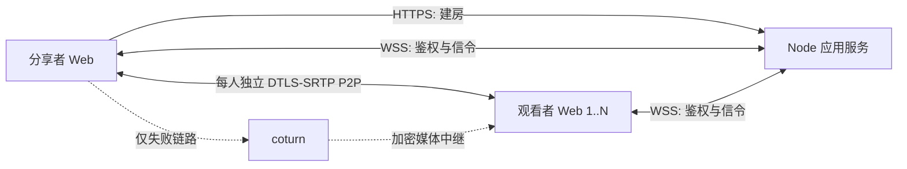

# 屏幕共享 WebRTC PoC 方案设计

## 2026-08-18 14:45

状态：已接受的首个 PoC 基线。本文不接受后续媒体拓扑；peer-assisted 仅由 ADR-0004 提议为独立实验。

## 目标与边界

首个 PoC 验证一名分享者向小范围朋友进行低延迟游戏画面分享。观看端使用普通桌面或手机浏览器；媒体对每名观看者独立进行 ICE，能直连时走 P2P，只有失败的链路使用 coturn。房间默认最多八名观看者，可配置范围为 1 至 16；八人是接入默认值，不是未经真实 1:8 测试即可宣称的性能能力。

本阶段必须形成完整的最小纵向链路：

- 分享者主动选择屏幕、窗口或标签页，并请求可用音频；
- 创建数字房间，并用可选全站密码统一保护分享和观看入口；受保护部署可选择最小 SQLite 持久化，使房间和链接在停止分享及进程重启后仍有效；
- 每名观看者拥有独立的 `RTCPeerConnection`；
- 生产基线支持 STUN、TURN/UDP 和 TURN/TCP，并允许可选 TURN/TLS 配置；
- 展示连接状态、direct/relay、RTT、实际码率、帧率和丢包等数据；
- 超过部署配置上限的观看者被明确拒绝，不静默超载；
- 在代码、测试和真实浏览器验证完成前，不宣称达到延迟或画质目标。

本基线不实现账号数据库、通用业务数据库、Redis、SFU、simulcast/SVC、观看者转发树、语音聊天、Electron、原生捕获、PWA、录制、遥测平台或多地区调度。唯一持久化例外是可选的 `node:sqlite` 房间身份表。后续 SFU 与 peer-assisted 工作必须留在各自分支和 ADR 中，不能反向把实验复杂度预埋进该基线。

## 技术栈决策

| 层 | 选择 | 原因 |
| --- | --- | --- |
| Web 客户端 | React 19、TypeScript、Vite 8 | 同一套响应式界面覆盖分享者与桌面/移动观看者；官方模板成熟 |
| 媒体 | 浏览器原生 WebRTC 与 Screen Capture API | 不引入 PeerJS/simple-peer，保留对 ICE、sender 参数和 stats 的直接控制 |
| 应用服务 | Node.js 24 LTS、TypeScript、原生 HTTP、`ws` | 服务只负责小流量控制面；前后端可共享协议类型和校验 |
| 可选房间持久化 | Node.js 内置 `node:sqlite` | 单文件、无额外依赖；只保存恢复持久房间所需的 ID 与 token 摘要 |
| 运行时校验 | Zod | WebSocket 和 HTTP 输入不可信，需要与 TypeScript 类型一致的运行时边界 |
| 静态文件 | `sirv` | 生产环境由同一 Node 进程提供前端构建结果，避免引入完整 Web 框架 |
| NAT 中继 | coturn 4.17.2 或更新补丁版本 | 成熟的 STUN/TURN 实现，支持 WebRTC 短期凭据 |
| 测试 | Vitest | 覆盖纯逻辑和 Node 集成测试；真实媒体能力另做浏览器/网络矩阵 |
| TLS 入口 | Caddy 或 nginx，由部署者选择 | 统一 HTTPS/WSS；不把证书管理写进应用进程 |

不选 Go 的原因是 Node 不承载正常情况下的媒体流量，换语言不会减少分享者上行或 TURN 中继成本。不选 C++ 的原因是浏览器能力尚未被实测证明不足；只有捕获、应用音频或硬件编码出现明确瓶颈时才增加原生 helper。

## 系统结构



每个观看者的候选检查和最终路径互不影响。同一房间可以同时存在 direct 和 relay 连接。中心房间服务不复制、解码或转发媒体。

## 代码布局

```text
src/
  client/       React 页面、捕获、PeerConnection、stats 和样式
  server/       HTTP/WS 入口、配置、房间和 TURN 凭据
  shared/       信令 schema 与跨端类型
tests/          RoomStore、TURN、协议和 WebSocket 集成测试
```

保持单个 npm package。出现第二个可独立发布的程序前，不建立 monorepo 或 workspace。

## 房间与访问控制

`ACCESS_PASSWORD` 是可选的全站开关。为空时网站公开；非空值必须包含 1 至 128 个可见 ASCII 字符（`0x21` 至 `0x7e`）。配置时，分享者访问根页面、观看者访问 `/join` 或 `/r/{code}` 都先进入同一个登录 gate。`POST /api/session` 校验密码后签发 12 小时的无状态 cookie：值只包含版本、到期时间和 HMAC-SHA256 签名，不创建账号、JWT 或服务端 session Map，也不提供 logout 流程。cookie 使用 `HttpOnly`、`SameSite=Strict`、`Path=/` 与有限 `Max-Age`；HTTPS 生产环境再使用 `Secure` 和 `__Host-` 前缀。WebSocket 异常断开后会用 `/api/session` 检查一次当前 cookie；仅在确认失效时停止重连并返回 gate，网络故障仍走原重连流程。

建房 `POST /api/rooms` 和 WebSocket upgrade 在启用密码时都只验证该 cookie。密码只以 `Authorization: Bearer` 提交给登录接口，建房 API 不接受相同的 Bearer 旁路。密码模式下 HTTP 建房还要求精确 Origin；公开模式也会拒绝不在 allowlist 中的已提供 Origin。WebSocket 在握手完成前同时校验 Origin、容量和 access cookie。

`ROOM_DATABASE_PATH` 是可选 SQLite 文件路径，且配置它时必须同时配置 `ACCESS_PASSWORD`，否则启动失败。由此形成三个明确配置：

- `ACCESS_PASSWORD` 为空、数据库路径为空：公开临时模式，生成随机数字 `roomId`，使用 `ROOM_TTL_SECONDS` 过期，随机性降低匿名枚举风险；
- 只配置 `ACCESS_PASSWORD`：受保护临时模式，房间仍使用随机 ID 和 TTL；
- 同时配置 `ACCESS_PASSWORD` 与 `ROOM_DATABASE_PATH`：受保护持久模式，SQLite `INTEGER PRIMARY KEY AUTOINCREMENT` 从 `1` 开始分配十进制 `roomId`，房间与邀请链接不设过期时间。

所有模式都为新房间生成 256-bit 随机 `hostToken`，只把 SHA-256 摘要留在服务端。host 浏览器把建房响应保存在同源 `localStorage`，用于刷新后重新取得发布权；清除站点数据或换设备不会从摘要恢复 token。持久模式的 SQLite 表只有作为 rowid 的房间 ID 与 32-byte host token 摘要两个应用字段；不保存全站密码、token 明文、access cookie、SDP、ICE candidate、IP 地址、观看者状态、媒体或 TURN 凭据。`node:sqlite` 由单个 Node 进程直接使用，不增加 ORM、迁移框架、Redis 或多节点同步。生产 systemd 示例通过 `StateDirectory=screener` 提供 `/var/lib/screener`，当前实例使用 `/var/lib/screener/rooms.sqlite`。

观看者没有独立 token：邀请为 `/r/{roomId}`，也可访问 `/join` 并只输入房间码。在受保护模式中，两种入口都必须先通过全站 gate。自增 ID 可被已登录用户枚举，这是“一个全站密码保护一组可信朋友”的已接受边界；它绝不能用于公开模式。账号、逐人邀请、逐人撤销、逐房间密码和持久 access session 不在当前需求内。

房间规则：

- 一名在线分享者、默认最多八名在线观看者；部署配置只接受 1 至 16；
- 分享者明确停止或捕获轨结束时只停止当前发布并通知观看者进入等待，不删除房间或使链接失效；host 信令短断仅更新在线状态并触发恢复，不能主动关闭仍健康的 P2P 媒体；
- 临时房间到达 TTL 后才拒绝新连接、通知现有参与者并从内存清理；持久房间没有 TTL，进程启动时从 SQLite 恢复房间身份；
- 设置全局房间上限防止内存耗尽；持久房间没有自动删除策略，运维方必须保护和备份数据库文件；
- 运行时仍只在内存保存当前 host/viewer 连接与信令状态，任何模式都不记录 SDP、ICE candidate、IP 地址、媒体或 TURN 密钥。

客户端用 `sessionStorage` 保存随机的 128-bit `clientId`，作为当前标签页内稳定的参与者 key。同一 role/clientId 的新 WebSocket 会原子替换旧 socket；观看者断线后保留五秒 grace，期间不发送 `peer-left` 且 `peerId` 不变，重新鉴权时重发幂等的 `peer-joined`，超时才释放名额。host 鉴权或重连后，`authenticated` 携带包含 grace 成员的权威 viewer ID 列表供客户端删除已离开的 peer，服务端再重放当前在线观看者的 `peer-joined`，因此观看者可以先于 host 打开邀请，host 离线期间的离开也不会遗留幽灵连接。

## 信令协议

WebSocket 使用同源 `/signal`。启用全站密码时，upgrade 必须先携带有效 access cookie；连接后五秒内第一条消息仍必须是房间级 `authenticate`。host 消息携带内部 host token，viewer 只携带房间码、role 与 clientId，不存在 viewer token，也不把凭据放 query string。服务端设置 64 KiB `maxPayload`、关闭 `perMessageDeflate`，并以 ping/pong 清理失效连接。单进程固定限制 2048 条总连接和 256 条未鉴权连接，容量在 WebSocket upgrade 前预留，超限直接返回 HTTP 503 并销毁 socket；这只是 PoC 的资源边界，不是容量承诺。

主要消息：

| 方向 | 消息 | 作用 |
| --- | --- | --- |
| client -> server | `authenticate` | host 以 room、role、内部 host token 和 clientId 建立会话；viewer 只使用 room、role 和 clientId |
| server -> client | `authenticated` | 返回角色、peerId、可为空的房间期限、容量、host 状态、该 viewer 的历史 connectionId、host 的权威 viewer 列表和 ICE 配置 |
| server -> host | `peer-joined` / `peer-left` | 建立或关闭该观看者的独立连接 |
| host -> viewer | `offer` / `candidate` | 带 `peerId` 与 `connectionId` 的定向信令 |
| viewer -> host | `answer` / `candidate` | 只能回给本房间分享者 |
| viewer -> host | `restart-request` | 以 `rebuild` 标志请求 ICE restart 或完整重建该 peer |
| client -> server | `refresh-ice` | 鉴权会话内刷新即将到期的 TURN 凭据 |
| host -> server | `stop-sharing` | 结束当前发布、清理本轮连接并让观看者等待；不删除房间或使邀请失效 |

Zod 在服务边界拒绝未知类型、超长字符串、非法 SDP/candidate 结构和越权目标。服务端根据已认证会话决定路由：观看者不能给另一名观看者发信令，分享者也不能向本房间以外的 peerId 发送。

## WebRTC 协商

分享者是唯一 offerer。每名观看者对应一个 `RTCPeerConnection`，以独立 `connectionId` 区分重建代次：

1. 分享者在开始按钮的同一用户手势内先成功调用 `getDisplayMedia()`。
2. 只有捕获 track 已存在时才请求创建房间、连接 host WebSocket 并显示邀请；若用户在建房响应返回前取消，迟到结果不得覆盖后续分享会话。尚未被客户端认领的迟到结果通过内部 `abandon-room` 清理；已经认领的房间不因正常停止捕获而删除。持久模式使用 `AUTOINCREMENT`，被清理的编号不会复用。
3. 观看者认证后，服务端向在线分享者发送 `peer-joined`；host 晚上线或重连时收到完整观看者快照。
4. 分享者创建连接、加入当前视频 track，并以现有音轨或空 sender 预留 audio transceiver，设置 sender 参数，然后创建 offer。
5. 观看者收到 offer 后创建连接、设置 remote description、创建 answer。
6. 双方持续通过信令服务交换 trickle ICE candidates。
7. remote description 尚未设置时，客户端仅缓存有界数量的 candidates；旧 `connectionId` 消息直接丢弃。

这种单一 offerer 模式满足当前单向媒体需求，不引入 perfect-negotiation 状态机。同一页面中的不健康连接发送 `rebuild: false`，host 先尝试 `restartIce()`，非稳定信令状态或恢复失败时重建该 peer。新标签页没有旧 `RTCPeerConnection`，或页面 peer 与 `authenticated.connectionId` 代次不一致时，viewer 发送 `rebuild: true`，host 直接换代。健康且代次一致的媒体在单纯信令重连时保持不变；所有异步启动结果以 host 会话 generation 隔离，viewer 的异步 answer、candidate 和 stats 结果也必须同时匹配当前 connection 对象与 connectionId，旧代次不得改写新状态或发出信令。

信令 WebSocket 暂时中断时，不立即关闭仍健康的 P2P 媒体；客户端指数退避恢复控制通道。明确不可重连的会话替换会释放旧页面的 peer、统计定时器和媒体引用，host 也停止旧捕获。首版只保证同一页面生命周期内恢复，不承诺浏览器进程被系统挂起后的连续播放。

## 捕获、编码与质量

捕获只能由按钮产生的用户手势调用 `getDisplayMedia()`。三档目标为：

| 档位 | 约束目标 | 初始码率上限 |
| --- | --- | ---: |
| 1080p60 | 1920x1080、60 fps | 8 Mbps/peer |
| 1080p30 | 1920x1080、30 fps | 5 Mbps/peer |
| 720p30 | 1280x720、30 fps | 3 Mbps/peer |

浏览器可返回更低设置，界面以 `track.getSettings()` 显示实际捕获结果。生产 release `769de201f7cc` 已部署有界手动质量控制：视频 track 保留 `contentHint = "motion"`，默认使用清晰优先的 `degradationPreference = "maintain-resolution"`，并允许显式选择 balanced 或 fluid。折叠高级区将设置严格限制为 720p/1080p/1440p、15 至 60 整数 FPS、2 至 12 Mbps，以及 `maintain-resolution`、`balanced`、`maintain-framerate` 三种偏好。它们只是 ceiling 和浏览器偏好，不保证实际分辨率、帧率或码率。

每次 `setParameters()` 都必须从当次 `getParameters()` 派生更新，然后读回 requested/applied `maxBitrate`、`maxFramerate`、`scaleResolutionDownBy` 和 degradation preference。拒绝或浏览器改写必须进入可见状态，不能只写 `console.warn`。线上已是 clarity-first bounded controls，但用户报告的严重降级尚未完成受控分类，ADR-0007 自动质量控制也尚未实现；不得据此宣称画质提升。下一次真实质量验收仍需在同一高动态场景采样 1、2、3 名观看者和 TURN 路径。不得只提高 ceiling、强制 codec 或修改 SDP。

PoC 不强制 codec，也不做 SDP munging。先通过 stats 记录实际协商 codec、`encoderImplementation` 和 `powerEfficientEncoder`，再依据目标机器测量决定是否优先 H.264。这样避免静态 codec 偏好意外触发软件编码。

`audio: true` 只是请求。若 `getAudioTracks()` 为空，分享者界面必须显示“当前来源没有可共享音频”。`systemAudio`、`windowAudio` 和 `audioSelection` 只影响选源器偏好，浏览器可以忽略且没有对应的标准音频来源类型读回，因此不能显示为系统、窗口或所选游戏音频保证。纯 Web 首版接受浏览器实际提供的标签页或系统音频，不承诺仅捕获某个游戏进程。

直播中切换来源仍由明确的按钮手势重新调用 `getDisplayMedia()`，不改变房间、host generation 或媒体拓扑。选源取消或失败时继续发送旧流；成功后为每个现有 sender 调用 `replaceTrack()`，健康连接不重新协商。初始 offer 预留 send-only audio transceiver，使音频可以在 `null -> track -> null` 间切换。若某个 peer 的替换或回滚失败，只重建该 peer；新流提交后才停止旧流，并以当前 stream 身份保护旧 track 的迟到 `ended` 事件。统计码率累加器在换源后重置，避免把不同 track 的计数器混算。

直播中切换质量不重新打开选源器：对当前视频 track 调用 `applyConstraints()`，再更新所有现有 sender 的参数；新加入、重建的 relay sender 和启用的 SFU publisher 使用同一权威设置。失败时保留当前分享并给出状态，不以重建整个房间补偿。临时暂停只禁用当前视频 track，使远端收到黑画面；音频、房间和连接保持不变，恢复时重新启用同一 track。

当前 Web 高级区不暴露音频质量控件。Screen Capture 规范未把 `channelCount`、`sampleRate` 列为 display-audio 可控属性；`track.getSettings()` 中偶尔出现的值只能作为捕获观测。标准 `RTCRtpSender.encodings[].maxBitrate` 可设置和读回，但只降低发送 ceiling，既不能要求编码器提高质量，也不等于 Opus `maxaveragebitrate`。Opus stereo、DTX 和 in-band FEC 属于协商的 codec/fmtp 行为，没有跨主流浏览器的标准 sender setter；`opus/48000/2` 也只是 RTP 信令约定，不能证明 48 kHz 源或实际 stereo。设计不为这些控件新增应用层 SDP munging，也不把 SDK 私有设置包装成浏览器保证。详细证据与复核门槛见 `docs/research/browser-screen-audio-quality.md`。

`frameRate` 约束和 sender 的 `maxFramerate` 都是目标或上限；浏览器仍控制实际捕获、重复帧处理、编码和拥塞降级。静态画面可能由浏览器减少实际编码数据，但标准没有保证每个实现以同一种方式节省采集或 GPU 开销。本 PoC 不添加画面差分、定时改约束或自定义动态 FPS 状态机，先用 `framesEncoded`、实际发送码率、`totalEncodeTime`、质量受限原因和主机资源占用测量真实问题。

自动质量控制采用 ADR-0007 的按需双表示，而不是全房间按最差链路降档。正常状态只运行一套共享 `HIGH` 编码；第一条被真实统计持续证明无法承受的观看路径出现时，临时启动一套共享 `LOW`，所有弱路径复用它，健康路径继续接收 `HIGH`。最后一条弱路径经过更长的稳定恢复窗口回到 `HIGH` 后关闭 `LOW`。表示数量硬限制为 `HIGH + optional LOW <= 2`，不能按 viewer 增长为 N 套编码。若没有合格硬件/power-efficient 编码路径或第二编码实测破坏游戏 CPU/GPU 预算，则不启动 `LOW`，保留健康路径的 `HIGH` 并让弱路径明确降级或失败。

每条观看路径只维护 `HIGH`/`FALLBACK` 两态。`HIGH -> FALLBACK` 需要多个连续采样窗口中的带宽不足、冻结或解码跟不上；`FALLBACK -> HIGH` 使用不同门槛和更长的稳定窗口，避免来回抖动。不把 RTT、CPU、码率、设备信息等压成一个综合分数。具体窗口和阈值必须由真实质量矩阵确定，而不是先写死一个猜测。

状态决策必须关联同一时间区间和媒体代次的三段证据：

| 阶段 | 必要证据 |
| --- | --- |
| A. Host capture | `track.getSettings()` 的实际宽、高、FPS |
| B. Host outbound | 实际宽高/FPS/码率、可用或目标码率、区间 encode time、`qualityLimitationReason`、RTT、丢包、重传、direct/TURN 路径，以及派生后的实际协商视频 codec/profile/parameters 和适用时的 `scalabilityMode` |
| C. Viewer inbound | 实际宽高/FPS/码率、丢包、jitter、区间 decoded/dropped frame 和 freeze，以及对应派生 codec/profile/parameters、适用时的 `scalabilityMode` 和实际解码表现 |

判断顺序固定为：Capture 低归为采集或约束；Capture 高而 outbound 低且 reason=`cpu` 归为编码资源；Capture 高而 outbound 低且 reason=`bandwidth` 归为 GCC、上行或 TURN/路径；outbound 正常而 inbound 低归为传输或接收；inbound 指标正常但肉眼模糊归为码率/量化、协商 codec/profile/parameters、适用的 scalable layer 或显示缩放。B/C 必须关联同一派生协商结果与实际解码表现。累计统计只计算相邻、不重叠区间的 delta；缺字段、stats ID/媒体代次变化或计数器回退时重新建立基线，不能把未知当零。

探针按最小顺序落地：先在 host 同一个采样 tick 内关联 A+B，并携带明确 window、媒体/stats identity 和有效 delta；验证可靠后才增加只包含两态判定所需字段的受限、已鉴权 C 上报。不建设通用遥测 schema，只传派生后的协商字段，绝不上传 raw stats、raw SDP、candidate 地址或原始设备/网络标识；鉴权与关联只使用服务端签发的不透明 path/connection generation ID。

Viewer 可通过已鉴权、绑定当前房间/路径代次的控制面请求 `LOW`，但请求只是一条观测输入，必须限频和去重，并与 sender 的 Transport-CC/GCC、实际码率、RTT、丢包、重传及编码限制、派生协商 codec/profile/parameters（适用时含 `scalabilityMode`）和 viewer 的实际解码/丢帧/冻结表现交叉验证。UA、平台和设备型号不参与质量决策；现有 mobile/iPad 检测只用于保守设置 relay capacity。

若以后要求任何时刻严格只有一个编码输出，才单独评估 SVC：每条连接可独立选择基础层或增强层，但必须读回实际 codec/`scalabilityMode`，确认目标硬件或 power-efficient 编码路径，并通过游戏性能和亚秒延迟验收。浏览器的硬件偏好不是保证，不能静默回退为软件 SVC；常驻 SVC 不是默认方案。普通非分层编码包不能只靠转发生成另一档画质，实现路径差异只能用第二表示、SVC 或 relay/SFU 转码，当前优先第二表示。

质量控制不放宽媒体拓扑预算：host 仍最多两条下游媒体边；native relay 只转发选定表示的编码包，不解码重编码。后续双树或条带化可把 host 上传从约两份完整码率推向一份加必要冗余，但不阻塞按需双表示的实现。

## TURN 配置与轮换

应用服务在房间鉴权后生成 coturn REST 凭据：

```text
expiry = floor(unix_seconds) + ttl
username = expiry + ":" + opaque_room_and_peer_subject
credential = base64(HMAC-SHA1(shared_secret, username))
```

`TURN_SHARED_SECRET` 只存在于应用服务和 coturn。浏览器只收到短期 username/credential、STUN/TURN URLs 和 `expiresAt`。生产环境缺少 STUN、TURN secret、显式 TURN/UDP URL 或显式 TURN/TCP URL 时应用启动失败；开发环境允许 STUN-only，但界面必须标记 TURN 未配置。

TURN/TLS 是可选能力，不是生产启动门槛。启用时默认使用 RFC 7065 的标准 TCP 5349；若为了受限网络改用 443，则 TURN 主机必须有独立公网 IP，或通过明确支持 TURN 的 L4/SNI 入口分流，不能与普通 HTTPS 进程直接争用同一 IP:443。普通 Cloudflare HTTP 代理只处理 HTTP/HTTPS，不转发 TURN；需要 Cloudflare 四层代理时必须单独评估 Spectrum 等支持该协议的服务。

凭据过期前，客户端通过已认证 WebSocket 请求新配置，并对现有连接调用 `setConfiguration()`。已有 TURN allocation 通常不会因凭据时间点到达而立即终止，但后续 ICE restart 必须使用新凭据。

候选由 ICE 按优先级和连通性检查选择，不承诺 JavaScript 严格串行执行 UDP、TCP 或可选 TLS 尝试。界面报告最终选中的 candidate type、ICE protocol，以及本地为 relay 时的 TURN protocol，而不是推测回退步骤。`turn:` over TCP 没有客户端至 TURN 的 TLS 封装，但被中继的 WebRTC 媒体仍由 DTLS-SRTP 保护。

## 可观测性

每两秒在本地采集一次 `getStats()`。首版不上传原始统计，也不展示候选地址。

质量诊断必须能按顺序区分：捕获源设置、sender 实际参数、CPU 或带宽 `qualityLimitationReason`、selected candidate/TURN 路径、outbound 与 inbound 差异，以及接收端 dropped/freeze。当前有界实现显示 sender 参数的 requested/applied 读回；同一个非 `none` 原生 `qualityLimitationReason` 连续出现三个采样周期后显示单条原因提示，原因变化、缺失或恢复为 `none` 即重新计数。这只是去抖后的观察，不组合评分、不触发调档或迁移。完整跨路径分类仍由后续真实矩阵验收；首轮使用浏览器 WebRTC internals 导出和一份脱敏 run manifest，不新增服务端遥测。

分享者逐观看者显示：

- `connectionState` / `iceConnectionState`；
- 选中候选对的 local/remote candidate type 与 ICE `protocol`，任一端为 `relay` 即标记中继；
- 本地 relay candidate 的 `relayProtocol`；规范禁止远端 candidate 暴露该字段，因此不推断远端使用 TURN/UDP、TCP 还是 TLS；
- `currentRoundTripTime`、发送码率和 `availableOutgoingBitrate`；
- 实际帧率、分辨率和丢包；
- codec、编码实现、最近采样区间内的每帧编解码耗时和 `qualityLimitationReason`；同一连接不并发采样，首个样本、无新帧、统计对象换代或计数器重置时显示未知并重新建立基线，不用连接生命周期均值掩盖后续过载。

观看者显示接收码率、帧率、分辨率、丢包、jitter、解码/丢帧和当前路径。字段不可用时显示“未知”。RTT 只标为网络往返时间，不能冒充玻璃到玻璃延迟。

## 界面结构

首屏就是工具，不做营销页。视觉采用中性深灰工作台，绿色表示 direct、琥珀色表示 relay/警告、红色表示失败，避免单一蓝紫色主题。

- 全站 gate：仅在配置 `ACCESS_PASSWORD` 且 cookie 无效时显示一个密码输入窗口；验证后返回原目标路径。
- 分享者根页面：顶部房间状态；主区域保持稳定的 16:9 舞台。未发布、已停止或可恢复错误状态时，舞台内以同等尺寸和权重显示“开始分享”和“加入房间”，中间只用“或”与分隔线表达发送/接收；前者直接开始现有分享流程，后者直接进入 `/join`，不增加首页、向导或拓扑选择。直播时舞台显示本地预览，底部保留停止、暂停、质量档位和复制邀请。
- `/join`：只输入正整数形式的数字房间码，成功后进入 `/r/{code}`。
- `/r/{code}` 观看者：主区域最大化远端视频；顶部显示房间与连接状态；提供声音、全屏和重试控制，不要求额外邀请码或 viewer token。
- 移动端：视频保持稳定宽高比，控制与状态移到视频下方，任何文字和按钮不得溢出或遮挡。

两端默认只显示房间、媒体、核心连接状态和常用操作。一个不持久化的“显示连接详情”复选框按页展开信令、ICE/TURN、codec、RTT、丢包、编解码耗时及逐边统计；真实连接失败、音频缺失、持续画质受限和需要用户动作的告警始终可见，不能被该开关隐藏。分享者默认观看人数必须来自房间 roster，而不是只统计当前由 host 直连的媒体 child。

用户可见的非直播状态只使用“已停止分享”（分享端已结束当前发布）、“等待开始分享”（观看端等待发布）、“正在连接”与“正在恢复连接”。`room-closed` 显示“房间已关闭”或“房间已过期”，不得误写成“分享已结束”。房间寿命、媒体代次、换父和恢复等内部状态不得作为额外产品文案暴露。

按钮使用 `lucide-react` 图标并提供可访问名称和 tooltip。动态状态区域固定最小尺寸，避免连接状态变化导致布局跳动。320、375 与 390 CSS px 下两个首屏动作仍须同排等宽、文字不溢出且触控高度至少 44 px；展开详情不遮挡视频或引入横向滚动。

## 安全与故障边界

- 生产仅允许 HTTPS/WSS，并校验 WebSocket `Origin` allowlist。
- 全站密码以定长摘要配合常量时间比较；access cookie 由服务端 HMAC 签名且不含账号或可查询的 session ID。host token 只保存摘要并以常量时间验证；TURN secret 仅作为 HMAC key 存在于服务端；认证和建房响应设置 `Cache-Control: no-store`。
- HTTP body、WebSocket payload、总连接数、未鉴权连接数、输出缓冲、房间总数、观看人数和 candidate 缓存都有硬上限；无法解析的 upgrade request-target 在未鉴权边界返回 HTTP 400，不允许异常逃逸到进程顶层。
- 应用日志不得主动记录 IP；反向代理和 coturn 为提供网络服务必然可见源地址，部署时需设置最短必要留存与访问控制。
- TURN 应配置 `use-auth-secret`、`realm`、`fingerprint`、`no-multicast-peers`、私网/loopback peer 拒绝、配额和出口监控；禁止匿名 relay。
- 分享者直连会向可信观看者暴露网络地址。需要隐藏 IP 时才提供强制 relay 诊断选项，并明确其服务器带宽成本。

## 验证计划

自动测试：

- AccessSession 的密码开关、12 小时签名 cookie、过期、篡改、cookie 属性和无服务端 session 状态；
- RoomStore 的随机临时房间、TTL、host token 摘要验证、停止分享等待、默认八人上限、自定义 1 至 16 边界和超额拒绝；
- SQLite 房间库从 `1` 自增、重启恢复、持久房间无过期时间、数据最小化、数据库路径无全站密码时启动失败；
- TURN HMAC 固定向量、TTL、生产环境缺少 STUN 或 TURN/UDP+TCP 覆盖时启动失败，并接受可选 TURN/TLS；
- 协议非法 JSON、未知消息、错误方向、跨房间目标和 payload 限制；
- 质量协议的 host 授权、严格字段与数值范围、last-wins、当前/未来 relay、可选 SFU 和普通 P2P wire 兼容；sender 的四字段 requested/applied 读回、拒绝与持续受限提示；
- HTTP/WS 集成：密码模式下 host/viewer gate、建房和 upgrade 只认 cookie 且无建房 Bearer 旁路；一名 host、多名 viewer、定向 offer/answer/candidate、连接上限、grace 内恢复、显式 restart/rebuild、离开和停止分享后的等待状态；
- 客户端策略与 stats 解析：会话替换不重连，本地 TURN protocol 与 ICE protocol 分离，远端 TURN transport 保持未知；
- TypeScript 类型检查、Vite production build 和仓库 hygiene。

人工矩阵：

- 同机双标签页与同 LAN direct；
- 真实跨网络、强制 relay、同房间 direct + relay；
- 封 UDP 后验证必需的 TURN/TCP；若部署启用 TURN/TLS，再分别验证默认 5349 或可选 443；
- Windows Chrome/Edge 的音轨有/无；
- Android Chrome 与 iOS Safari 的播放手势、旋转、前后台和网络切换；
- 一名分享者、八名异构观看者连续 30 分钟，同时记录较低人数基线、实际上行、编码负载和首帧时间。真实 1:8 未完成前不得把默认上限写成性能承诺。
- 真实桌面 Chrome 对 balanced 与 clarity 做控制传播和连接身份 smoke；该项只证明直播中应用与不重建，不代替清晰度、负载或公网矩阵。

真实矩阵未完成前，状态文档必须把这些列为待验证，而不是把设计目标写成产品能力。

## 实施顺序

1. 建立单 package 工程、共享 schema、配置与 CI。
2. 完成 RoomStore、建房 API、WebSocket 鉴权和定向信令。
3. 完成屏幕捕获、逐观看者 PeerConnection、观看播放和手动质量档。
4. 完成 TURN 短期凭据、ICE 配置刷新、连接恢复和 stats 面板。
5. 完成自动测试、真实浏览器烟测、部署说明、状态与记忆更新。

任何一步只实现当前消费者需要的接口。不得为未来账号、第三种媒体拓扑或原生 sender 预建抽象层。

## 2026-08-19 Peer-Assisted 实验边界

状态：Proposed / Experiment Only。该扩展不改变上面的已部署 PoC，也不表示正式采用。

部署可在 `PEER_ASSISTED_MEDIA=true` 时用可选的
`PEER_ASSISTED_ROOM_IDS` 精确限制实验房间。非空值只接受逗号分隔、符合现有
room code 规则且不重复的 ID；非法配置启动即失败。未配置或空值为兼容旧行为而
表示全部房间，因此隔离灰度必须填写至少一个精确 ID。未命中房间不得进入
`HybridMediaRouter`、房间质量同步或 LiveKit 兜底，鉴权 wire、定向信令、停止、
重连和删除必须逐项保持普通 P2P 行为。该边界不增加 UI、用户选择或百分比框架。

产品硬目标是分享端任何时刻最多两条下游媒体边。系统按一个或两个观看者直接 P2P、更多观看者 peer-assisted、部署已提供的 SFU 最后兜底的顺序自动分配和恢复，分享者与观看者不选择拓扑。当前实验只实现前两级；跨模式迁移由后续独立 ADR 定义。

实验只实现一个由服务端确定的广度优先拓扑：host 最多两个 child，每名 viewer 最多一个 child，因此形成两条按加入顺序平衡的 sticky 链。父节点只按深度和 `serverJoinSequence` 选择第一个空 slot。新 viewer 加入时不搬动已有节点；parent 离开时只把失去 parent 的 subtree root 重新分配到第一个空 slot，其 descendants 保持连接。该规则不采集或组合 RTT、带宽、CPU、地理位置与质量评分，也不主动重平衡。没有 parent 时明确等待或拒绝，不能创建分享端第三条边。

所有边都继续使用标准 WebRTC。每名 viewer 播放收到的 remote `MediaStream`，并把其中的 remote tracks 加入给唯一 child 的新 `RTCPeerConnection`。该路径会逐跳解码和重编码；实验必须记录每层 encode time、CPU/GPU、`qualityLimitationReason`、帧率、分辨率和延迟，不能称为 zero-copy 或 shared encode。

Peer-assisted 信令只接受一个严格对象：`resolution` 为 `720p | 1080p | 1440p`，`maxFramerate` 为 15 至 60 的整数，`maxBitrate` 为 2,000,000 至 12,000,000 的整数，`degradationPreference` 为 `maintain-resolution | balanced | maintain-framerate`，缺字段、多余字段和越界值都拒绝。服务端用受房间容量限制的内存 Map 保存完整设置，默认 1080p60、8 Mbps、清晰优先，不写入 SQLite；停止分享时保留，房间被放弃或过期时删除。只有 peer-assisted host 可更新，鉴权快照和在线广播携带同一完整设置；普通 P2P 的严格鉴权 wire 保持原样，host 或 viewer 在该模式发送同步消息都会被拒绝。启用 SFU 时 publisher 也使用这一设置，不另建一套质量协议。

Viewer 在处理 peer-assisted 鉴权快照时先更新 `ViewerRelay` 的 desired settings，再应用拓扑分配；同一个串行队列协调 remote stream、当前 child 更新和以后重建的 child，因此它们读取同一最新目标。每个 `HostPeer` 也把初始 sender 配置、`replaceStream()` 和 `updateProfile()` 放进同一 sender-mutation queue；desired settings 在入队前同步更新，已排队操作执行时读取最新值，使快速连续修改保持 last-wins，而不增加版本号或确认协议。这里同步的是浏览器 sender 的目标上限，不是实际分辨率、帧率、码率或 shared encoding 的性能保证。

spike 复用现有 screen stream 和浏览器 codec 协商，覆盖当前桌面 Chrome/Edge relay、按测试顺序位于链尾的当前 Android Chrome 与 iOS Safari leaf、最多八名 viewer；捕获存在时沿同一标准 WebRTC 路径带上音频。Encoded Transform/DataChannel/WebCodecs 媒体、SVC/simulcast、多树、转码、codec ladder、综合评分、移动端后台 relay 和跨模式 SFU 迁移不在本次 spike 内实现。该范围限制不能解释为拒绝产品所需的自动兜底；验收与失败即放弃条件以 ADR-0004 为准，自动路由由后续独立 ADR 定义。

浏览器不保证多个 `RTCPeerConnection` 共享一次编码。实验允许 host 对一至两个 seed 各自编码。后续独立的 native sender 阶段必须用 shared encoder 将一份编码结果交给最多两套标准 WebRTC packetizer，并由新的 ADR 约束；它降低 host 编码负载，但两条出边仍各自消耗上传带宽。该计划不依赖本次浏览器 relay 实验成败，也不在本 spike 中提前抽象或实现。

详细证据见 `docs/research/peer-assisted-media.md`，提案见 `docs/adr/0004-peer-assisted-media-experiment.md`。

## 官方与参考资料

访问日期为 2026-08-18 至 2026-08-19：

- [Vite Getting Started](https://vite.dev/guide/)
- [React: Build a React app from Scratch](https://react.dev/learn/build-a-react-app-from-scratch)
- [Node.js release status](https://nodejs.org/en/about/previous-releases)
- [ws official README](https://github.com/websockets/ws/blob/master/README.md)
- [Screen Capture specification](https://www.w3.org/TR/screen-capture/)
- [WebRTC specification](https://www.w3.org/TR/webrtc/)
- [Media Capture Content Hints](https://www.w3.org/TR/mst-content-hint/)
- [RTCRtpSender.replaceTrack](https://www.w3.org/TR/webrtc/#dom-rtcrtpsender-replacetrack)
- [WebRTC Stats](https://www.w3.org/TR/webrtc-stats/)
- [WebRTC SVC](https://www.w3.org/TR/webrtc-svc/)
- [Media Capabilities](https://www.w3.org/TR/media-capabilities/)
- [WebCodecs](https://www.w3.org/TR/webcodecs/)
- [WebRTC official samples](https://webrtc.github.io/samples/)
- [coturn TURN server documentation](https://github.com/coturn/coturn/blob/master/README.turnserver)
- [coturn example configuration](https://github.com/coturn/coturn/blob/master/examples/etc/turnserver.conf)
- [TURN REST API draft implemented by coturn](https://datatracker.ietf.org/doc/html/draft-uberti-behave-turn-rest-00)
- [Cookies: HTTP State Management Mechanism draft (RFC6265bis)](https://datatracker.ietf.org/doc/draft-ietf-httpbis-rfc6265bis/)
- [Node.js `crypto.createHmac()` and `crypto.timingSafeEqual()`](https://nodejs.org/api/crypto.html)
- [W3C WAI: Labeling Controls](https://www.w3.org/WAI/tutorials/forms/labels/)
- [W3C WCAG 2.2: Target Size (Enhanced)](https://www.w3.org/WAI/WCAG22/Understanding/target-size-enhanced)

MiroTalk BRO（AGPL-3.0）和 Screego（GPL-3.0）仅用于结构研究。Tailchat Meeting（Apache-2.0）用于捕获生命周期对照，但它采用 mediasoup/SFU，不作为本项目拓扑或依赖底座。项目许可证确定前不复制 GPL/AGPL 代码。

---
