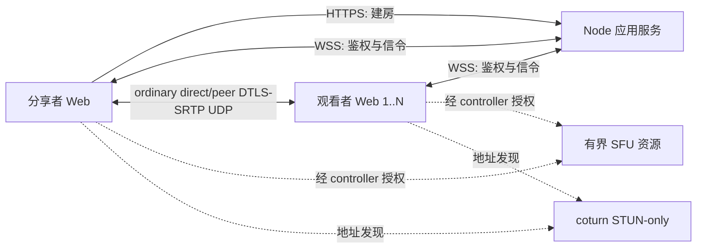

# 屏幕共享 WebRTC PoC 方案设计

## 2026-08-18 14:45

状态：production 运行精确 application/runtime revision `b68c47167da592dd673a78ec3d072936ef49e3ea`、release `b68c471` 和严格 `screener-v12`；canonical `main` 含相同 application/runtime tree 与当前 truth checkpoint。源码与生产已实现 22 字符 room-lived Viewer grant、`ROOM_NOT_FOUND`、产品诊断下载移除、完整短 URL 邀请 UI、收敛的房间密码控件与 exact-current audio stats，并固定 Browser VP8，video 不设置 `contentHint`、audio 保留 `music`，且无 codec UI/state/wire 或分享生命周期分支；Pause/Resume 继续由当前 Host session 和 `shareGeneration` 约束。Owner 的 SFU fallback 实测证据仍严格归属于 predecessor release `c4962f5`。

## 目标与边界

产品面向一名分享者和小范围可信朋友的低延迟游戏画面分享。观看端使用普通桌面或手机浏览器；每条普通媒体边独立 ICE 并优先 direct/peer UDP。所有非服务器端点共享一个服务端权威稳态 outbound media-copy capacity，由唯一部署项 `ENDPOINT_MEDIA_COPY_CAPACITY` 配置，默认 `2` 且只接受 `1`、`2` 或 `3`；peer child 或 Host publication 各消耗一份，upstream receive 免费，角色、浏览器、UA、设备和页面可见性不改变该值。活动媒体图无环，每名 Viewer 同时至多一个 active upstream。不兼容的 capacity 能力与单一 signaling wire 原子升级，旧客户端在取得房间 authority 前 fail closed。SFU subscriber egress、temporary overlap 和 direct-to-SFU fallback sequence 由 ADR-0005 的整体模型统一定义。

本阶段必须形成完整的最小纵向链路：

- 分享者主动选择屏幕、窗口或标签页，并请求可用音频；
- 创建四位随机数字房间；production site access 密码严格控制建房/发布和 code-only 观看，默认 room-scoped capability link 让受邀 Viewer 直接观看，房间控制状态只驻留当前进程内存；
- 每名观看者拥有独立的 `RTCPeerConnection`；
- 当前 production 要求 STUN，普通 peer ICE 只发 STUN servers；source 与 production 的 Browser SFU PC 使用空 ICE-server 列表、保留 LiveKit signaling 的 UDP candidates 并由标准 ICE 选择；
- 展示连接状态、direct/relay、RTT、实际码率、帧率和丢包等数据；
- 超过部署配置上限的观看者被明确拒绝，不静默超载；
- 在代码、测试和真实浏览器验证完成前，不宣称达到延迟或画质目标。

首个基线不实现账号数据库、通用业务数据库、房间数据库、Redis、语音聊天、Electron、原生捕获、PWA、录制、遥测平台或多地区调度。房间控制状态只驻留当前应用进程；peer-assisted/SFU candidate 只通过 ADR-0004/0005 的现有窄 owner 扩展，不引入第二套路由器或通用优化框架。

## 技术栈决策

| 层 | 选择 | 原因 |
| --- | --- | --- |
| Web 客户端 | React 19、TypeScript、Vite 8 | 同一套响应式界面覆盖分享者与桌面/移动观看者；官方模板成熟 |
| 媒体 | 浏览器原生 WebRTC 与 Screen Capture API | 不引入 PeerJS/simple-peer，保留对 ICE、sender 参数和 stats 的直接控制 |
| 应用服务 | Node.js 24 LTS、TypeScript、原生 HTTP、`ws` | 服务只负责小流量控制面；前后端可共享协议类型和校验 |
| 房间状态 | 进程内 `RoomStore` | 重启本已中断媒体；新增房间号和邀请的有界回退不值得持续承担数据库、迁移和恢复分支 |
| 运行时校验 | Zod | WebSocket 和 HTTP 输入不可信，需要与 TypeScript 类型一致的运行时边界 |
| 静态文件 | `sirv` | 生产环境由同一 Node 进程提供前端构建结果，避免引入完整 Web 框架 |
| 地址发现 | coturn 4.17.2 或更新补丁版本 | 只提供 STUN/UDP；tracked 配置使用 `stun-only`、`no-tcp` 与 `no-tls`，不分配媒体 relay |
| 测试 | Vitest | 覆盖纯逻辑和 Node 集成测试；真实媒体能力另做浏览器/网络矩阵 |
| TLS 入口 | Caddy 或 nginx，由部署者选择 | 统一 HTTPS/WSS；不把证书管理写进应用进程 |

不选 Go 的原因是 Node 不承载正常情况下的媒体流量，换语言不会减少分享者上行或 SFU 成本。不选 C++ 的原因是浏览器能力尚未被实测证明不足；只有捕获、应用音频或硬件编码出现明确瓶颈时才增加原生 helper。

最终分发有两个独立产物。公网服务器一键部署包面向用户自有服务器，编排同一版本的 Web/信令应用、易失房间状态、STUN/SFU 和反向代理，不建立第二套应用；域名、TLS、secret、端口、容量、健康检查和恢复继续 fail closed。普通 app-only 更新先验证新的不可变 artifact 再原子切换，切换前 application release 只保证保留到有限 health/postflight 完成；之后没有保留合同，也不作为维护中的备份。只有任务实际改动基础设施、配置、secret、持久或不可逆状态时，才为被触及表面定义恢复。它不提供托管基础设施，也不把占位配置写成可用服务。

本地自包含一键包在分享者电脑上同时承载 Host、当前 Web/信令应用服务器与本地状态，Viewer 仍使用普通浏览器。它不调用任何外部 Screener、STUN、SFU、隧道或 relay 服务，并复用唯一协议、房间、鉴权和路由实现；公网覆盖取决于本机入口、可信 origin、网关映射和 NAT 条件，direct P2P 可用时保留，受限时明确失败。具体 runtime、进程边界、签名、更新、证书、网关与 NAT 方案等当前功能和真实网络 TODO 完成后再由证据确定，不得先用某个打包器或自动映射技巧反向定义产品。

## 系统结构



每个观看者的候选检查和最终路径互不影响；健康 direct/peer 子树不会因另一条弱路径被全房迁移。Node 房间服务不复制、解码或转发媒体。SFU 只按 ADR-0005 的明确 owner、edge 与 deployment budget 参与，不能由图中的连线另行推导 fallback 顺序或 server fanout。

## 代码布局

```text
src/
  client/       React 页面、捕获、PeerConnection、stats 和样式
  server/       HTTP/WS 入口、配置、房间和静态 STUN ICE snapshot
  shared/       信令 schema 与跨端类型
tests/          RoomStore、ICE 配置、协议和 WebSocket 集成测试
```

保持单个 npm package。出现第二个可独立发布的程序前，不建立 monorepo 或 workspace。

## 房间与访问控制

`SITE_ACCESS_PASSWORD` 是简单的部署访问口令，不是 Viewer 密码或账号凭据。production 启动时必须配置；本地开发/测试可显式关闭。非空值必须包含 8 至 128 个可见 ASCII bytes（`0x21` 至 `0x7e`），并作为不复用 LiveKit、TLS 或其他凭据的独立 secret。`POST /api/site-access` 只在严格允许的 Origin 下接收 `Authorization: Bearer`，成功后签发 12 小时的无状态 site-access cookie：值只包含版本、到期时间和 HMAC-SHA256 签名，不创建账号、JWT 或服务端 session Map。cookie 使用 `HttpOnly`、`SameSite=Strict`、`Path=/`、有限 `Max-Age`；HTTPS 生产环境使用 `Secure` 和 `__Host-` 前缀。`POST /api/rooms` 只认该 cookie，不接受同一 Bearer 旁路。原子 deployment change 在 nginx 为该 admission endpoint 配置 per-source `limit_req`，初始边界为 `5r/m`、`burst=5 nodelay`；超限返回通用 429，允许到达 Node 的错误 secret 使用常量时间比较和统一 401。limiter 只使用 nginx shared memory，不新增 IP 持久化/日志字段；Node 不建立 IP key/LRU/session table，并保留现有全局/未鉴权连接上限。删除旧 `ACCESS_PASSWORD`、`/api/session` 与旧 cookie；旧环境变量出现时 fail-fast。

WebSocket upgrade 无法预知后续 role，因此仍允许没有 site-access cookie 的合法 grant Viewer 完成握手；握手前严格校验 `/signal` 无 query、Origin allowlist、总连接数和未鉴权连接数，并把当次 cookie 校验结果保存到 socket state。五秒内的第一条 `authenticate` 完成授权：Host 必须同时拥有 upgrade 时有效的 site-access 状态和当前房间 `hostToken`；Viewer 必须拥有目标房间当前 digest 对应的 grant，或者先通过 site access 再按 `open | private` code-only policy 校验。site-access cookie 只允许进行 code-only 尝试，不能替代 grant/房间密码；Viewer grant 也不能用于 HTTP 建房、Host role、其他房间或其他操作。

Viewer grant 与 code-only 入口是两个正交维度。每个房间用 `randomBytes(16).toString("base64url")` 生成 128-bit、22 字符 room-scoped opaque grant，服务端只在该 exact room incarnation 内保存完整 grant 的 SHA-256 摘要并用定长比较验证。grant 不编码版本、房间号或到期时间，也没有独立 expiry；它随房间存在，并在房间回收、进程重启、rotate 或 revoke 时失效。同号新房间生成新 digest，旧链接不能进入。Host 的主分享动作始终复制 token-bearing invitation；即时清退使用 rotate/revoke。

code-only policy 使用单一 `open | private` 状态：`open` 是无房间密码的默认值；`private` 在未配置密码时拒绝全部 code-only 请求，只允许有效 grant，配置密码后才接受已通过 site access 且密码匹配的 Viewer。两种状态都不改变有效 grant 的 exact-room Viewer authority，也不建立目录、账号、ACL 或额外媒体容量。Host 可独立改变 code-only policy、设置/替换/移除密码，以及 rotate/revoke grant；移除私密房间的密码会回到仅邀请可入，而不会切换为公开。

房间准入管理统一使用同源 `POST /api/rooms/{roomId}/access`：site-access cookie 与 `Authorization: Bearer {hostToken}` 共同授权一个受 schema 约束的 policy、password、rotate 或 revoke 动作。该控制面在分享活动和休眠期间语义相同，不建立 Host participant/WebSocket/media route，不改变 `sharingActive` 或 dormant lease；rotate/revoke 的现有强撤销副作用保持不变。

Host 的同源 `localStorage` creation profile 保存显示名、code-only policy 和可选房间密码，使进程重启或租约过期后的下一次显式分享可原子应用同一偏好。该密码只保存在 Host 浏览器；不保存在 Viewer 浏览器、URL/query/fragment、cookie、日志、错误或服务器持久存储。建房/更新请求通过 HTTPS 把明文短暂交给服务端，服务端使用 Node 标准异步 `scrypt` 固定 `N=16384,r=8,p=1`、16-byte 随机 salt 和 32-byte verifier，只在当前房间内存保存 48-byte material。进程级 gate 最多执行 2 个、等待 16 个派生，队满即有界失败；任务开始和提交前都复核当前 Host authority 与 room material。不存在、已回收或已过期房间使用 `ROOM_NOT_FOUND`；现存房间的未配置/错误密码和正确密码后的满房使用 `ROOM_ACCESS_DENIED`。

邀请使用 `/r/{roomId}#v={grant}`。RFC 3986 要求 fragment 在 dereference 前由 user agent 分离，因此 HTTP request-target 与反向代理 access log 看不到它；WHATWG WebSocket 还明确拒绝含 fragment 的 URL。客户端只从页面 URL 严格解析一次，把 grant 写入 `screener:viewer-grant:{roomId}` 的 `sessionStorage`，随即以 `history.replaceState` 把地址栏替换为 canonical `/r/{roomId}`；刷新和页面内 WSS 重连继续使用该页面会话的值。Host 建房/rotate 收到的 raw grant 同样只在内存和 room-scoped `sessionStorage` 中保留，用它临时构造复制链接；`localStorage` 的 room ownership 只包含 canonical URL、room ID、Host token 和期限。grant 不进入 cookie、query、WebSocket URL、Referrer、日志或错误。生产继续发送 `Referrer-Policy: no-referrer`；fragment 与该 header 降低传输泄漏，但不能防止原邀请消息、浏览器扩展、截图或用户转发，UI 必须把链接称为访问凭据。

房间只有一种易失模型。进程启动时建立 `1000..9999` 的空闲码池；创建房间时用加密随机索引从当前空闲集合取出一个号码并以 swap-remove 删除，释放时放回。这样在 9000 个号码内没有碰撞重试、递增身份或数据库序列。`MAX_ROOMS` 默认 1000 且不得超过 9000。

`ROOM_LEASE_SECONDS` 默认 86400。RoomStore 对连接中的 Host 不执行到期；Host 明确停止或连接消失时将 `expiresAt` 设为 `now + lease`，同一 Host token 在期限内重新鉴权并分享时续租，Viewer 活动不修改期限。清理循环删除 dormant expired room、关闭其 session/route/resource 并把号码归还空闲池。应用进程重启直接清空全部房间；配置不再包含 `ROOM_DATABASE_PATH`、`ROOM_TTL_SECONDS` 或任何 schema/migration。所有房间继续生成 256-bit Host token，Host 浏览器保存 raw token，服务器当前进程只保存摘要；不使用 IP、UA、设备信息或浏览器指纹认领。

rotate/revoke 是 grant 路径的强撤销：服务端先同步提交新 digest/authorization generation，再清除 Viewer grace、连接代次与路由状态，向 Viewer 发送通用访问已撤销终态使其立即关闭接收 `RTCPeerConnection`/媒体并停止重连，同时让每个 Host/relay/SFU upstream owner 关闭旧代次发送边，最后关闭 Viewer socket。不能只断 WSS，因为健康 P2P 可在信令断开后继续播放。rotate 生成并仅返回一次新 grant；revoke 写入没有对应 raw grant 的 fresh random locked digest。code-only policy 和密码保持独立；其变更只影响以后 code-only admission，除非 Host 明确执行强撤销。服务端永不返回现有 grant 明文；丢失 Host 标签页中的 grant 时只能 rotate。

房间规则：

- 一名在线分享者、最多 `20` 名 authenticated Viewer；房间 admission 与 endpoint/SFU capacity 分离；
- 分享者明确停止或捕获轨结束时停止当前发布、通知观看者进入等待并开始 dormant lease，不立即删除房间；host 信令短断先交给既有恢复，在租期内仍可用同一 Host token 续租；
- 活动分享不因租期到达而删除；dormant 房间过期后拒绝新连接、通知现有参与者、清理 route/resource 并释放号码；
- 设置不超过四位号码池的全局房间上限；进程重启清空全部房间，不恢复任何 ownership、grant 或密码状态；
- 单个服务器内存控制面保存当前 room/participant/authorization/signaling 状态，但不记录 SDP、ICE candidate、IP 地址或媒体；媒体面继续按 P2P-first 图分布，不把媒体压力移到应用服务器。

客户端用 `sessionStorage` 保存随机的 128-bit `clientId`，作为当前标签页内稳定的参与者 key。同一 role/clientId 的新 WebSocket 会原子替换旧 socket；观看者断线后保留五秒 grace，期间不发送 `peer-left` 且 `peerId` 不变，重新鉴权时重发幂等的 `peer-joined`，超时才释放名额。host 鉴权或重连后，`authenticated` 携带包含 grace 成员的权威 viewer ID 列表供客户端删除已离开的 peer，服务端再重放当前在线观看者的 `peer-joined`，因此观看者可以先于 host 打开邀请，host 离线期间的离开也不会遗留幽灵连接。

显示名是独立的本地偏好：同源 `localStorage` 只保存浏览器输入，存储不可用时静默退回内存 fallback；服务端只把参与者的规范化名称挂在当前 authenticated socket state，断线即丢弃，不进入 RoomStore durable state 或日志。shared schema 先做 NFC、合并 Unicode space separators、去除边缘空格，再限制为 1 至 24 个 Unicode code points，并拒绝控制字符、行/段分隔符、BOM、双向控制符和孤立 surrogate；未设置时 Viewer 使用通用“访客”，Web Host 可由 room-scoped stable client ID 生成本地 fallback。普通多语言文本、组合字符和 emoji 仍可用。

Web Host 在 `authenticate` 中显式发送 `viewerPresence: true` capability，Viewer 也可显式订阅同一 participant snapshot；Native sender 不在 accepted Browser wire 内并在 authority 前拒绝。两端可在 `authenticate.displayName` 发送名称，并以 `set-display-name` 更新当前会话。服务端只向已订阅的 Web participant 发送完整 `viewer-presence` snapshot，列表严格来自当前带 sessionId 的在线参与者，不含五秒媒体恢复 grace 成员；条目用 `role` discriminator 区分 Host/Viewer。加入、离线、会话替换、改名和 active route 改变都会重发快照；该只读广播不调用 connect/reconcile，也不建立任何媒体边。Host 的“在线”Viewer 总数只取 Viewer 条目数；最多两条本机媒体快照只补充当前以 Host 为 active upstream 的连接指标。

每个 presence 条目包含 `role`、`peerId`、`displayName` 和服务端 active assignment 的精确 `upstream`：Host 为 `none`，Viewer 为 `none | peer(peerId) | sfu`。UI 默认只展示名称；房内出现同名时，仅为同名项追加 peerId 尾部至少六字符短后缀，并只在同名项后缀碰撞时逐字符有界延长至完整 peerId。卡片状态只依据本机连接或当前 Viewer 接收证据显示“已连接”，否则保持中性的“线路分配中”或具体连接状态；active assignment 本身不是连接成功证据。Host 对 direct、Peer 转发和 SFU Viewer 使用完全相同的卡片结构，不生成 SFU 分组或 Host publication 伪 Viewer。连接详情同样等待当前媒体证据，再显示绿色 `P2P` 或黄色 `SFU fallback`；每张卡优先使用该 Viewer 回报的实际接收指标，Host 直连发送快照只在尚无回报时提供同结构回退。一级固定为分辨率、帧率、码率和丢包，二级按方向只渲染当前有值的 RTT、jitter、冻结/丢帧、解码耗时、音频播放质量，或捕获/编码输入、编码耗时、编码器与质量限制。固定 VP8/Opus 不显示；实际 codec 偏离产品合同时在卡片内提示。候选地址、候选对 ID、STUN 计数、RID、fmtp、常规 sender 请求/读回和其他内部标识不渲染。Viewer 接收证据由服务端绑定当前 `viewer/upstream/connection/route revision`：Peer 子边只送达其直接父节点及 Host，SFU 接收只送达 Host；因此 SFU Viewer 继续带 Peer 子节点时，两名 Viewer 的证据仍各自归属，不逐层转发或互相冒充。Host 与 Viewer 都可通过独立拓扑按钮从 authoritative assignment snapshot 展示 Host、实际存在的 SFU 节点及精确上下游；Viewer 默认收起并放在视频下方，没有当前 Host presence 时不生成占位拓扑。拓扑不把计划线路当作连接成功，也不显示 IP 或唯一名称对应的 peerId。peerId 不因此成为授权身份或路由输入；名称、presence 与拓扑视图不改变授权、媒体或路由状态机。

## 信令协议

WebSocket 使用无 query/fragment 的同源 `/signal`。upgrade 只记录 site-access cookie 是否有效；连接后五秒内第一条消息必须是当前单一 wire 的房间级 `authenticate`。Host 消息携带 room、role、内部 Host token 与 clientId，并由 socket state 复核 site access。Viewer 消息携带 room、role、clientId，以及 exact-room Viewer grant 或当前 code-only password attempt。成功的 `authenticated` 快照始终携带部署最终值 `endpointMediaCopyCapacity: 1|2|3`；普通模式的服务端 admission 只向 Host 激活稳定加入顺序中的至多该数量 Viewer，并在离开后提升等待者，双方信令只允许 active child。Browser Host 与 Viewer 严格校验该值，房间 `maxViewers` 只约束观看者总 admission。Native/executable sender 停留在旧 wire 并在 authority 前拒绝。服务端设置 64 KiB `maxPayload`、关闭 `perMessageDeflate`，并以 ping/pong 清理失效连接。单进程固定限制 2048 条总连接和 256 条未鉴权连接，容量在 upgrade 前预留，超限直接返回 HTTP 503 并销毁 socket。

下表描述 accepted Browser 的单一 `screener-v12` wire；server 与 Browser assets 必须作为一个完整合同原子发布，其他 wire 在取得房间 authority 前拒绝，不存在旧 parser、writer、translator 或中间协议子集：

| 方向 | 消息 | 作用 |
| --- | --- | --- |
| client -> server | `authenticate` | Host 以 upgrade 时的 admission 状态加 room-scoped Host token 建立会话并可订阅 Web-only presence/settings；Viewer 以 exact-room Viewer grant，或 site access 加当前 `open/private` code-only policy 建立仅观看会话，并可附带规范化本地显示名 |
| server -> client | `authenticated` | 返回角色、peerId、可为空的房间期限、容量、host 状态、该 viewer 的历史 connectionId、host 的权威 viewer 列表和 ICE 配置；仅 Host 额外接收是否已配置房间密码的布尔状态，不回显密码 |
| viewer -> server | `set-display-name` | 只更新该 Viewer 当前 authenticated socket state 的规范化名称，不写房间或数据库状态 |
| server -> subscribed Web host | `viewer-presence` | 返回全部当前在线 Viewer 的权威 snapshot 与精确 active upstream；不触发媒体连接 |
| Host HTTPS -> server | room-access update | 以 site access 与精确 Host token 独立设置 `open/private`、设置/移除 password，或 rotate/revoke grant；不建立媒体会话或续租，raw grant 只在新建或 rotate 成功响应中出现一次，服务端不回显密码 |
| server -> host | `peer-joined` / `peer-left` | 建立或关闭该观看者的独立连接 |
| host -> viewer | `offer` / `candidate` | 带 `peerId` 与 `connectionId` 的定向信令 |
| viewer -> host | `answer` / `candidate` | 只能回给本房间分享者 |
| viewer -> host | `restart-request` | 以 `rebuild` 标志请求 ICE restart 或完整重建该 peer |
| host -> server | `stop-sharing` | 结束当前发布、清理本轮连接并让观看者等待；不删除房间或使邀请失效 |
| server -> viewer | `route-status` | strict union 只允许 `{ revision, state: "waiting", reason: "sfu-admission" }` 或 `{ revision, state: "failed", reason: "route-exhausted" }`；只补充现有 `route-update` 无法表达的 SFU admission waiting 与 bounded route exhaustion，不携带 raw text、identity、candidate 或 retry hint |
| host -> server -> host | `request-route-diagnostic` / `route-diagnostic-snapshot` | 仅供 authenticated Host 自动验收请求一份当前快照；产品 UI 不提供下载按钮，不连续推送、不参与 route authority |
| host -> server -> viewers | `set-sharing-paused` / `host-status` | 当前 Host session 与 `shareGeneration` 约束一个 paused boolean；Resume 使用同一状态更新，不建立第二次授权、source acknowledgement 或媒体 proof |

Zod 在服务边界拒绝未知类型、超长字符串、非法 SDP/candidate 结构和越权目标。服务端根据已认证会话决定路由：观看者不能给另一名观看者发信令，分享者也不能向本房间以外的 peerId 发送。

accepted 的唯一 wire 是 `screener-v12`，不做版本协商、旧 parser、双写或 translator。任何其他 Browser wire 及 executable sender 的首条消息在角色进入 room lookup 前得到同一个 fatal refresh 终态并停止自动重连。Client 与 server 共用 `SIGNAL_CLOSE_CODES` 定义会话替换、鉴权失败和 Viewer access revoke 的终态语义，避免双方对重连边界产生分叉；非法协议消息使用 WebSocket policy-violation close code。缺失、跨房、已 rotate 或 revoked 的当前 Viewer grant 使用同一个通用“邀请无效或已失效”结果。已通过 site access 的 well-formed code-only attempt 在没有 current room 时发 `ROOM_NOT_FOUND`；现存房间的 absent/wrong password、room full 与其他已知有界 admission refusal 继续发 `ROOM_ACCESS_DENIED`。两者都使用共享 authentication-failed close code。Grant 继续使用 `INVALID_TOKEN`，Host 鉴权保持独立，unexpected internal failure 使用不含 raw message 的 `SERVER_ERROR`。

## WebRTC 协商

分享者是唯一 offerer。每名观看者对应一个 `RTCPeerConnection`，以独立 `connectionId` 区分重建代次：

1. 分享者在开始按钮的同一用户手势内先成功调用 `getDisplayMedia()`。
2. 只有捕获 track 已存在时才请求创建或续租房间、连接 Host WebSocket 并显示邀请。新建请求携带本地 creation profile，使 code-only policy 与可选密码 verifier 在房间可见前原子生效；若用户在响应返回前取消，迟到结果不得覆盖后续分享会话，尚未认领的房间通过内部 `abandon-room` 立即释放号码。已经认领的房间在停止捕获后进入 dormant lease，过期才释放。
3. 观看者认证后，服务端向在线分享者发送 `peer-joined`；host 晚上线或重连时收到完整观看者快照。
4. 分享者创建连接、加入当前视频 track，并以现有音轨或空 sender 预留 audio transceiver，设置 sender 参数，然后创建 offer。
5. 观看者收到 offer 后创建连接、设置 remote description、创建 answer。
6. 双方持续通过信令服务交换 trickle ICE candidates。
7. remote description 尚未设置时，客户端仅缓存有界数量的 candidates；旧 `connectionId` 消息直接丢弃。

这种单一 offerer 模式满足当前单向媒体需求，不引入 perfect-negotiation 状态机。同一页面中的不健康连接发送 `rebuild: false`，host 先尝试 `restartIce()`，非稳定信令状态或恢复失败时重建该 peer。新标签页没有旧 `RTCPeerConnection`，或页面 peer 与 `authenticated.connectionId` 代次不一致时，viewer 发送 `rebuild: true`，host 直接换代。健康且代次一致的媒体在单纯信令重连时保持不变；所有异步启动结果以 host 会话 generation 隔离，viewer 的异步 answer、candidate 和 stats 结果也必须同时匹配当前 connection 对象与 connectionId，旧代次不得改写新状态或发出信令。

信令 WebSocket 暂时中断时，不立即关闭仍健康的 P2P 媒体；客户端指数退避恢复控制通道。明确不可重连的会话替换会释放旧页面的 peer、统计定时器和媒体引用，host 也停止旧捕获。首版只保证同一页面生命周期内恢复，不承诺浏览器进程被系统挂起后的连续播放。

## 捕获、编码与质量

捕获只能由按钮产生的用户手势调用 `getDisplayMedia()`。三档目标为：

| 档位 | 约束目标 | 初始码率上限 |
| --- | --- | ---: |
| 1080p60 | 1920x1080、60 fps | 8 Mbps/peer |
| 1080p30 | 1920x1080、30 fps | 5 Mbps/peer |
| 720p30 | 1280x720、30 fps | 3 Mbps/peer |

浏览器可返回更低设置，界面以 `track.getSettings()` 显示实际捕获结果。推荐区始终只有表中的三档并默认选择中档 `1080p30`；高级分辨率额外提供 `480p`（854x480）、720p、1080p 与 1440p，FPS 继续独立接受 15 至 60 整数，码率继续独立接受 2 至 12 Mbps，因此不建立第四个推荐档或 `480p` preset ID。视频 track 不赋任何 `contentHint`，让 display capture 保留浏览器的 screen 分类；返回的音频 track 使用 `contentHint = "music"`。三档推荐质量与折叠高级区初始值统一采用 `degradationPreference = "balanced"`，并允许显式选择 clarity-first 或 fluid。“分享高级设置”不提供 codec 选择，并提供离散的 `64 kbps 省流 | 128 kbps 音乐默认 | 256 kbps 极高音质` 屏幕音频 sender ceiling。音频 ceiling 可在直播中串行更新。这些设置只是 ceiling 和浏览器偏好，不保证实际分辨率、帧率、码率或声道。

每次 `setParameters()` 都必须从当次 `getParameters()` 派生更新，然后读回 requested/applied `maxBitrate`、`maxFramerate`、`scaleResolutionDownBy` 和 degradation preference。浏览器负责具体降级，实际结果由 stats 观测；拒绝或浏览器改写必须进入可见状态，不能只写 `console.warn`。

Accepted `screener-v12` Web 视频固定使用 `VP8`。P2P 与 browser relay 在首次 offer 前只保留 VP8 media capabilities 及 RTX/RED/FEC repair capabilities；无法应用该约束时明确失败，不静默协商另一媒体 codec。SFU publication 显式使用 VP8 且关闭 backup codec。UI、quality state/wire 和分享生命周期均没有 codec 分支；实际 outbound codec/profile、encoder implementation 与 stats 是只读结果真相。Viewer answer 的 Opus stereo receive preference 是当前唯一应用 SDP 变换边界。

Web display-audio 请求显式关闭 `echoCancellation`、`noiseSuppression`、`autoGainControl` 和 `voiceIsolation`，并以 `channelCount: { ideal: 2 }` 偏好双声道；这是当前 Chrome/Edge Host 基线的实现契约，用于避开网页 `getDisplayMedia()` 默认的语音处理和单声道 APM 候选，不宣称跨浏览器保证，也不固定采样率。所有值都是非强制 post-selection preference；不使用 `exact`、`min` 或 `advanced`。若 `getAudioTracks()` 为空，分享者界面必须显示“当前来源没有可共享音频”。Web 端同时传入 `windowAudio: "window"` 与 `systemAudio: "include"`：窗口选项请求该窗口/应用音频，整个屏幕选项允许用户勾选系统音频；标签页使用浏览器自身的标签页音频选择。浏览器可以忽略这些约束或 picker hints，且没有对应的标准来源类型读回，因此 UI 不额外推断或标注来源。系统音频由用户显式选择，可能包含语音或通知；video-only 始终可用。

当前 Windows Native sender 用本地 opaque ID 保存所选窗口的 HWND、PID 与进程创建时间；helper 在使用前重新验证三者绑定，并以 WASAPI process loopback 的 include-target-process-tree 捕获游戏及其子进程。目标进程无渲染流、退出或捕获失败时显示无声/未知，不回退为整机音频，也不上传 PID、路径、窗口标题、设备标识或原始音频。该路径只支持 Windows 11；Windows 10 game-only 音频保持明确不支持。

同一 helper 的显式 `native-window-h264` source 用 `CreateForWindow` 建立 WGC item，在所选 adapter 的 free-threaded D3D11 frame pool 接收 BGRA surface；D3D11 VideoProcessor 做固定 1280x720/30 aspect-fit NV12 转换，随后进入 adapter-LUID-bound、hardware-only asynchronous Media Foundation H.264 MFT。输出必须是 Annex-B `42c01f`，首次、周期和反馈恢复帧携带 SPS、PPS 与 IDR。PCM、H.264 access unit 和 local-only hardware status 通过一个有界 helper protocol 进入 generation-bound Go session；H.264 直接写现有 shared fanout，UI 只收一份单向预览副本，PCM 保持现有本地 WebCodecs Opus bridge。任一 Native capture/encode 失败都终止该 source，不静默改用软件 MFT、其他 codec、browser capture、monitor capture 或 system mix；普通 Web Host 使用独立的 Browser codec 路径。一名普通 Chrome Viewer 已 decoded/rendered 203 帧并收到 500 Opus packets；同一 helper PID/adapter 的 `VideoEncode` 与 LUID 匹配。

直播中切换来源仍由明确的按钮手势重新调用 `getDisplayMedia()`，不改变房间、host generation 或媒体拓扑。选源取消或失败时继续发送旧流；成功后为每个现有 sender 调用 `replaceTrack()`，健康连接不重新协商。初始 offer 预留 send-only audio transceiver，使音频可以在 `null -> track -> null` 间切换。若某个 peer 的替换或回滚失败，只重建该 peer；新流提交后才停止旧流，并以当前 stream 身份保护旧 track 的迟到 `ended` 事件。统计码率累加器在换源后重置，避免把不同 track 的计数器混算。

直播中切换质量不重新打开选源器：对当前视频 track 调用 `applyConstraints()`，再更新所有现有 sender 的参数；quality mutation 不含 codec，新加入或重建的 Browser sender 仍使用固定 VP8 与最新其他权威设置。失败时保留当前分享并给出状态，不以重建整个房间补偿。临时暂停禁用当前 capture stream 的全部音视频 tracks；Host 通过当前 session 与 `shareGeneration` 发送一个 paused boolean，服务端同步 `host-status`、route pause 与 `authenticated` 快照，Viewer 在舞台显示“分享者已暂停”。Resume 使用同一状态更新并重新启用同一批 tracks，不另设 authorization、source acknowledgement 或 proof。晚加入和信令重连从快照恢复，恢复、停止、新分享或会话替换清除旧状态；不得把 track mute、黑帧或网络停顿推断成主动暂停。房间与连接保持不变。

Host 本地预览直接绑定现有 capture stream，不创建 viewer、`RTCPeerConnection` 或额外媒体边，也不产生 SFU/应用服务器出口。预览仍可能有本地合成、缩放和 GPU 显示成本；在同一动态场景对预览开/关采集 Host CPU、GPU、encode time 和实际 FPS。后台性能诊断必须把 Host 页面前台/遮挡/最小化、被捕获 source 前台/遮挡/最小化以及 preview 播放/暂停分成独立变量，并关联 document visibility/focus、track mute/readyState 与 capture/outbound/inbound stats。页面 timer、伪活跃和 Screen Wake Lock 都不构成屏幕捕获保活方案；若标准浏览器无法维持目标行为，应记录平台能力边界而不是制造第二套 lifecycle。只有稳定收益且捕获、编码和远端画面不变时，才把直播后的默认动态预览改为静止缩略图或隐藏并允许按需展开；隐藏预览绝不停止 capture track 或 sender encode。

codec 与 content-hint 依据由研究文档持有。`motion` 会把 Chromium/libwebrtc 的 display capture 从 screen 改成 realtime，并在同一 VP8 条件下造成明显降帧和降分辨率，因此产品不设置视频 hint。无 hint VP8 在当前受控证据中恢复接近 30 fps、完整分辨率和正常码控，具备 Browser 基线覆盖；它因此成为唯一 Browser codec。普通 AMD H.264 MFT 的浏览器码控仍丢帧，而诊断性 Desktop SW BRC 可恢复约 30 fps，说明问题不等于硬件编码器本身的吞吐上限；网页没有启用该浏览器进程开关或选择具体 GPU/MFT 的 API。实际 codec 与 encoder 字段只用于诊断，不触发 codec 切换。VP8 hardware acceleration 需要后续按目标浏览器和真实游戏负载单独取证；本设计不假定其存在，也不增加替代 codec 或自定义编码路径。

`track.getSettings()` 中存在的 EC/NS/AGC/voice-isolation、`channelCount` 和 `sampleRate` 只能作为当前捕获观测；缺失字段保持未知，Opus 协商仍是独立事实。每个 Web Host 或浏览器 relay 的实际音频 sender 在首次绑定和换源后通过标准 `RTCRtpSender.setParameters()` 请求并读回当前 64/128/256 kbps ceiling；这只是上限，浏览器 WebRTC 拥塞控制仍可降低实际流量，不新增应用层音频降级器。128 kbps 保持默认，因为 RFC 7587 将 20 ms full-band stereo music 的建议区间列为 64--128 kbps，pinned LiveKit 2.22.0 也把 128 kbps 命名为 `musicHighQualityStereo`；256 kbps 是用户显式选择的较高上限，不是质量保证。Peer answer 声明 `stereo=1;maxaveragebitrate=256000`，让同一接收协商覆盖所有三档，实际 sender ceiling 仍由所选档位约束；普通 PC synthetic 不用于标定参数、听感或性能。

Web peer 的最小 stereo 契约只改 Viewer 生成的 answer。实现把 MIT `sdp-transform` 2.15.0 与 `@types/sdp-transform` 声明为 root direct dependencies，不依赖 LiveKit 的 transitive install，也不用字符串或正则拼接 SDP。Helper 仅在解析出唯一非 rejected audio media、通过结构化 `rtp` entry 找到唯一 Opus payload 时，才在该 payload 的 fmtp 幂等 upsert `stereo=1` 与 `maxaveragebitrate=256000`；随后 `ViewerPeer` 把同一个结果交给 `setLocalDescription()` 和 signaling。首次连接、ICE restart、同 parent rebuild与浏览器 relay child 都走该边界。空 SDP、无或歧义 Opus、多个有效 audio、重复目标参数、畸形 fmtp、parse/write 异常都按对象 identity 返回浏览器原 answer，保住仍可继续的 mono/video edge，不发送半修改 SDP。RFC 7587 说明这两个值都是可选的单向 receiver parameters；`maxaveragebitrate` 是 maximum 而非最低保证，实际发送仍可随拥塞下降。当前 libwebrtc 把缺省 full-band stereo codec bitrate 配成 64 kbps，而 `RTCRtpSender.maxBitrate` 只限制上界；本接收上限允许三档，实际发送预算仍由 64/128/256 kbps sender ceiling 与拥塞共同决定。`sprop-stereo` 只是 sender likelihood hint，`usedtx` 缺省已是 0，本 slice 不增加二者，也不改浏览器协商的 `useinbandfec`。

SFU publisher 将 64 kbps 映射到 `AudioPresets.musicStereo`、128 kbps 映射到 `musicHighQualityStereo`，256 kbps 使用显式 `maxBitrate`；三者都保留 `forceStereo: true` 与 `dtx: false`。LiveKit 2.22.0 先合并 room publish defaults，其中 `red: true`；本实现不传 `red` 覆盖值，保留既有 RED request。RED 与 Opus in-band FEC 是不同修复机制，保留前者不声称实际启用、替代或等价于后者。直播中只改变档位时，不重新协商 Opus 或 republish；服务端沿现有 quality wire 保存 last-wins desired profile，各客户端 sender-mutation queue 从 fresh parameters 更新当前 P2P、relay 和 SFU audio sender并立即 readback，过期 completion 不覆盖新值，未来 sender 读取最新 desired profile。应用失败保留该 sender 的旧 applied 值和媒体并显示告警；无远端 applied 回执时 Host 不宣称全房原子收敛。Pinned LiveKit 2.22.0 的当前 Chrome/Edge screen-audio baseline 可直接更新现存 audio sender；其他浏览器以实际 readback 为准。Viewer 继续在同一个持久 `MediaStream`/媒体元素中增删 screen video/audio track；不新建 audio element、Web Audio mix/resample graph、第二 audio representation 或独立音频时钟。默认每条 outbound edge 的 audio RTP payload ceiling 为 128 kbps，显式最高档为 256 kbps；非服务器端点容量为 C 时最多 C × 128/C × 256 kbps（不含 RTP/SRTP/UDP/IP overhead）。stereo 仍可能增加编码与网络成本，且浏览器 relay 不保证跨 PeerConnection shared encode。未来 microphone voice 若进入范围，另建独立 source/track 与 AEC、降噪、gain、DTX 设计，不能作用于电影/游戏屏幕音频。详细证据与 Oopz 未知边界见 `docs/research/browser-screen-audio-quality.md`。

Viewer 本地连接详情只从当前 route 的唯一 inbound screen video/audio stats 读取同步证据：`audio estimatedPlayoutTimestamp - video estimatedPlayoutTimestamp` 表示当前发送端时间线差；音视频 jitter-buffer delay 取相邻窗口累计 delay/count 的比值；音频 concealment 取相邻窗口 concealed/total sample 与 event 增量。每个媒体种类用 stats id、SSRC 和 track identifier 共同守住区间身份，换流或累计计数回退时先重新基线，字段缺失或分母为零时保持未知。该证据不进入 signaling、质量上报或持久化，也不设置 `jitterBufferTarget`、Web Audio 或任何媒体控制参数；真实同步仍由同一持久 `MediaStream`/媒体元素和 WebRTC playout 负责。

`frameRate` 约束和 sender 的 `maxFramerate` 都是目标或上限；浏览器仍控制实际捕获、重复帧处理、编码和拥塞降级。静态画面可能由浏览器减少实际编码数据，但标准没有保证每个实现以同一种方式节省采集或 GPU 开销。本 PoC 不添加画面差分、定时改约束或自定义动态 FPS 状态机，先用 `framesEncoded`、实际发送码率、`totalEncodeTime`、质量受限原因和主机资源占用测量真实问题。

质量自适应采用 ADR-0007 的 built-in-first 路径隔离双表示，而不是全房间按最差链路降档。Direct/peer 保留每条 PeerConnection 的 stock WebRTC GCC。每条 SFU path 从 `HIGH` ceiling 开始；优先发布共享 `HIGH+LOW` 并让 LiveKit BWE 独立降层和恢复。若该 gate 通过，Screener 不实现媒体层 selector。应用证据只用于诊断。`LOW` 可以常驻；关闭空闲层只是资源优化。active representation/layer 数量硬限制为二，不能按 viewer 增长。标准浏览器不保证跨 PeerConnection 共用一个物理编码器，inactive 层也不保证释放 GPU；实际层数、实例数、CPU/GPU、游戏 FPS/p1 low、区间 encode cost、上传与释放行为必须实测。若没有合格 hardware/power-efficient 路径或额外表示破坏游戏/上传预算，则 fail closed，保留健康路径并明确显示弱路径降级或失败。

质量证据只用于诊断，不形成全房分数或 parent authority。路由只消费 exact child edge 的 `failed/closed` 和非暂停 decoded-frame stall。prepare/commit/abort 绑定 authenticated sessions、share generation、base/pending revision 与 candidate connection；candidate child 的第一帧新 decoded video 是唯一应用层 media-ready，ICE connected 不能单独提交。

状态决策必须关联同一时间区间和媒体代次的三段证据：

| 阶段 | 必要证据 |
| --- | --- |
| A. Host capture | `track.getSettings()` 的实际宽、高、FPS |
| B. Host outbound | 实际宽高/FPS/码率、可用或目标码率、区间 encode time、`qualityLimitationReason`、RTT、丢包、重传、direct/SFU 路径，以及派生后的实际协商视频 codec/profile/parameters 和适用时的 `scalabilityMode` |
| C. Viewer inbound | 实际宽高/FPS/码率、丢包、jitter、区间 decoded/dropped frame 和 freeze，以及对应派生 codec/profile/parameters、适用时的 `scalabilityMode` 和实际解码表现 |

判断顺序固定为：Capture 低归为采集或约束；Capture 高而 outbound 低且 reason=`cpu` 归为编码资源；Capture 高而 outbound 低且 reason=`bandwidth` 归为 GCC、上行或当前路径；outbound 正常而 inbound 低归为传输或接收；inbound 指标正常但肉眼模糊归为码率/量化、协商 codec/profile/parameters、适用的 scalable layer 或显示缩放。B/C 必须关联同一派生协商结果与实际解码表现。累计统计只计算相邻、不重叠区间的 delta；缺字段、stats ID/媒体代次变化或计数器回退时重新建立基线，不能把未知当零。

探针按最小顺序落地：先在 host 同一个采样 tick 内关联 A+B，并携带明确 window、媒体/stats identity 和有效 delta；需要 Viewer 诊断时只增加受限、已鉴权 C 上报。不建设通用遥测 schema，只传派生后的协商字段，绝不上传 raw stats、raw SDP、candidate 地址或原始设备/网络标识；这些字段不产生路由 authority。

Viewer 可通过已鉴权、绑定当前房间/路径代次的控制面报告需要 `LOW`，但该请求只用于表示诊断，不能命令内建 WebRTC/LiveKit 媒体层或改变拓扑。报告必须限频、去重；UA、平台和设备型号不参与质量或 relay capacity 决策。

SVC 的标准能力门禁已经静态关闭为 `no-go-web-svc-cross-path-hardware-contract`。WebRTC-SVC 只配置单个 outgoing sender，direct/peer receiver 没有对应的按层选择 API，独立 PeerConnection 之间也没有 shared-encode 契约；requested/applied codec/`scalabilityMode`、Media Capabilities `powerEfficient` 与 RTCStats encoder 字段不能证明编码器一定是硬件。Pinned LiveKit 虽能在 SFU 内为每个 subscriber 设置最大空间/时间层请求，但实际选择依 codec/selector 而异：server 1.13.5 只为 VP8 安装 temporal selector，当前 H.264 `q,h` simulcast 只有空间层选择。Client 2.22.0 还会把 screen-share SVC 强制成三层 temporal-only `L1T3`，既没有低分辨率 base，也超过最多两层的门槛；这种 SFU 选层也不延伸到 direct/peer descendants。当前静态结论不运行 browser harness。未来只能由能明确锁定硬编、最多两层、跨 direct/peer/SFU 复用同一输出且通过游戏性能/延迟门槛的 native sender 以新决策重开。普通非分层编码包不能只靠转发生成另一档画质，实现路径差异只能用第二表示、合格的 scalable layers 或 relay/SFU 转码。

质量控制不放宽稳态 outbound media-copy 预算：所有非服务器端点继续受统一静态 capacity 约束；native relay 只转发选定表示的编码包，不解码重编码。后续双树或条带化必须另行验收，不能绕过当前 graph、identity 和 capacity invariant。

路由状态只有 committed graph 和一个 pending child operation；该对象聚合 candidate list/cursor、一个 current candidate/预留和一个总 deadline。relay 自身 ingress 失效时，它作为 child 进入同一 reparent 并保留 subtree；disconnect 或 effective capacity 降低时让 direct/overflow children 逐个回到 reconcile。多个下游 edge 若各自失效，会独立迁移并自然排空 relay。权威 pause abort operation、保持 active graph、抑制 stall；resume 重新 reconcile。

标准表示能力排在任何自定义双表示媒体实现之前。当前 Web P2P simulcast 缺少 receiver 选 RID 与跨 PeerConnection shared-encode 契约；当前 Web/LiveKit SVC 也缺少 direct/peer 独立选层和可移植硬件保证。Production 的 exactly-two screen-share simulcast 与 `dynacast: false` 只是实现和质量实验事实，不证明 root topology、publication accounting 或 subscriber model。具体表示门槛由 ADR-0007 和[实时质量调研](./research/realtime-quality-adaptation.md)持有，不得绕过 stock WebRTC congestion control。

## 移动分享端能力边界与排期

普通移动浏览器当前只承担 Viewer。Chrome Android、Firefox Android 与 Safari
iOS 都没有可靠的 `getDisplayMedia()`；Web Host 入口必须检查运行时 API 并明确
区分 unsupported、用户拒绝/取消与 capture failure，不能用 UA、desktop mode
或设备型号放行。该边界不影响普通手机浏览器观看或统一 relay capacity；移动表现继续作为真机兼容观察。浏览器版本证据由
[WebRTC 调研](./research/webrtc-p2p-screen-sharing.md)持有。

移动端只承担响应式 Web Viewer；Web Host 支持矩阵保持桌面 Chrome/Edge。

Viewer 向电视投屏不进入媒体拓扑；系统级屏幕镜像现在由平台直接提供。Web 端后续只在运行时检测
`HTMLMediaElement.remote`，并在真实目标证明 live WebRTC `srcObject` 可远端播放后才
显示入口；Safari 官方只保证 `HTMLMediaElement` 的原生 AirPlay picker。Google Cast
`MediaInfo` 最终需要 `contentUrl` 或充当 URL 的 `contentId`，当前 P2P `MediaStream` 没有
该资源，因此不接
Cast sender/receiver SDK、不建转码或自有投屏协议。无论输出到本机还是电视，Viewer
都保留同一 upstream PeerConnection，SFU/peer route 与 Host fanout 完全不变。

## 媒体传输配置

Production `ServerConfig` 必须配置 `STUN_URLS`。所有 ordinary direct/peer
`RTCPeerConnection` 的 authenticated snapshot 只包含 STUN。HTTPS/WSS 始终使用
TLS/TCP，不属于媒体 transport 策略。

`PEER_ASSISTED_MEDIA` 启用同一个 process-wide route controller，但每个房间拥有
独立的 assignment、session、revision、generation、connection 和 capacity 状态。
所有非服务器端点读取同一个 deployment steady outbound media-copy capacity，默认
`2`，只接受 `1`、`2` 或 `3`；peer child 或 Host publication 各消耗一份，upstream
receive 免费。服务端是权威，客户端广告只能
收紧，不能按 Host/Viewer、浏览器、UA、设备或页面状态放宽或分叉。

每个 candidate 和异步结果都绑定 authenticated room/endpoint sessions、share
generation、base/pending route revision 与 candidate connection identity；SFU
publication generation 由 resource owner 单独持有。迁移保留可用旧 media；只有
candidate child 解码出第一帧新画面时才原子 commit。ICE `connected`、token
签发或 assignment 本身都不是 media-ready。失败、超时、stale identity 或授权
撤销销毁 candidate，保留或恢复最后一个有效 route。

SFU 是可选、有界的 server-assisted resource。一个 room controller
通过同一个 reconcile 处理 allocate/distribute、child reparent 和 relay drain。
Host 拥有唯一 authoritative publication，所有 SFU-fed Viewer 订阅它；SFU-fed
与 peer-fed endpoint 的新 child 都使用同一 provisional first-frame transaction。
现有 edge 优先保持 direct/STUN，唯一 suffix 是复用或建立 direct-ingress Host
publication 后的 SFU subscription。端点容量、SFU ingress/egress、临时 overlap、server admission
和 bounded failure 在同一 reserve/first-frame/commit-or-abort 事务中记账。

短期 SFU credential 必须严格绑定当前 route identity、只存内存、受 TTL 与 quota
限界，并且不进入 URL、日志、browser storage 或任何持久存储。普通 SFU 终止
DTLS-SRTP；没有应用层 E2EE 时 operator 可接触媒体，产品必须如实说明。
所有物理 hop 按[低服务器成本媒体路由](./research/low-server-media-routes.md)逐项计量。

精确 production behavior 只由 deployment 记录；新实现仅复用满足当前 identity、
media-proof 和 bounded-recovery 不变量的 scoped code 与 tests。

## 可观测性

每两秒在本地采集一次 `getStats()`。首版不上传原始统计。折叠详情可在产生该连接的本机显示 selected local/remote candidate 的 `address`/`port`，但浏览器未暴露时保持未知；地址不得进入信令、Viewer C、日志、诊断导出、持久化或路由/质量决策。在 peer 边中它只是当前连接端点，在 SFU 边中通常是 SFU 端点，不能标成参与者的权威公网 IP。

accepted `screener-v12` 的 Host/Viewer 产品 UI 不提供连接诊断文件下载。现有 periodic stats 只驱动当前页面的折叠连接详情、typed failure 与 accepted exact-edge stall；原始 stats、地址和身份不上传。authenticated Host 自动验收仍可按需请求一次 `route-diagnostic-snapshot`；服务端当场读取 current graph/operation 与 bounded latest timing records，不连续推送、不保留事件环、不建立第二张 graph。snapshot 使用临时 ordinal 和封闭 outcome bucket，不含 raw identity、address、candidate、credential 或 error，也不形成 route authority。

Host 与 relay Viewer 复用同一个纯 presentation reducer 保存远端 `ViewerQualityEvidence`。代际 identity 是 exact route identity（room/share、viewer/parent、assignment/connection、route revision 和当前可用的 media-binding generation，及适用时 publication generation）；只有同 identity 且 sequence 严格递增才可承接旧字段，其他输入从新 evidence 重建。每个非空 metric 保存自己的本地观测时间并在五秒边界清空，页面 timer 总是指向最早边界；整块详情不因某个采样缺字段而卸载。`new`/`connecting`/`disconnected` 保留同 identity shell 但立即标为非 fresh，`failed`/`closed` 或 route identity 变化清空。任何依赖当前状态的消费者只读取 fresh presentation；该层不新增 wire 字段或服务端 route authority。

质量诊断必须能按顺序区分：捕获源设置、sender 实际参数、CPU 或带宽 `qualityLimitationReason`、当前 peer/SFU 路径、outbound 与 inbound 差异，以及接收端 dropped/freeze。当前有界实现显示 sender 参数的 requested/applied 读回；同一个非 `none` 原生 `qualityLimitationReason` 连续出现三个采样周期后显示单条原因提示，原因变化、缺失或恢复为 `none` 即重新计数。这只是去抖后的观察，不组合评分、不触发调档或迁移。完整跨路径分类仍由后续真实矩阵验收；首轮使用浏览器 WebRTC internals 导出和一份脱敏 run manifest，不新增服务端遥测。

分享者逐观看者显示：

- `connectionState` / `iceConnectionState`；
- 选中候选对的 local/remote candidate type 与 ICE `protocol`；
- SFU/UDP 只按[低服务器成本媒体路由](./research/low-server-media-routes.md)的 generation-baselined、privacy-safe ICE manifest 记录；先以本地脱敏 `webrtc-internals` 建立 ground truth，不新增后台遥测；
- `currentRoundTripTime`、发送码率和 `availableOutgoingBitrate`；
- 实际帧率、分辨率和相邻有效采样窗的 RTP 丢包率；
- codec、编码实现、最近采样区间内的每帧编解码耗时和 `qualityLimitationReason`；同一连接不并发采样，首个样本、无新帧、统计对象换代或计数器重置时显示未知并重新建立基线，不用连接生命周期均值掩盖后续过载。
- 同一连接上实际存在且唯一的 audio RTP 对象所对应的区间码率、RTP 丢包率、jitter，以及由其 `codecId` 引用且绑定同一 transport 的 `RTCCodecStats` MIME、clock rate、channels 和最长 512 个可打印 ASCII 字符的 fmtp。clock/channels/fmtp 只标成 codec 协商事实，不推断捕获采样率、有效载荷立体声、DTX 或 FEC 当前行为。

观看者显示接收码率、帧率、分辨率、RTP 丢包率、jitter、解码/丢帧和当前路径；Host 对 outbound 使用其链接的 `remote-inbound-rtp` 计算接收侧丢包率。视频和音频丢包率都只在同一 RTP generation 的相邻样本中以 `lostDelta / (receivedDelta + lostDelta)` 计算；首样本、对象/计数器重置、负 delta、零分母或字段缺失时显示“未知”，不把累计 `packetsLost` 伪装成百分比。RTT 只标为网络往返时间，不能冒充玻璃到玻璃延迟。

## 界面结构

首屏就是工具，不做营销页。视觉采用中性深灰工作台，绿色表示 direct、琥珀色表示 relay/警告、红色表示失败，避免单一蓝紫色主题；浏览器 favicon 复用页头 `MonitorUp` 的深绿底、绿色显示器和上行箭头语言。

- 访问入口：未鉴权根路径、`/join` 和合法 code-only `/r/{code}` 显示“站点访问”与“站点口令”；malformed `/r/...` 直接显示房间号必须是 `1000..9999` 四位数字，其他未知路径只显示“无法访问”。有效 `/r/{code}#v={grant}` 直接进入；其余 Viewer 通过 site access 后以 code-only 方式进入。未分配、已回收或已过期的 well-formed code 显示“房间不存在或已过期”，不展开或提供密码输入；现存房间的 `ROOM_ACCESS_DENIED` 保留“输入房间密码”和使用 Host 邀请的动作。已有有效 site-access cookie 不重复显示整站验证；站点口令和房间密码不共享输入值或授权状态。
- 分享者根页面：顶部显示“{分享者显示名} 的屏幕”和房间状态，并在标题旁显示可单独复制的紧凑四位房间号；Viewer 同一位置显示权威 Host 名称，不再在标题下重复。主区域保持稳定的 16:9 舞台。未发布、已停止或可恢复错误状态时，舞台内以同等尺寸和权重显示“开始分享”和“加入房间”，中间只用“或”与分隔线表达发送/接收；固定 action row 只能包含这两个按钮及分隔，disclosure 是紧随其后的 sibling，不得参与 action-row track sizing。前者直接开始现有分享流程，后者在当前舞台内展开共享的房间码表单，提交后才导航到 `/r/{code}`。按钮同步 `aria-expanded`/`aria-controls`，展开后输入获得焦点，DOM 与焦点顺序保持触发器后接表单；窄屏允许 disclosure 自己换行，不改变两个 action 的矩形或产生横向滚动。不增加首页、向导或拓扑选择。直播时舞台显示本地预览及独立全屏图标，底部保留停止、同步暂停音视频和质量档位。邀请控制使用紧凑 copy-first 布局：包含 22 字符 grant 的完整短 URL 保持可见，复制是主动作；更新和撤销使用有 tooltip/accessible name 的 familiar icons，房间号复制、`公开 | 私密` code-entry segmented control 与可选密码编辑保持职责分离。页面失焦仅暂停本地 video element，并在舞台提示“本地预览已暂停，分享仍在继续”；媒体暂停则禁用 capture stream 轨道，两者都保留现有连接。
- `/join`：保留为可直接访问的回退入口，并复用同一个四位房间码表单；一个纯 route parser 返回 `host | join | viewer | malformed-room | unknown`，只把精确 `/r/{1000..9999}` 当成 Viewer route。输入保留用户原文，`inputMode="numeric"` 只提示软键盘，提交时由共享 schema 拒绝而不是 `trim`、删除非数字或接受 Unicode 数字。通过 site access 后输入合法 code 并进入 `/r/{code}`，后续行为由 code-only admission 决定。
- `/r/{code}` 观看者：首次解析合法 fragment grant 后立即清理地址栏并直达；仅有 code 时先通过 site access，再按 `open/private` policy 进入。私密房间统一返回通用拒绝并允许尝试密码，不披露房间是否配置了密码。鉴权后主区域最大化远端视频，标题旁显示可复制的紧凑房间号，顶部保留连接状态，并提供本地音量、静音、全屏和重试控制；Host 主动暂停时复用视频舞台遮罩显示“分享者已暂停”，恢复后立即移除。视频舞台用单一派生 presentation reducer 合成 access、Host presence、route prepare/active、peer/SFU connection、remote track、首个 composited frame、autoplay rejection 和 bounded failure。支持时用 `requestVideoFrameCallback()` 确认第一帧已提交，旧浏览器回退到当前代 decoded-frame delta 与 video readiness；`playing`、track object 或 ICE `connected` 单独都不足以结束占位层。连接阶段占用固定布局且不显示虚假百分比，播放按钮只处理实际 autoplay rejection，失败重试只调用现有有界 controller 入口。
- 首帧观察绑定当前 assignment/connection/media-binding generation 以及适用的 publication generation；`srcObject` 或 route identity 变化立即使旧回调和旧 decoded baseline 失效，迟到回调不能把新路线标成已播放。
- 移动端：视频保持稳定宽高比，控制与状态移到视频下方，任何文字和按钮不得溢出或遮挡。

两端默认显示紧凑在线 roster；Viewer 端复用同一权威 participant snapshot，只列出当前 Viewer（含本机）并在新 snapshot 到达时整体替换，停止分享仅移除已离线 Host，鉴权失效、房间关闭或页面卸载则清空。Host 与 Viewer 的本机显示名在界面中统一标为“昵称”，默认只读，铅笔按钮紧贴昵称并只切换当前控件的输入、保存和取消，唯一名称仅显示名称，重名时才追加 room-scoped `peerId` 短后缀。一个不持久化的“显示连接详情”复选框按页展开媒体方式、传输协议、候选路径、浏览器实际暴露的本地/远端候选地址、codec、RTT、RTP 丢包率、编解码耗时及逐边统计；地址与端口只从当前页面 `RTCPeerConnection.getStats()` 精确关联的 selected pair 读取，浏览器隐藏或缺失任一字段就不显示，且不进入质量证据、信令、服务端、日志或持久化。界面不提供诊断文件下载。真实连接失败、音频缺失、持续画质受限和需要用户动作的告警始终可见。显示名/roster 不进入 access credential 或服务器持久状态。

用户可见的非直播状态使用稳定、真实的阶段词：分享端使用“已停止分享”；观看端使用“等待开始分享”“正在分配线路”“正在建立 P2P”“正在连接备用线路”“正在接收画面”“需要点击播放”“正在恢复连接”或明确失败。阶段只描述当前用户可感知动作，不暴露房间寿命、媒体代次、parent identity 或内部迁移步骤。`room-closed` 显示“房间已关闭”或“房间已过期”，不得误写成“分享已结束”。服务端 raw `message` 永不直接渲染；单一纯 reducer 按下表优先级把 typed current-generation fact 派生为文案、遮罩、保留画面和动作，较旧 revision/generation 输入直接丢弃：

| 优先级 | 权威输入 | 展示与动作 |
| ---: | --- | --- |
| 1 | stale client、room closed/expired/lost、`ROOM_NOT_FOUND`、`ROOM_ACCESS_DENIED` | 阻塞终态；`ROOM_NOT_FOUND` 只显示房间不存在/已过期且不显示密码，其他状态显示对应刷新、可选密码或使用 Host 邀请的动作，不显示 route retry |
| 2 | Host authoritative pause | 保留仍属于 current binding 的最后画面并显示“分享者已暂停”；等待 Host，不显示 retry |
| 3 | 同一 current media identity 的 `play()` 仅因 `NotAllowedError` 被拒绝 | 不要求先有 frame proof，立即显示唯一主动作 `Play`；点击后播放成功只清除 autoplay block，仍须等 current-generation frame proof 才撤遮罩，其他播放异常使用 typed failure |
| 4 | current binding 已有 composited frame | 去掉阻塞层；若 signaling 恢复中但媒体仍健康，只显示非阻塞提示且不清空画面 |
| 5 | route terminal failure、Host stopped/offline | Host offline 本身保留仍健康的 current media；exact upstream 硬失败或 route terminal 先使 current frame proof 失效，已证明画面至多降为 retained background 并显示离线或失败。仅 route/controller 明确允许时显示 bounded retry |
| 6 | SFU capacity wait、peer/SFU prepare、已绑定但未证明首帧、尚无 assignment | 依次显示备用线路等待、建立线路、接收画面或分配线路；无 `Play`、无虚假百分比 |

Token-free SFU standby prewarm 保持可选且不创建 participant、publication、subscription 或 route authority。它只提前加载 pinned SDK 并调用官方 `prepareConnection()`；是否缩短公网首帧由阶段时间戳验证，失败时继续既有冷路径。

按钮使用 `lucide-react` 图标并提供可访问名称和 tooltip。动态状态区域固定最小尺寸，避免连接状态变化导致布局跳动。在 1440、1024、780、520、390、375 与 320 CSS px 下，closed/open/validation-error 三种 disclosure 状态的两个首屏 action 都须同排等宽、触控高度至少 44 px且前后 `getBoundingClientRect()` 尺寸不变；输入获得焦点，文字不溢出，详情不遮挡视频且 `scrollWidth <= clientWidth`。

观看端使用原生 `range` 展示 `0%` 至 `100%`，并把归一化值直接写入当前 `<video>.volume`；它不进入 WebRTC sender、信令、房间状态或 `localStorage`。React 页面状态跨 `srcObject` 替换、换父和 ICE 恢复保留；页面刷新后恢复默认值。静音按钮只切换本地 `muted`，并保留上次非零音量；拖到零自动静音，从零调高或直接取消静音时恢复可听状态。该控件不作为音频码率、声道、采样率或来源隔离设置。

## 安全与故障边界

- 生产仅允许 HTTPS/WSS，并校验 WebSocket `Origin` allowlist。
- site access 密码以定长摘要配合常量时间比较；site-access cookie 由服务端 HMAC 签名且不含账号或可查询 session ID。Host token 与 Viewer grant 只保存 SHA-256 摘要并以定长比较验证；房间密码只保存带随机 salt 的 scrypt verifier material，并对派生结果做定长比较。site access 与建房 HTTP 响应设置 `Cache-Control: no-store`。
- Fragment 只避免其进入 HTTP/WebSocket request-target，不能把 capability 变成非敏感数据。客户端首次读取后立即清理地址栏，只在 room-scoped `sessionStorage` 留存；服务端和代理日志不得记录 WebSocket payload、Authorization、cookie、raw grant 或响应 body，异常只能记录安全路径、状态码和分类。
- HTTP body、WebSocket payload、总连接数、未鉴权连接数、输出缓冲、房间总数、观看人数和 candidate 缓存都有硬上限；无法解析的 upgrade request-target 在未鉴权边界返回 HTTP 400，不允许异常逃逸到进程顶层。
- 应用日志不得主动记录 IP；反向代理、STUN 和 LiveKit 为提供网络服务必然可见源地址，部署时需设置最短必要留存与访问控制。
- tracked coturn 的 `stun-only`、`no-tcp` 与 `no-tls` 加上 LiveKit 的 UDP-only 配置共同定义当前媒体边界。Coturn 不分配 relay，Screener 不配置 TURN、ICE/TCP、media TCP 或 TLS-relayed media。
- 分享者直连会向可信观看者暴露网络地址。受限网络只尝试当前 direct 与 SFU/UDP 路径并在有界窗口后明确失败。

## 验证计划

自动测试：

- SiteAccess 的 production 必配、8 至 128 visible-ASCII bytes/独立 secret、local-dev 显式关闭、12 小时签名 cookie、过期、篡改、cookie 属性、已移除 access key fail-fast 和无服务端 session 状态；
- RoomStore 的四位空闲码随机分配/释放、活动分享免过期、dormant lease/续租、Host token/Viewer grant 摘要验证、22 字符 128-bit grant 与 exact room incarnation 同寿、`open/private` 正交 policy、私密无密码仅邀请可入、跨房/同号重建拒绝、rotate/revoke 强撤销、Viewer 上限和超额拒绝；
- 进程重启后 room state 全空、旧 Host/grant/password fail closed、释放号码复用时旧 grant 仍失败；`ROOM_LEASE_SECONDS` 的默认/边界与 `MAX_ROOMS <= 9000` 校验，已删除的 `ROOM_DATABASE_PATH`/`ROOM_TTL_SECONDS` fail-fast；
- STUN UDP URL 严格校验、生产 STUN 必需、LiveKit tuple 完整性/TTL/secret 独立性、当前 route/session/revision/connection generation guard，以及 ordinary peer、未授权房间和 Native 的 STUN-only isolation；LiveKit `sfu-config` 保持独立边界；
- Accepted v12 contract 使用单一 `screener-v12` 信令 literal、严格 JSON schema、方向与房间授权校验、payload 上限和 client-mismatch 刷新终态；分享状态由 `shareGeneration`-fenced paused boolean 表达，missing room 使用 `ROOM_NOT_FOUND`，现存房间准入失败使用 `ROOM_ACCESS_DENIED`，Viewer route failure 为 typed terminal，Host-only bounded route snapshot 保留给自动验收但不进入产品 UI。`qualityProfileIdSchema` 保持三档，`qualityResolutionSchema` 包含 `480p`，`DEFAULT_QUALITY_SETTINGS` 为 1080p30，quality schema 严格拒绝 codec 字段；
- 质量协议的 host 授权、严格字段与数值范围、last-wins、当前/未来 relay、已配置 SFU 和普通 P2P wire 兼容；sender 的四字段 requested/applied 读回、拒绝与持续受限提示；screen audio SDP helper 覆盖 CRLF、existing/missing fmtp、unknown key preservation、幂等、payload number、rejected/non-audio，以及 empty/no-Opus/ambiguous/parser 异常原对象 fallback，`ViewerPeer` 覆盖 initial/restart/rebuild 时同一结果的 local/signaling 一致性，SFU publisher 精确断言 high-quality stereo/forceStereo/DTX 且不覆盖 RED；
- HTTP/WS 集成：nginx per-source site-access `limit_req` 与错误不泄露 secret，应用不建立 IP limiter 状态；Viewer 可在 Origin/容量门下 upgrade；Host 首条鉴权同时要求 upgrade-captured site access 与 Host token，Viewer 要么持 exact-room grant，要么先有 site access 再按 `open/private`。覆盖原子创建 profile、同浏览器重建偏好、fragment/sessionStorage/replaceState、无 site access 的 code-only 拒绝、unknown/reclaimed/expired room 使用 `ROOM_NOT_FOUND` 且不显示密码、私密无密码与 wrong-or-absent-password/full code-only 使用 `ROOM_ACCESS_DENIED`、grant 与 Host 的独立错误、raw grant/密码不进入 URL/日志/服务端持久状态，以及 rotate/revoke 后 grace/route 清理、旧 Viewer/上游媒体边关闭和 reconnect 拒绝；
- 客户端策略与 stats 解析：会话替换不重连，ordinary ICE 与 LiveKit protocol 分离；
- SFU client isolation：`SfuPublisher` 与 `SfuSubscriber` 的 `Room.connect` mock 分别精确断言 `autoSubscribe: false` 与 `rtcConfig: { iceServers: [] }`，ordinary `HostPeer`/`ViewerPeer` 回归继续断言部署 STUN，防止空列表遗漏 Viewer 或扩散到 peer edge；
- route planner property tests：候选输入乱序仍产生相同 list，健康边 sticky，硬过滤拒绝 stale/cycle/effective-capacity/unadmitted parent，优先结果深度和剩余容量并稳定打破平局；失败候选清理后 cursor 前进且总 deadline 不重置；
- Viewer stage reducer：按上表覆盖 access/Host/queue、peer/SFU prepare、remote track 无首帧、首个 composited frame、autoplay rejection、健康媒体上的 signaling recovery、Host stop/offline 和 bounded failure；stale revision不能覆盖 current frame，raw server message不能进入 UI；
- route parser 覆盖 `/r/`、三位/五位、`0000`、ASCII 字母、Unicode 数字、额外 path segment、合法 query/hash 与 exact `1000..9999`，且 malformed 输入不发起鉴权；Host/Viewer UI 都不渲染诊断下载按钮，Host-only snapshot 继续拒绝 Viewer 与额外/raw/private 字段；
- TypeScript 类型检查、Vite production build 和仓库 hygiene。

人工矩阵：

- 同机双标签页与同 LAN direct；
- 真实跨网络、同房间 direct/peer UDP + SFU/UDP root；
- CGNAT、双 NAT、移动热点和普通家宽下按 accepted route model 验证 direct/peer、SFU/UDP、恢复和 bounded failure；记录 RSS/CPU/latency 与 RX/TX/loss。人为封锁全部 UDP 时仍必须有界明确失败。涉及路由或基础设施变更的候选保留独立实例和被触及表面的恢复边界，不在同进程保留旧 transport；
- Windows Chrome/Edge 的 tab/window/monitor 音轨有/无、同时语音通话和 video-only；一个可区分左右声道的 fixture 只验证 Web P2P 与 SFU 的 channel correctness、协商 fmtp 和 route switch 后持久 `MediaStream`，不做听感/性能标定；Windows 11 原生候选另测 game process tree、通知、无渲染流与进程重启，Windows 10 记录明确不支持/未解决；
- Android Chrome 与 iOS Safari 的播放手势、旋转、前后台和网络切换；
- 一名分享者、20 名观看者先运行 bounded smoke，记录路由深度、queue wait、candidate start、first decoded frame、final route、sender 数、应用 CPU/内存和 SFU 用量，并报告 current-child sample/pending count、原始排序时长与 nearest-rank p50/p95/max；端点 `C=1/2/3` 分开解释。未接受产品体验上限前不把观测值变成新的 magic timeout。30 分钟异构公网 endurance 仍是后续质量证据，不阻止已经有界失败的 20-Viewer admission。
- 真实桌面 Chrome 对 balanced 与 clarity 做控制传播和连接身份 smoke；该项只证明直播中应用与不重建，不代替清晰度、负载或公网矩阵。

真实矩阵未完成前，状态文档必须把这些列为待验证，而不是把设计目标写成产品能力。

## 当前交付边界

- Production 使用严格单一 `screener-v12` wire 和精确 deployed application/runtime revision `b68c47167da592dd673a78ec3d072936ef49e3ea`、release `b68c471`；current source 含相同 application/runtime tree 与当前 truth checkpoint。两者均已实现短 room-lived grant、明确 missing-room 结果、产品诊断下载移除、完整短 URL 邀请 UI 与 exact-current audio stats，固定 Browser VP8 且 video 不设置 `contentHint`，codec selector、quality-state/wire 字段与分享生命周期 codec 分支不存在。
- Pause/Resume 由当前 Host session 和 `shareGeneration` 约束。Host 后台性能和 VP8 hardware acceleration 分别按受控根因证据诊断；标准 ICE/SFU 按真实异构网络验收。
- 当前发布面只包含 Web Host、Viewer 和 browser relay。Native sender、capture helper、shared-encode executable 与两个分发包仍由各自后续决策和物理证据驱动，不属于当前 Browser release。

任何一步只实现当前消费者需要的接口。不得为未来账号、第三种媒体拓扑或原生 sender 预建抽象层。

## 自动路由设计

启动 owner fence 复用配置的应用监听地址：进程必须先完成独占 bind，绑定失败时不得调用 LiveKit；bind 成功但 LiveKit 初始化未完成时，HTTP 只返回 `503` 且不安装 signaling upgrade handler。唯一 owner 完成 foreign-room 拒绝、遗留 managed-room 删除和 empty readback 后，才开放 HTTP 与 signaling。这个顺序使重启或竞争进程不能在失去应用 owner 身份时清理仍在使用的 LiveKit room。

服务端维护每个房间唯一的版本化 route owner，它独占 committed graph、一个 pending child operation 和 transition lifecycle。运行时只在该 owner 外保存一个串行 pump、一个 operation deadline timer 和资源生命周期任务；拓扑 helper 不持有第二份 graph。operation 内聚 tuple list/cursor、一个 current candidate/预留、当前 fact version 和一个总 deadline。committed media graph 必须无环且 source-reachable；Host 没有 upstream，每名 Viewer 同时只有零或一个 active upstream。加入、容量变化、节点离开、当前 edge `failed/closed`，以及非暂停时的 decoded-frame stall 都只唤醒同一个 `reconcileRoom(roomId)`；未受影响分支保持 sticky。

`reconcileRoom` 在没有 pending operation 时先删除 disconnected childless participant，再找一个 waiting Viewer，或 parent offline/effective-capacity 不足、exact edge 已失效的 child。Candidate planning 拒绝 stale session、不可 source-reachable、成环或没有稳态/overlap/bounded-gap producer slot 的 candidate；server resource admission 在执行当前 cursor 时单独检查。由 failed edge 启动时只为当前 fact version 把 exact candidate 记为已尝试；新的外部事实允许重新评估。对剩余 upstream 依次比较结果深度、剩余 sender slots、稳定加入顺序与 peer identity，先建立其他 direct/STUN，再复用或建立 SFU。Host root退出后新释放的Host槽位因此优先于另一root的更深槽位；健康旧边保持sticky，不做周期性整树平衡。每次只 reserve/prepare cursor 指向的 candidate。WebRTC 负责 ICE/DTLS/consent；exact candidate child 解码出第一帧新画面后发送一次 ready，controller 先同步 commit typed admission，再原子提交 graph。失败释放 candidate、广播严格更新的 rollback revision 并推进 cursor，operation 总 deadline 不重置。耗尽时 hard-invalid、confirmed-departed 或 deterministic overflow edge 被退休并进入明确 waiting；healthy bootstrap edge 保留。无环和房间 admission 已约束最大深度，不增加独立 depth hard cap。

Pending candidate 的 receive-transport owner 只在当前 exact generation 下运行一个短生命周期 `framesDecoded` 观察器。全新 peer/SFU activation 以正累计值证明首帧；暂停期间仍保留的 prepared SFU 在 Resume 时先取 baseline，再要求后续增长。观察器在 proof、promotion、pause、换代或 teardown 时停止，不增加另一 success/failure deadline，也不参与 candidate 选择。Active route 仍由既有两秒 stats sampler维护诊断和 decoded stall，两者不得互相替代。

一个 operation 仍只有一个 timer 和一个总 deadline，但 timer 的下一次 wake 从当前 candidate list 派生。Controller 提取实际存在的 direct 与 SFU 阶段并等分总窗口；显式失败可以在阶段内继续尝试其他 candidate，silent candidate 到达 direct wake boundary 后释放 reservation、广播 rollback 并跳到 SFU。只有 direct 时仍使用完整 deadline；direct+SFU 时各用一半。这样不引入每-candidate magic milliseconds，也不允许一条 silent direct 把 SFU suffix 饿死。

首次需要 SFU 但 Host 已满时不建立另一条 rescue 流程。若 affected child 已是 Host direct child，就用它；否则用稳定加入顺序中最新的 connected Host direct child。`reconcileRoom` 为该 child 建立普通 SFU candidate，创建唯一 publication，保持其 subtree，并在该 child 首帧后提交。Host publication 取代释放的 peer slot，随后同一 fixed-point scan 再处理原 waiting/failed child。若旧 Host peer sender 在首帧前仍保留，candidate 必须持有同一 `TransitionOverlapSlot`。没有 overlap 时先 preflight server resource，再退休 exact producer；operation 保持原总 deadline、按新 graph 重算未尝试 suffix，并为被切断的 healthy direct edge追加一个最后 restore tuple。Forward candidate 与 restore 都失败才进入 waiting，不得产生第四份 endpoint copy或另一套恢复状态。

所有非服务器端点共享一个 server-authoritative steady outbound media-copy cap `C`：唯一配置 `ENDPOINT_MEDIA_COPY_CAPACITY` 默认 `2`，只接受 `1`、`2` 或 `3`，不兼容旧键。服务端将 endpoint 当前广告的 `0..C` 可用值 clamp 为唯一 `effectiveDownstreamCapacity`；该值只表示当前可用 sender slots，不建立角色、浏览器、UA、设备或页面可见性 tier。peer child 或 Host publication 各占一份，upstream receive 免费；SFU subscriber egress 使用独立 server admission。Browser `screener-v12` 的 `authenticated.endpointMediaCopyCapacity` 把部署 `C` 交给 Host 与 Viewer；两端用该值校验稳态 assignment，并让 active+pending 的物理 copy 只在 controller 已授权 overlap 时达到 `min(C + 1, 3)`。代码通过一个 shared accounting guard 执行，不重复 magic number；其他 wire 与 Native executable 在 authority 前拒绝，不保留兼容路径。`C=3` 满载时先收到 active bounded-gap retirement再收到 prepare；任何会产生第四份 endpoint media copy 的 token都不得签发。

SFU admission 在应用单进程中只有一个注入实例。LiveKit credential tuple 完整时，必须同时显式配置私有 `LIVEKIT_API_URL`、正 safe integer `SFU_INGRESS_CAPACITY` 与 `SFU_EGRESS_CAPACITY`；容量没有产品默认值，也不从 Viewer 数、endpoint cap 或历史 root 数推导。专用 LiveKit 实例设置 `room.auto_create: false`。账本只保存全局已用计数，以及 exact room/share/publication generation 下的一份 publication handle 和按 Viewer identity 索引的 subscription handle。Publication 的 `reserved | committed | draining` 占 ingress `1`，每份 subscription 的同类状态占 egress `1`；离开 route 的 subscription 在该 generation 删除并确认 absent 前保持 draining，同一 Viewer handle 再次启用不重复计数。首个 SFU child 先 reserve publication 与自己的 subscription，再通过 `RoomService.CreateRoom` 创建 exact-generation room，成功后才 prepare 和签发 token；后续 child 只在同 generation reserve subscription 并复用 Host publication。exact candidate child 的 first decoded frame 后 commit 自己的资源；publication replacement 将旧 generation 及其全部 subscription 一起转入 draining，失败、超时、失联、分享换代、停止或删房按资源所有权进入同一生命周期。只有 `RoomService.DeleteRoom` 成功且 follow-up lookup 证明 room 不存在，账本才扣除该 generation 的 ingress/egress；auto-create 关闭后，旧 token 不能重建已删除 room。进程启动在接受流量前拒绝任何非 Screener room，删除全部遗留 Screener room并确认 namespace 为空；关闭时先 drain 再遗忘计数。Host 信令离线期间若 exact room 中的 Host participant 仍存在就继续计费并保留健康媒体，participant 消失后在一个有界轮询周期内回收。稳态 reserve/commit/drain bookkeeping 仍是 Map lookup 与整数加减；只有 generation 创建、删除、启动清场和 Host 离线检查访问 LiveKit control plane。多应用进程部署必须先增加共享原子 admission/lifecycle owner。

只有实际因 deployment-wide SFU admission 失败的房间进入一个 `resourceWaiterRoomIds` Set。LiveKit delete-plus-absent 使真实 usage 下降时，owner 一次 drain 该 Set，对每个仍存在的 controller 调用 `touchExternalFacts()` 并排入普通 reconcile。它不轮询、不按资源类型复制 route state，也不唤醒未等待资源的房间。

普通 Web relay 把收到的 remote track 加入独立 downstream `RTCPeerConnection`，因此可能逐跳解码和重编码；浏览器不保证跨连接 shared encode。每条 ordinary child 是独立网络副本，实际 encode time、CPU/GPU、bitrate、loss、frame rate、depth 和 recovery 必须测量。

迁移使用 authenticated room/endpoint sessions、share generation、base/pending route revision 与 candidate connection identity。`route-update/prepare` 显式携带当前 operation 的 exact child peer ID、route kind 与服务端生成的 candidate connection ID；parent 与 child 直接使用该 candidate。服务端在每个 WebSocket 上先发 prepare，再发其 SFU config，并在允许 parent offer前先排入 child 的 companion；客户端依赖 WebSocket顺序而不维护消息重排 inbox。可用旧 route 保持 active，candidate 在 active map 外准备；candidate child 的第一帧新 decoded video 触发 `settleReady(commitAdmissionSync)`，成功 candidate `P` 下发 active `P`。失败、超时、代次变化或授权撤销销毁 candidate，保持仍有效的 committed graph 内容并先下发单调递增的 active rollback revision `R > P`，再准备后续 candidate；一个 monotonic allocator同时拥有 prepare/commit/rollback/retirement/prune revision。Direct edge 的 stock WebRTC rebuild可在 exact current sessions内原子采用新 connection ID而不改变 topology。Make-before-break 的 overlap 由统一端点容量、单个有界 `TransitionOverlapSlot` 和 typed server-resource admission 同时决定；stop/delete通过controller `dispose()`一次返回所有current与committed资源。

SFU 的 publisher、subscriber、central admission、resource accounting、temporary overlap 和 fallback sequence 由 ADR-0005 统一定义。普通端点 child count 不能成为 server cap，兜底也不能形成无界 whole-room fanout。一个 Host publication 服务所有 SFU subscriptions；SFU-fed 与 peer-fed endpoint 使用相同的 provisional-child first-frame transaction。

Browser SFU publisher 与 subscriber 在 `Room.connect` 时都传入同一个显式 `rtcConfig: { iceServers: [] }`。LiveKit signaling SDP 继续交付专用 SFU 的授权 UDP candidates，并由标准 ICE 选择 nominated non-relay pair；candidate type、地址族、数量和浏览器 socket 分配都不是应用不变量。该配置只阻止 pinned SDK 合并 join response 或默认公共 STUN，不删除 remote candidate、不改变 ordinary peer 的 STUN 配置，也不改变 LiveKit server 使用部署 STUN 发现自身公网地址。它移除 SFU PC 不需要的外部 STUN/TURN 目的地，避免本次 TUN reproduction 中的 external-STUN/SFU association 冲突。连接失败仍由现有 operation deadline 和 typed failure处理，不增加 TURN、端口、重试层或专用超时。

relay 自身 ingress 失效时，reconcile 把它作为 child 换父并保留 subtree。endpoint disconnect 或 effective capacity 降低时，只保留稳定顺序内可容纳的 children，并把 overflow children 逐个送回同一 reconcile；offline childless participant 自然删除。Browser child复用现有 WebRTC/LiveKit stats sampling保存 exact active route的 `lastDecodedAt`；采样出现新 decoded frame就更新，route/connection变化就重置，超过统一 deadline只报告一次 exact edge。权威 pause abort pending operation、保留 active graph、让新参与者 waiting，并抑制/重置 decoded stall；resume重新从当前采样建立基线。Track availability、A/B/C、码率、FPS、模糊、sender stats和SFU layer只用于框架恢复或诊断。

实现迁移以当前 ADR-0005 invariants 为准；代码迁移只保留仍满足当前 identity、first-frame commit 和 bounded-recovery 约束的部分。
## 官方与参考资料

访问日期为 2026-08-18 至 2026-08-21：

- [Vite Getting Started](https://vite.dev/guide/)
- [React: Build a React app from Scratch](https://react.dev/learn/build-a-react-app-from-scratch)
- [Node.js release status](https://nodejs.org/en/about/previous-releases)
- [ws official README](https://github.com/websockets/ws/blob/master/README.md)
- [Screen Capture specification](https://www.w3.org/TR/screen-capture/)
- [WebRTC specification](https://www.w3.org/TR/webrtc/)
- [Media Capture Content Hints](https://www.w3.org/TR/mst-content-hint/)
- [RTCRtpSender.replaceTrack](https://www.w3.org/TR/webrtc/#dom-rtcrtpsender-replacetrack)
- [WebRTC Stats](https://www.w3.org/TR/webrtc-stats/)
- [WebRTC SVC](https://www.w3.org/TR/webrtc-svc/)
- [Media Capabilities](https://www.w3.org/TR/media-capabilities/)
- [WebCodecs](https://www.w3.org/TR/webcodecs/)
- [WebRTC official samples](https://webrtc.github.io/samples/)
- [coturn server documentation](https://github.com/coturn/coturn/blob/master/README.turnserver)
- [coturn example configuration](https://github.com/coturn/coturn/blob/master/examples/etc/turnserver.conf)
- [Cookies: HTTP State Management Mechanism draft (RFC6265bis)](https://datatracker.ietf.org/doc/draft-ietf-httpbis-rfc6265bis/)
- [Node.js `crypto.createHmac()` and `crypto.timingSafeEqual()`](https://nodejs.org/api/crypto.html)
- [W3C WAI: Labeling Controls](https://www.w3.org/WAI/tutorials/forms/labels/)
- [W3C WAI-ARIA APG: Disclosure Pattern](https://www.w3.org/WAI/ARIA/apg/patterns/disclosure/)
- [W3C WCAG 2.2: Focus Order](https://www.w3.org/WAI/WCAG22/Understanding/focus-order.html)
- [W3C WCAG 2.2: Target Size (Enhanced)](https://www.w3.org/WAI/WCAG22/Understanding/target-size-enhanced)

MiroTalk BRO（AGPL-3.0）和 Screego（GPL-3.0）仅用于结构研究。Tailchat Meeting（Apache-2.0）用于捕获生命周期对照，但它采用 mediasoup/SFU，不作为本项目拓扑或依赖底座。项目许可证确定前不复制 GPL/AGPL 代码。

---
