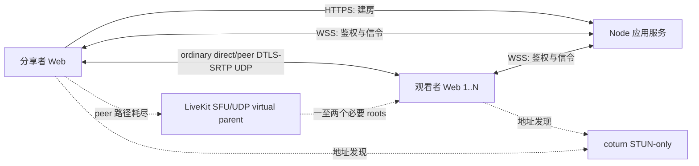

# 屏幕共享 WebRTC PoC 方案设计

## 2026-08-18 14:45

状态：首个 PoC 基线及其已接受扩展的当前设计。Production 仍使用 STUN-only ordinary ICE；旗舰进程以 `PEER_ASSISTED_MEDIA=true` 对所有正常房间启用 peer-assisted 与 LiveKit SFU/UDP，room `1` 仅是历史 smoke。built-in Peer ICE TURN canary 已失败并回滚，不再是产品方向；production 已配置仅由 controller 向单条异常 edge 发放的 selected-edge TURN，但真实中继媒体仍未验收。旧 release 与 coturn relay 仅保留为隔离回滚路径，不是同进程兼容分支。

## 目标与边界

产品面向一名分享者和小范围可信朋友的低延迟游戏画面分享。观看端使用普通桌面或手机浏览器；每条媒体边独立 ICE。当前 production 的普通边只接收自托管 STUN；所有正常房间在 peer 恢复耗尽后均可由 LiveKit ICE/UDP virtual parent 服务一至两个必要 roots，再失败时仅可为 controller 选中的异常 edge 尝试一次短期 TURN，随后有界明确结束。当前房间默认最多八名观看者、可配置范围为 1 至 16；自动分布式拓扑通过 20 人门禁后，目标 release 才把默认值和上限原子改为 20。容量配置只是接入边界，不是性能声明。

本阶段必须形成完整的最小纵向链路：

- 分享者主动选择屏幕、窗口或标签页，并请求可用音频；
- 创建数字房间；production site access 密码严格控制建房/发布，默认 room-scoped capability link 让 Viewer 免站点密码观看，部署可选择最小 SQLite 持久化；
- 每名观看者拥有独立的 `RTCPeerConnection`；
- 当前 production 要求 STUN，普通 peer ICE 只发 STUN servers；SFU 只开放 LiveKit ICE/UDP；
- 展示连接状态、direct/relay、RTT、实际码率、帧率和丢包等数据；
- 超过部署配置上限的观看者被明确拒绝，不静默超载；
- 在代码、测试和真实浏览器验证完成前，不宣称达到延迟或画质目标。

首个基线不实现账号数据库、通用业务数据库、Redis、simulcast/SVC、语音聊天、Electron、原生捕获、PWA、录制、遥测平台或多地区调度。唯一持久化例外是可选的 `node:sqlite` 房间身份表。后来接受的 peer-assisted/SFU candidate 只通过 ADR-0004/0005 的现有窄 owner 扩展，不引入第二套路由器或通用优化框架。

## 技术栈决策

| 层 | 选择 | 原因 |
| --- | --- | --- |
| Web 客户端 | React 19、TypeScript、Vite 8 | 同一套响应式界面覆盖分享者与桌面/移动观看者；官方模板成熟 |
| 媒体 | 浏览器原生 WebRTC 与 Screen Capture API | 不引入 PeerJS/simple-peer，保留对 ICE、sender 参数和 stats 的直接控制 |
| 应用服务 | Node.js 24 LTS、TypeScript、原生 HTTP、`ws` | 服务只负责小流量控制面；前后端可共享协议类型和校验 |
| 可选房间持久化 | Node.js 内置 `node:sqlite` | 单文件、无额外依赖；只保存房间 ID、Host token 摘要、nullable Viewer grant 摘要与 nullable Viewer-password KDF material |
| 运行时校验 | Zod | WebSocket 和 HTTP 输入不可信，需要与 TypeScript 类型一致的运行时边界 |
| 静态文件 | `sirv` | 生产环境由同一 Node 进程提供前端构建结果，避免引入完整 Web 框架 |
| 地址发现/鉴权回退 | coturn 4.17.2 或更新补丁版本 | 当前 tracked template 与 production 应用只下发 STUN，但共享机保留旧 authenticated-relay daemon 配置/端口规则且不下发 credential；未来只为 controller 选中的异常 edge 签发短期 TURN，先验收 TURN REST、UDP relay range 与 quotas，不启用媒体 TCP |
| 测试 | Vitest | 覆盖纯逻辑和 Node 集成测试；真实媒体能力另做浏览器/网络矩阵 |
| TLS 入口 | Caddy 或 nginx，由部署者选择 | 统一 HTTPS/WSS；不把证书管理写进应用进程 |

不选 Go 的原因是 Node 不承载正常情况下的媒体流量，换语言不会减少分享者上行或 TURN 中继成本。不选 C++ 的原因是浏览器能力尚未被实测证明不足；只有捕获、应用音频或硬件编码出现明确瓶颈时才增加原生 helper。

## 系统结构



每个观看者的候选检查和最终路径互不影响。同一 candidate 房间可同时存在健康 direct/peer 子树与必要的 SFU roots；Node 房间服务不复制、解码或转发媒体，LiveKit 只在有界 root 路径上转发。

## 代码布局

```text
src/
  client/       React 页面、捕获、PeerConnection、stats 和样式
  server/       HTTP/WS 入口、配置、房间和静态 STUN ICE snapshot
  shared/       信令 schema 与跨端类型
tests/          RoomStore、ICE 配置、协议和 WebSocket 集成测试
```

保持单个 npm package。出现第二个可独立发布的程序前，不建立 monorepo 或 workspace。

## 房间与访问控制

`SITE_ACCESS_PASSWORD` 是简单的部署访问口令，不是 Viewer 密码或账号凭据。production 启动时必须配置；本地开发/测试可显式关闭。非空值必须包含 8 至 128 个可见 ASCII bytes（`0x21` 至 `0x7e`），并作为不复用 TURN、LiveKit、TLS 或其他凭据的独立 secret。`POST /api/site-access` 只在严格允许的 Origin 下接收 `Authorization: Bearer`，成功后签发 12 小时的无状态 site-access cookie：值只包含版本、到期时间和 HMAC-SHA256 签名，不创建账号、JWT 或服务端 session Map。cookie 使用 `HttpOnly`、`SameSite=Strict`、`Path=/`、有限 `Max-Age`；HTTPS 生产环境使用 `Secure` 和 `__Host-` 前缀。`POST /api/rooms` 只认该 cookie，不接受同一 Bearer 旁路。原子 deployment change 在 nginx 为该 admission endpoint 配置 per-source `limit_req`，初始边界为 `5r/m`、`burst=5 nodelay`；超限返回通用 429，允许到达 Node 的错误 secret 使用常量时间比较和统一 401。limiter 只使用 nginx shared memory，不新增 IP 持久化/日志字段；Node 不建立 IP key/LRU/session table，并保留现有全局/未鉴权连接上限。删除旧 `ACCESS_PASSWORD`、`/api/session` 与旧 cookie；旧环境变量出现时 fail-fast。

WebSocket upgrade 无法预知后续 role，因此仍允许没有 site-access cookie 的合法 grant Viewer 完成握手；握手前严格校验 `/signal` 无 query、Origin allowlist、总连接数和未鉴权连接数，并把当次 cookie 校验结果保存到 socket state。五秒内的第一条 `authenticate` 完成授权：Host 必须同时拥有 upgrade 时有效的 site-access 状态和当前房间 `hostToken`；Viewer 必须拥有目标房间合法未过期 grant，或者先通过 site access 再按 public/private policy 校验。site-access cookie 只允许尝试私密房间密码，不能替代 grant/password；Viewer grant 也不能用于 HTTP 建房、Host role、其他房间或其他操作。

新房间默认 `private-link`，也允许 Host 显式选择 `public-watch`：

- `private-link`：服务端用 `randomBytes(32)` 生成 256-bit 随机量，并把到期信息和随机量组成严格、room-scoped 的 opaque Viewer grant；只保存完整 grant 的 SHA-256 摘要并用定长比较验证。临时房间 grant 不晚于 room TTL；持久房间 grant 固定七天。这个无配置首版边界允许熟人跨短期游戏会话复用链接，但不让可枚举持久房间产生永久邀请；只有真实使用证据才调整。到期在首次鉴权/重连时拒绝，不定时踢出已鉴权 Viewer；即时清退使用 rotate/revoke。
- `public-watch`：通过 site access 后，`/r/{roomId}` 或 `/join` 房间码允许 Viewer 进入，不签发 Viewer grant。房间码只定位；该 policy 仍受房间 Viewer、全局/未鉴权连接和中央 egress/admission 上限保护，不提供房间目录。
- `private-link` 另可设置一个逐房间 Viewer 密码。有效 fragment grant 保持直达；只有房间号时显示中性密码表单，正确密码仅鉴权当前 Viewer 会话。Host 可设置、改写或移除，密码接受 1 至 64 个可见 ASCII 字符且不要求组合复杂度。逐人邀请、账号、找回、ACL 和通用授权服务仍不做。

房间密码明文只短暂存在于当前 React 状态、WebSocket 鉴权消息和异步派生调用内存；不进入 URL/query/fragment、cookie、`localStorage`、`sessionStorage`、日志、错误或 SQLite。服务端使用 Node 标准异步 `scrypt` 固定 `N=16384,r=8,p=1`、16-byte 随机 salt 和 32-byte verifier；进程级 gate 最多执行 2 个、等待 16 个派生，队满即有界失败。等待任务取槽后先复核当前 Host/Viewer session，stale work 不启动 KDF；实际派生后再复核 room material 与连接代次。功能部署后的目标机 benchmark 再校准参数，不阻塞最小闭环。不存在房间、未配置密码、错误密码与正确密码后的满房都使用通用拒绝，不形成存在性 oracle。

私密邀请使用 `/r/{roomId}#v={grant}`。RFC 3986 要求 fragment 在 dereference 前由 user agent 分离，因此 HTTP request-target 与反向代理 access log 看不到它；WHATWG WebSocket 还明确拒绝含 fragment 的 URL。客户端只从页面 URL 严格解析一次，把 grant 写入 `screener:viewer-grant:{roomId}` 的 `sessionStorage`，随即以 `history.replaceState` 把地址栏替换为 canonical `/r/{roomId}`；刷新和页面内 WSS 重连继续使用该页面会话的值，独立且无 fragment/room key 的页面只进入中性密码路径，没有正确房间密码仍 fail closed。Host 建房/rotate 收到的 raw grant 同样只在内存和 room-scoped `sessionStorage` 中保留，用它临时构造复制链接；写入 `localStorage` 的 room ownership 对象只能包含 canonical URL、room ID、Host token 和期限。grant 不进入 cookie、query、WebSocket URL、Referrer、日志或错误。生产继续发送 `Referrer-Policy: no-referrer`；fragment 与该 header 降低传输泄漏，但不能防止原邀请消息、浏览器扩展、截图或用户转发，UI 必须把链接称为访问凭据。

`ROOM_DATABASE_PATH` 仍是可选 SQLite 文件路径，但必须同时配置 `SITE_ACCESS_PASSWORD`。无数据库时房间使用随机数字 ID 和 `ROOM_TTL_SECONDS`；有数据库时 SQLite `INTEGER PRIMARY KEY AUTOINCREMENT` 从 `1` 开始分配持久 room ID。所有房间继续生成 256-bit Host token，服务端只保存 SHA-256 摘要；Host 浏览器只把 room ownership 明文留在同源 `localStorage`。SQLite schema v3 在同一个 `rooms` row 上保存 `id`、32-byte `host_token_digest`、nullable 32-byte `viewer_grant_digest` 和 nullable 48-byte `viewer_password_material`；后者是 16-byte salt 与 32-byte scrypt verifier 的单一 BLOB，`CHECK` 只允许 `NULL` 或准确长度 48，避免半写状态。没有明文房间密码、用户、成员或 session 表。

schema v1/v2 -> v3 使用单个 `BEGIN IMMEDIATE` 事务。v1 先新增 checked `viewer_grant_digest` 并为旧行写入没有对应 raw grant 的随机 locked digest；v1 与 v2 都新增 checked `viewer_password_material`，默认 `NULL`，最后更新 `user_version`。读取畸形非空值时 fail closed。旧 Host token 能认领房间；旧 code-only Viewer 不能 fail-open。部署前备份数据库；由于新 release 不读写双 schema，回滚旧 binary 必须停服并恢复备份。临时内存房间随部署重启结束。

rotate、revoke 或从 public-watch 切回 private-link 都是当前 Viewer 的强撤销：服务端先原子提交新 digest/authorization generation；成功后清除所有 Viewer grace、连接代次与路由状态，向 Viewer 发送通用访问已撤销终态使其立即关闭接收 `RTCPeerConnection`/媒体并停止重连，同时向每个 Host/relay/SFU upstream owner 发送权威旧边移除使其关闭对应发送边，最后关闭 Viewer socket。不能只断 WSS，因为健康 P2P 可在信令断开后继续播放。rotate 与 public-to-private 都生成并仅返回一次新 grant；revoke 写入未生成对应 grant 的 fresh random locked digest，不再允许旧 grant，但已配置的房间密码仍是独立的以后进入方式。数据库写失败时，内存摘要、现有 Viewer、媒体和拓扑保持不变。切到 public-watch 只放宽已通过 site access 的房间级鉴权，不需要迁移健康媒体。服务端永不返回现有 grant 明文；丢失 Host 标签页中的 grant 时只能 rotate。

房间规则：

- 一名在线分享者；当前默认最多八名在线观看者、配置只接受 1 至 16，目标路由 release 通过门禁后统一改为 20；
- 分享者明确停止或捕获轨结束时只停止当前发布并通知观看者进入等待，不删除房间或使链接失效；host 信令短断仅更新在线状态并触发恢复，不能主动关闭仍健康的 P2P 媒体；
- 临时房间到达 TTL 后才拒绝新连接、通知现有参与者并从内存清理；持久房间没有 TTL，进程启动时从 SQLite 恢复房间身份；
- 设置全局房间上限防止内存耗尽；持久房间没有自动删除策略，运维方必须保护和备份数据库文件；
- 运行时仍只在内存保存当前 host/viewer 连接与信令状态，任何模式都不记录 SDP、ICE candidate、IP 地址、媒体或 TURN 密钥。

客户端用 `sessionStorage` 保存随机的 128-bit `clientId`，作为当前标签页内稳定的参与者 key。同一 role/clientId 的新 WebSocket 会原子替换旧 socket；观看者断线后保留五秒 grace，期间不发送 `peer-left` 且 `peerId` 不变，重新鉴权时重发幂等的 `peer-joined`，超时才释放名额。host 鉴权或重连后，`authenticated` 携带包含 grace 成员的权威 viewer ID 列表供客户端删除已离开的 peer，服务端再重放当前在线观看者的 `peer-joined`，因此观看者可以先于 host 打开邀请，host 离线期间的离开也不会遗留幽灵连接。

显示名是独立的本地偏好：同源 `localStorage` 只保存浏览器输入，存储不可用时静默退回内存 fallback；服务端只把参与者的规范化名称挂在当前 authenticated socket state，断线即丢弃，不进入 RoomStore、SQLite 或日志。shared schema 先做 NFC、合并 Unicode space separators、去除边缘空格，再限制为 1 至 24 个 Unicode code points，并拒绝控制字符、行/段分隔符、BOM、双向控制符和孤立 surrogate；未设置时 Viewer 使用通用“访客”，Web Host 可由 room-scoped stable client ID 生成本地 fallback。普通多语言文本、组合字符和 emoji 仍可用。

Web Host 在 `authenticate` 中显式发送 `viewerPresence: true` capability，Viewer 也可显式订阅同一 participant snapshot；Native sender 不发送，因此继续只收到原有 exact server wire。两端可在 `authenticate.displayName` 发送名称，并以 `set-display-name` 更新当前会话。服务端只向已订阅的 Web participant 发送完整 `viewer-presence` snapshot，列表严格来自当前带 sessionId 的在线参与者，不含五秒媒体恢复 grace 成员；条目用 `role` discriminator 区分 Host/Viewer。加入、离线、会话替换、改名和 active route 改变都会重发快照；该只读广播不调用 connect/reconcile，也不建立任何媒体边。Host 的“在线”Viewer 总数只取 Viewer 条目数；最多两条本机媒体快照只补充当前以 Host 为 active upstream 的连接指标。

每个 presence 条目包含 `role`、`peerId`、`displayName` 和服务端 active assignment 的精确 `upstream`：Host 为 `none`，Viewer 为 `none | peer(peerId) | sfu`。UI 默认只展示名称；房内出现同名时，仅为同名项追加 peerId 尾部至少六字符短后缀，并只在同名项后缀碰撞时逐字符有界延长至完整 peerId。卡片状态只依据本机连接或当前 Viewer 接收证据显示“已连接”，否则保持中性的“线路分配中”或具体连接状态；active assignment 本身不是连接成功证据。连接详情同样等待当前媒体证据，再显示绿色 `P2P` 或黄色 `SFU fallback`；实际 relay 另附 `TURN`，本地 relay protocol 可见时才显示 `TURN/UDP` 等实际值。Host 观看者卡片采用两级指标披露：一级固定保留 route/transport、协议、帧率、分辨率、码率、丢包、RTT 和发送质量限制，codec/fmtp、编解码深指标、sender 参数与音频细节由卡片内的二级按钮按需展开；Viewer 自身的独立详情页保持完整指标。Host 与 Viewer 都可通过独立拓扑按钮从 authoritative assignment snapshot 展示 Host、实际存在的 SFU 节点及精确上下游；Viewer 默认收起并放在视频下方，没有当前 Host presence 时不生成占位拓扑。拓扑不把计划线路当作连接成功，也不显示 IP 或唯一名称对应的 peerId。peerId 不因此成为授权身份或路由输入；名称、presence 与拓扑视图不改变授权、媒体或路由状态机。

## 信令协议

WebSocket 使用无 query/fragment 的同源 `/signal`。upgrade 只记录 site-access cookie 是否有效；连接后五秒内第一条消息必须是 `screener-v5` 的房间级 `authenticate`。Host 消息携带 room、role、内部 Host token 与 clientId，并由 socket state 复核 site access；Web Host 可选发 `viewerPasswordSettings: true` capability，source-only Native 使用同一 wire 版本但不发送该 capability，也不接收密码设置或 presence 新消息。Viewer 消息携带 room、role、clientId，以及 private room 的 Viewer grant 或当前尝试的房间密码。服务端设置 64 KiB `maxPayload`、关闭 `perMessageDeflate`，并以 ping/pong 清理失效连接。单进程固定限制 2048 条总连接和 256 条未鉴权连接，容量在 upgrade 前预留，超限直接返回 HTTP 503 并销毁 socket。

主要消息：

| 方向 | 消息 | 作用 |
| --- | --- | --- |
| client -> server | `authenticate` | Host 以 upgrade 时的 admission 状态加 room-scoped Host token 建立会话，并可显式订阅 Web-only viewer presence/password settings；Viewer 以 public room code、private Viewer grant 或当前房间密码尝试建立仅观看会话并可附带规范化本地显示名 |
| server -> client | `authenticated` | 返回角色、peerId、可为空的房间期限、容量、host 状态、该 viewer 的历史 connectionId、host 的权威 viewer 列表和 ICE 配置 |
| viewer -> server | `set-display-name` | 只更新该 Viewer 当前 authenticated socket state 的规范化名称，不写房间或数据库状态 |
| server -> subscribed Web host | `viewer-presence` | 返回全部当前在线 Viewer 的权威 snapshot 与精确 active upstream；不触发媒体连接 |
| host -> server -> host | `set-viewer-access` / `viewer-access-updated` | Host 切换 public/private、rotate 或 revoke；raw grant 只在新建、rotate 或 public-to-private 成功响应中出现一次 |
| opted-in Web host -> server -> host | `set-viewer-password` / `viewer-password-updated` | 设置、替换或移除逐房间 Viewer 密码；服务端只返回 enabled snapshot，不回显密码；未声明 capability 的 v2 Host 不接收该新 type |
| server -> host | `peer-joined` / `peer-left` | 建立或关闭该观看者的独立连接 |
| host -> viewer | `offer` / `candidate` | 带 `peerId` 与 `connectionId` 的定向信令 |
| viewer -> host | `answer` / `candidate` | 只能回给本房间分享者 |
| viewer -> host | `restart-request` | 以 `rebuild` 标志请求 ICE restart 或完整重建该 peer |
| host -> server | `stop-sharing` | 结束当前发布、清理本轮连接并让观看者等待；不删除房间或使邀请失效 |

Zod 在服务边界拒绝未知类型、超长字符串、非法 SDP/candidate 结构和越权目标。服务端根据已认证会话决定路由：观看者不能给另一名观看者发信令，分享者也不能向本房间以外的 peerId 发送。

该授权迁移把唯一 literal 从 `screener-v1` 原子改为 `screener-v2`，不做版本协商。旧页面的首条消息在任何角色进入 room lookup 前得到同一个 fatal refresh 终态、停止自动重连；服务端不解析 v1、不双写、不维护 translator。缺失、过期、跨房、已 rotate 或 revoked 的 v2 Viewer grant 则使用同一个通用“邀请无效或已失效”结果，不区分房间不存在与凭据错误。

## WebRTC 协商

分享者是唯一 offerer。每名观看者对应一个 `RTCPeerConnection`，以独立 `connectionId` 区分重建代次：

1. 分享者在开始按钮的同一用户手势内先成功调用 `getDisplayMedia()`。
2. 只有捕获 track 已存在时才请求创建房间、连接 host WebSocket 并显示邀请；若用户在建房响应返回前取消，迟到结果不得覆盖后续分享会话。尚未被客户端认领的迟到结果通过内部 `abandon-room` 清理；已经认领的房间不因正常停止捕获而删除。持久模式使用 `AUTOINCREMENT`，被清理的编号不会复用。
3. 观看者认证后，服务端向在线分享者发送 `peer-joined`；host 晚上线或重连时收到完整观看者快照。
4. 分享者创建连接、加入当前视频 track，并以现有音轨或空 sender 预留 audio transceiver，设置 sender 参数，然后创建 offer。
5. 观看者收到 offer 后创建连接、设置 remote description、创建 answer。
6. 双方持续通过信令服务交换 trickle ICE candidates。
7. remote description 尚未设置时，客户端仅缓存有界数量的 candidates；旧 `connectionId` 消息直接丢弃。

这种单一 offerer 模式满足当前单向媒体需求，不引入 perfect-negotiation 状态机。同一页面中的不健康连接发送 `rebuild: false`，host 先尝试 `restartIce()`，非稳定信令状态或恢复失败时重建该 peer。新标签页没有旧 `RTCPeerConnection`，或页面 peer 与 `authenticated.connectionId` 代次不一致时，viewer 发送 `rebuild: true`，host 直接换代。健康且代次一致的媒体在单纯信令重连时保持不变；所有异步启动结果以 host 会话 generation 隔离，viewer 的异步 answer、candidate 和 stats 结果也必须同时匹配当前 connection 对象与 connectionId，旧代次不得改写新状态或发出信令。

信令 WebSocket 暂时中断时，不立即关闭仍健康的 P2P 媒体；客户端指数退避恢复控制通道。明确不可重连的会话替换会释放旧页面的 peer、统计定时器和媒体引用，host 也停止旧捕获。首版只保证同一页面生命周期内恢复，不承诺浏览器进程被系统挂起后的连续播放。

## 捕获、编码与质量

捕获只能由按钮产生的用户手势调用 `getDisplayMedia()`。三档目标为：

| 档位 | 约束目标 | 初始码率上限 |
| --- | --- | ---: |
| 1080p60 | 1920x1080、60 fps | 8 Mbps/peer |
| 1080p30 | 1920x1080、30 fps | 5 Mbps/peer |
| 720p30 | 1280x720、30 fps | 3 Mbps/peer |

浏览器可返回更低设置，界面以 `track.getSettings()` 显示实际捕获结果。Current source 保留有界手动质量控制：视频 track 使用 `contentHint = "motion"`，返回的音频 track 使用 `contentHint = "music"`；二者都是内容提示而不是 codec 或质量档位。三档推荐质量与折叠高级区初始值统一采用 `degradationPreference = "balanced"`，并允许显式选择 clarity-first 或 fluid。高级区将设置限制为 720p/1080p/1440p、15 至 60 整数 FPS、2 至 12 Mbps、三种 degradation preference，以及 `自动 | H.264 | VP8`；codec 直播中锁定并于下一次分享生效。它们只是 ceiling 和浏览器偏好，不保证实际分辨率、帧率、码率或硬编。本期屏幕音频只有一个固定媒体默认，不增加音频 UI。

每次 `setParameters()` 都必须从当次 `getParameters()` 派生更新，然后读回 requested/applied `maxBitrate`、`maxFramerate`、`scaleResolutionDownBy` 和 degradation preference。浏览器负责具体降级，实际结果由 stats 观测；拒绝或浏览器改写必须进入可见状态，不能只写 `console.warn`。

Web 视频端不做视频 SDP munging。`automatic` 不调用 P2P `setCodecPreferences()` 且不覆盖 LiveKit 默认 codec；显式 H.264/VP8 在首个 offer/publication 前应用，P2P 与 browser relay 仍保留完整 browser codec/repair 回退列表，SFU 始终保持 `backupCodec: false`。codec 改动不热切换现有连接。实际 outbound codec/profile、encoder implementation 与 stats 是结果真相；浏览器支持 H.264 不证明命中硬编。AV1 仍不得仅凭压缩率推断默认启用。唯一获准的 Web SDP 变换是下述 Viewer answer 的 Opus stereo receive preference，不得借此扩展视频码率、codec 或通用 munging。

Web display-audio 请求显式关闭 `echoCancellation`、`noiseSuppression`、`autoGainControl` 和 `voiceIsolation`，并以 `channelCount: { ideal: 2 }` 偏好双声道；这是当前 Chrome/Edge Host 基线的实现契约，用于避开网页 `getDisplayMedia()` 默认的语音处理和单声道 APM 候选，不宣称跨浏览器保证，也不固定采样率。所有值都是非强制 post-selection preference；不使用 `exact`、`min` 或 `advanced`。若 `getAudioTracks()` 为空，分享者界面必须显示“当前来源没有可共享音频”。Web 端同时传入 `windowAudio: "window"` 与 `systemAudio: "include"`：窗口选项请求该窗口/应用音频，整个屏幕选项允许用户勾选系统音频；标签页使用浏览器自身的标签页音频选择。浏览器可以忽略这些约束或 picker hints，且没有对应的标准来源类型读回，因此 UI 不额外推断或标注来源。系统音频由用户显式选择，可能包含语音或通知；video-only 始终可用。

当前 Windows Native sender 用本地 opaque ID 保存所选窗口的 HWND、PID 与进程创建时间；helper 在使用前重新验证三者绑定，并以 WASAPI process loopback 的 include-target-process-tree 捕获游戏及其子进程。目标进程无渲染流、退出或捕获失败时显示无声/未知，不回退为整机音频，也不上传 PID、路径、窗口标题、设备标识或原始音频。该路径只支持 Windows 11；Windows 10 game-only 音频保持明确不支持。

同一 helper 的显式 `native-window-h264` source 用 `CreateForWindow` 建立 WGC item，在所选 adapter 的 free-threaded D3D11 frame pool 接收 BGRA surface；D3D11 VideoProcessor 做固定 1280x720/30 aspect-fit NV12 转换，随后进入 adapter-LUID-bound、hardware-only asynchronous Media Foundation H.264 MFT。输出必须是 Annex-B `42c01f`，首次、周期和反馈恢复帧携带 SPS、PPS 与 IDR。PCM、H.264 access unit 和 local-only hardware status 通过一个有界 helper protocol 进入 generation-bound Go session；H.264 直接写现有 shared fanout，UI 只收一份单向预览副本，PCM 保持现有本地 WebCodecs Opus bridge。任一 Native capture/encode 失败都终止该 source，不静默改用软件 MFT、其他 codec、browser capture、monitor capture 或 system mix；普通 Web Host 的 `automatic` 默认与显式 H.264/VP8 选择是独立标准 WebRTC 路径。一名普通 Chrome Viewer 已 decoded/rendered 203 帧并收到 500 Opus packets；同一 helper PID 与 adapter LUID 的 `VideoEncode` 观测匹配。

直播中切换来源仍由明确的按钮手势重新调用 `getDisplayMedia()`，不改变房间、host generation 或媒体拓扑。选源取消或失败时继续发送旧流；成功后为每个现有 sender 调用 `replaceTrack()`，健康连接不重新协商。初始 offer 预留 send-only audio transceiver，使音频可以在 `null -> track -> null` 间切换。若某个 peer 的替换或回滚失败，只重建该 peer；新流提交后才停止旧流，并以当前 stream 身份保护旧 track 的迟到 `ended` 事件。统计码率累加器在换源后重置，避免把不同 track 的计数器混算。

直播中切换质量不重新打开选源器：对当前视频 track 调用 `applyConstraints()`，再更新所有现有 sender 的参数；新加入、重建的 relay sender 和启用的 SFU publisher 使用同一权威设置。失败时保留当前分享并给出状态，不以重建整个房间补偿。临时暂停禁用当前 capture stream 的全部音视频 tracks；Host 通过当前 share generation 更新现有 `host-status`，`authenticated` 快照携带当前暂停位，Viewer 在舞台显示“分享者已暂停”。晚加入和信令重连从快照恢复，恢复、停止、新分享或会话替换清除旧状态；不得把 track mute、黑帧或网络停顿推断成主动暂停。房间与连接保持不变，恢复时重新启用同一批 tracks。

Host 本地预览直接绑定现有 capture stream，不创建 viewer、`RTCPeerConnection` 或额外媒体边，也不产生 TURN/SFU/应用服务器出口。预览仍可能有本地合成、缩放和 GPU 显示成本；在同一动态场景对预览开/关采集 Host CPU、GPU、encode time 和实际 FPS。只有稳定收益且捕获、编码和远端画面不变时，才把直播后的默认动态预览改为静止缩略图或隐藏并允许按需展开；隐藏预览绝不停止 capture track 或 sender encode。

部署版 `769de201f7cc` 的模糊、游戏低帧、持续 `bandwidth` 提示和 Host 刷新恢复都只作为同一 release 的用户报告。首轮复现必须在相同机器、Chrome/Edge、驱动、游戏场景和单个有线 direct Viewer 上对照该 release 与最新 `main`，并分别执行只重建受影响 `HostPeer`、只替换 capture、完整 Host 重建和预览开/关；任何一次只改变一个变量。若实际 codec/encoder 不变而 BWE/发送恢复，则下调 codec 根因优先级；只有编码成本异常时才进入受控 codec spike。

当前 Web “高级视频设置”不暴露音频质量控件。`track.getSettings()` 中存在的 EC/NS/AGC/voice-isolation、`channelCount` 和 `sampleRate` 只能作为当前捕获观测；缺失字段保持未知，Opus 协商仍是独立事实。每个 Web Host、浏览器 relay 或 selected-edge 的实际音频 sender 在首次绑定和换源后通过标准 `RTCRtpSender.setParameters()` 请求并读回 128 kbps ceiling；这只是上限，浏览器 WebRTC 拥塞控制仍可降低实际流量，不新增应用层音频降级器。RFC 7587 将 20 ms full-band stereo music 的建议区间列为 64--128 kbps，pinned LiveKit 2.22.0 也把 128 kbps 命名为 `musicHighQualityStereo`。Peer answer 同时声明 `stereo=1;maxaveragebitrate=128000`，与 sender ceiling/SFU preset 对齐；普通 PC synthetic 不用于标定参数、听感或性能。

Web peer 的最小 stereo 契约只改 Viewer 生成的 answer。实现把 MIT `sdp-transform` 2.15.0 与 `@types/sdp-transform` 声明为 root direct dependencies，不依赖 LiveKit 的 transitive install，也不用字符串或正则拼接 SDP。Helper 仅在解析出唯一非 rejected audio media、通过结构化 `rtp` entry 找到唯一 Opus payload 时，才在该 payload 的 fmtp 幂等 upsert `stereo=1` 与 `maxaveragebitrate=128000`；随后 `ViewerPeer` 把同一个结果交给 `setLocalDescription()` 和 signaling。首次连接、ICE restart、同 parent rebuild、浏览器 relay child 与 selected-edge TURN 都走该边界；TURN 只改变 ICE transport。空 SDP、无或歧义 Opus、多个有效 audio、重复目标参数、畸形 fmtp、parse/write 异常都按对象 identity 返回浏览器原 answer，保住仍可继续的 mono/video edge，不发送半修改 SDP。RFC 7587 说明这两个值都是可选的单向 receiver parameters；`maxaveragebitrate` 是 maximum 而非最低保证，实际发送仍可随拥塞下降。当前 libwebrtc 把缺省 full-band stereo codec bitrate 配成 64 kbps，而 `RTCRtpSender.maxBitrate=128000` 只限制上界，不能单独把它提高；显式 128 kbps 参数让 peer 与 LiveKit preset 使用同一 codec 配置目标。`sprop-stereo` 只是 sender likelihood hint，`usedtx` 缺省已是 0，本 slice 不增加二者，也不改浏览器协商的 `useinbandfec`。

SFU publisher 使用 pinned SDK 的 `AudioPresets.musicHighQualityStereo`、`forceStereo: true` 与 `dtx: false`。LiveKit 2.22.0 先合并 room publish defaults，其中 `red: true`；本实现不传 `red` 覆盖值，保留既有 RED request。RED 与 Opus in-band FEC 是不同修复机制，保留前者不声称实际启用、替代或等价于后者。只改 SFU 会导致 route switch 声道行为分叉，因此 P2P/browser relay 与 SFU 必须同一 slice 落地。Viewer 继续在同一个持久 `MediaStream`/媒体元素中增删 screen video/audio track；不新建 audio element、Web Audio mix/resample graph、第二 audio representation 或独立音频时钟。当前每条 outbound edge 的 audio RTP payload ceiling 为 128 kbps，cap2 节点最多 256 kbps（不含 RTP/SRTP/UDP/IP overhead），相对 3--8 Mbps 视频档位较小；stereo 仍可能增加编码与网络成本，且浏览器 relay 不保证跨 PeerConnection shared encode。未来 microphone voice 若进入范围，另建独立 source/track 与 AEC、降噪、gain、DTX 设计，不能作用于电影/游戏屏幕音频。详细证据与 Oopz 未知边界见 `docs/research/browser-screen-audio-quality.md`。

`frameRate` 约束和 sender 的 `maxFramerate` 都是目标或上限；浏览器仍控制实际捕获、重复帧处理、编码和拥塞降级。静态画面可能由浏览器减少实际编码数据，但标准没有保证每个实现以同一种方式节省采集或 GPU 开销。本 PoC 不添加画面差分、定时改约束或自定义动态 FPS 状态机，先用 `framesEncoded`、实际发送码率、`totalEncodeTime`、质量受限原因和主机资源占用测量真实问题。

质量自适应采用 ADR-0007 的 built-in-first 路径隔离双表示，而不是全房间按最差链路降档。Direct/peer 保留每条 PeerConnection 的 stock WebRTC GCC。每条 SFU path 从 `HIGH` ceiling 开始；优先发布共享 `HIGH+LOW` 并让 LiveKit BWE 独立降层和恢复。若该 gate 通过，Screener 不实现媒体层 selector。应用证据只决定下述 parent/leaf 拓扑资格与诊断。`LOW` 可以常驻；关闭空闲层只是资源优化。active representation/layer 数量硬限制为二，不能按 viewer 增长。标准浏览器不保证跨 PeerConnection 共用一个物理编码器，inactive 层也不保证释放 GPU；实际层数、实例数、CPU/GPU、游戏 FPS/p1 low、区间 encode cost、上传与释放行为必须实测。若没有合格 hardware/power-efficient 路径或额外表示破坏游戏/上传预算，则 fail closed，保留健康路径并明确显示弱路径降级或失败。

单个三窗确认的 C+B 事件仍是 edge-local：`severe` 进入原 fallback ladder，`relative-fps` 只尝试 peer。若同一 Viewer parent peer/session/share 在五秒内由两个不同 child 分别确认任一类型，服务端把该 parent 的独立 `relayEligible` 暂停 30 秒，使拓扑有效容量为零但保留客户端广告值；后续 capacity 广播不能绕过。Host 不参与，parent 自身 upstream/观看和无可替代 peer 的旧 child edge 均保留；有 peer 的当前 children 各自重选，退位不创建 SFU/TURN intent。到期惰性恢复，parent 新 session 或新分享立即恢复，stop/delete/disconnect 清理状态。该离散资格不命令 LiveKit/WebRTC 媒体层，也不把 RTT、CPU、码率、设备信息压成综合分数；窗口仍需真实质量矩阵校准。

状态决策必须关联同一时间区间和媒体代次的三段证据：

| 阶段 | 必要证据 |
| --- | --- |
| A. Host capture | `track.getSettings()` 的实际宽、高、FPS |
| B. Host outbound | 实际宽高/FPS/码率、可用或目标码率、区间 encode time、`qualityLimitationReason`、RTT、丢包、重传、direct/TURN 路径，以及派生后的实际协商视频 codec/profile/parameters 和适用时的 `scalabilityMode` |
| C. Viewer inbound | 实际宽高/FPS/码率、丢包、jitter、区间 decoded/dropped frame 和 freeze，以及对应派生 codec/profile/parameters、适用时的 `scalabilityMode` 和实际解码表现 |

判断顺序固定为：Capture 低归为采集或约束；Capture 高而 outbound 低且 reason=`cpu` 归为编码资源；Capture 高而 outbound 低且 reason=`bandwidth` 归为 GCC、上行或 TURN/路径；outbound 正常而 inbound 低归为传输或接收；inbound 指标正常但肉眼模糊归为码率/量化、协商 codec/profile/parameters、适用的 scalable layer 或显示缩放。B/C 必须关联同一派生协商结果与实际解码表现。累计统计只计算相邻、不重叠区间的 delta；缺字段、stats ID/媒体代次变化或计数器回退时重新建立基线，不能把未知当零。

探针按最小顺序落地：先在 host 同一个采样 tick 内关联 A+B，并携带明确 window、媒体/stats identity 和有效 delta；验证可靠后才增加只包含拓扑判定所需字段的受限、已鉴权 C 上报。不建设通用遥测 schema，只传派生后的协商字段，绝不上传 raw stats、raw SDP、candidate 地址或原始设备/网络标识；鉴权与关联只使用服务端签发的不透明 path/connection generation ID。

Viewer 可通过已鉴权、绑定当前房间/路径代次的控制面报告需要 `LOW`，但它只是一条拓扑观测输入，不能命令内建 WebRTC/LiveKit 媒体层。报告必须限频、去重，并与 sender 的 Transport-CC/GCC、实际码率、RTT、丢包、重传及编码限制、派生协商 codec/profile/parameters（适用时含 `scalabilityMode`）和 viewer 的实际解码/丢帧/冻结表现交叉验证。UA、平台和设备型号不参与质量或 relay capacity 决策。

SVC 的标准能力门禁已经静态关闭为 `no-go-web-svc-cross-path-hardware-contract`。WebRTC-SVC 只配置单个 outgoing sender，direct/peer receiver 没有对应的按层选择 API，独立 PeerConnection 之间也没有 shared-encode 契约；requested/applied codec/`scalabilityMode`、Media Capabilities `powerEfficient` 与 RTCStats encoder 字段不能证明编码器一定是硬件。Pinned LiveKit 虽能在 SFU 内为每个 subscriber 设置最大空间/时间层请求，但实际选择依 codec/selector 而异：server 1.13.5 只为 VP8 安装 temporal selector，当前 H.264 `q,h` simulcast 只有空间层选择。Client 2.22.0 还会把 screen-share SVC 强制成三层 temporal-only `L1T3`，既没有低分辨率 base，也超过最多两层的门槛；这种 SFU 选层也不延伸到 direct/peer descendants。当前静态结论不运行 browser harness。未来只能由能明确锁定硬编、最多两层、跨 direct/peer/SFU 复用同一输出且通过游戏性能/延迟门槛的 native sender 以新决策重开。普通非分层编码包不能只靠转发生成另一档画质，实现路径差异只能用第二表示、合格的 scalable layers 或 relay/SFU 转码。

质量控制不放宽媒体拓扑预算：host 仍最多两条下游媒体边；native relay 只转发选定表示的编码包，不解码重编码。后续双树或条带化可把 host 上传从约两份完整码率推向一份加必要冗余，但不阻塞路径隔离双表示的实现。

应用不得稳定保留经交叉证据确认的 `FALLBACK` parent。SFU BWE 可能先自主 downshift；该观测进入 `suspect`，跨有界窗口确认后再迁走 children 并撤销 capacity，不能承诺 packet-level 先迁后降。Root-with-children gate 必须限制 descendants 的短暂影响。计划或显式质量 fallback 只在内建路径失败后考虑，并先在 assignment/connection generation guard 下迁走全部 children；失败或 stale 操作保持原 assignment 与 quality。更长恢复窗口和 cooldown 后才能重新发布 capacity。Viewer 自报不能单独改变拓扑。详细 wire 由后续 routing owner 持有。

标准表示能力排在任何自定义双表示媒体实现之前。当前 Web P2P simulcast 因 receiver 不能选 RID 且跨 PeerConnection 无 shared-encode 契约而静态 no-go；当前 Web/LiveKit SVC 因 direct/peer 无独立选层、硬件不可证明且 pinned screen share 为 `L1T3` 而静态 no-go。下一 gate 优先验证 pinned LiveKit 的标准 exactly-two screen-share simulcast：Dynacast off 常驻 `HIGH+LOW`，zero-descendant SFU leaf 以 `HIGH` 为 maximum，由 SFU BWE 独立降层和恢复；通过后不实现自定义媒体 selector。Root-with-children 的 suspect/确认/有界迁移是 default-on 前硬门。只有内建选择不满足门槛时才显式设置标准 subscriber quality；常驻成本违反硬件、游戏或上传预算时才测标准 sender 手动启停，全部标准路径失败后才进入 custom/native dual encode。当前 subscriber 未 attach `RemoteTrack`，因此不直接启用 `adaptiveStream`，但这不阻塞 SFU BWE leaf 候选。Cumulative Dynacast-on 只作为另一种 always-on 形态。本 SVC 静态审查不跑 browser。具体门槛由 ADR-0007 和[实时质量调研](./research/realtime-quality-adaptation.md)持有，任何方案都不得复用 PR #28 的 minimum-of-two 或绕过 stock WebRTC congestion control。

## 移动分享端能力边界与排期

普通移动浏览器当前只承担 Viewer。Chrome Android、Firefox Android 与 Safari
iOS 都没有可靠的 `getDisplayMedia()`；Web Host 入口必须检查运行时 API 并明确
区分 unsupported、用户拒绝/取消与 capture failure，不能用 UA、desktop mode
或设备型号放行。该边界不影响普通手机浏览器观看或统一 relay capacity；移动表现继续作为真机兼容观察。浏览器版本证据由
[WebRTC 调研](./research/webrtc-p2p-screen-sharing.md)持有。

移动端只承担响应式 Web Viewer；Web Host 支持矩阵保持桌面 Chrome/Edge。

Viewer 向电视投屏不进入媒体拓扑；系统级屏幕镜像现在由平台直接提供。Web 端后续只在运行时检测
`HTMLMediaElement.remote`，并在真实目标证明 live WebRTC `srcObject` 可远端播放后才
显示入口；Safari 官方只保证 `HTMLMediaElement` 的原生 AirPlay picker。Google Cast
`MediaInfo` 最终需要 `contentUrl` 或充当 URL 的 `contentId`，当前 P2P `MediaStream` 没有
该资源，因此不接
Cast sender/receiver SDK、不建转码或自有投屏协议。无论输出到本机还是电视，Viewer
都保留同一 upstream PeerConnection，TURN/SFU/peer route 与 Host fanout 完全不变。

## 媒体传输配置

当前仓库已经删除旧全房 TURN contract 和被拒绝的 participant-wide built-in
config、issuer、capability、`refresh-ice`/`ice-config` wire 与客户端传播。
Production `ServerConfig` 必须配置 `STUN_URLS`；旧 `PEER_ICE_TURN_*` 即使为空也
启动失败，且绝不是 selected-edge tuple 的 alias。当前 source 已加入完整可选的
`SELECTED_EDGE_TURN_*` tuple、controller consumer 与
Host/ViewerRelay/Viewer rebuild；部分配置、非法 UDP TURN URI、弱或复用 secret、越界
TTL 都启动失败。Production 已配置该 tuple，但尚未通过真实 relay-media 验收。
旧 `TURN_URLS`、`TURN_SHARED_SECRET`、`TURN_CREDENTIAL_TTL_SECONDS` 继续
fail-fast，绝不作为 alias。

普通 direct/peer `RTCPeerConnection` 的 authenticated snapshot 只含 STUN。
Controller 先完成一次 ICE restart、一次同 parent rebuild、一个 alternate peer，随后
准备最多两个 SFU/UDP roots；只有该 edge 仍无法通过 SFU/UDP 时，才生成一次
selected-edge TURN attempt。该 attempt 必须同时绑定 room/share generation、viewer
与 parent session、签发时 route revision、replaced connection 和 server-generated next
connection identity；parent 与 child 只为该新 PC 协同重建，Viewer 使用 relay-only
配置。pending 超时、失败或绑定变化清理 attempt；answer 后签发 revision 保持不可改写，
controller 另持 current route revision。只有 exact edge/session/share 与 parent downstream
budget 仍成立时才先发 carry、再发新的 active authority；否则撤销该 edge owner。普通 PC、其他 edge、
Source-only Native 与 authenticated snapshot 继续 STUN-only。凭据不进入 URL、日志、browser
storage、room row 或 SQLite。

该临时 edge 不改写 active SFU assignment 或另建 route owner；attempt 存续期间
presence 的 active upstream 仍为 `sfu`，本地 ICE path 才报告 TURN transport。签发前按当前 assignment
重新计算 parent 下游预算，Host 的 SFU publication 也占一边；Host 或 ViewerRelay
两边已满且 target 不是现有 child 时 fail closed，不替换无关 child。

普通 peer、LiveKit participant 与 selected-edge coturn 是三个明确 ICE 域。SFU
publisher/subscriber 只消费 revision-bound `sfu-config {url, token}`，再由 LiveKit
SDK 与服务端协商 candidates。tracked LiveKit 配置只开放 UDP mux，显式使用
`tcp_port: 0`、`allow_tcp_fallback: false` 和部署自托管 `stun_servers`，不配置
external TURN 或 embedded TURN。Node 应用不能替代部署验证来证明该 UDP listener
从公网可达；自托管 `stun_servers` 也避免 pinned LiveKit 1.13.5 继承默认公共
Google STUN。

当前可执行梯级是 `direct/peer UDP -> SFU ICE/UDP -> selected-edge TURN -> failure`。
Production 已配置整条梯级，但仍缺真实 SFU/TURN 媒体验收。Viewer 的
现有两次有界 ICE restart/rebuild 后报告 route failure；router 先尝试局部
reparent，再在 root budget 内准备 SFU，最终没有可行 route 时返回明确的
`PEER_NOT_FOUND`，不长时间维持伪连接。HTTPS/WSS 始终使用 TLS/TCP，不
属于媒体 TCP；clarity/balanced/fluid 只改变编码策略。

旧 release 需要 coturn TURN/UDP+TCP，目前仅作为独立回滚实例保留；current
production 不根据 room allowlist 保留旧 release TURN 兼容分支。
`PEER_ASSISTED_MEDIA` 是 process-wide topology/SFU route 开关；启用后每个房间
拥有独立 controller 状态，普通 peer edge 仍不能默认收到 TURN candidates。
`PEER_ASSISTED_ROOM_IDS` 已退役，旧变量必须在迁移时删除。因此验证与回滚必须使用
隔离 candidate/旧实例，不能假设旧 release 与新 transport 共存。

Selected-edge TURN 复用 `HybridMediaRouter` 的 assignment/revision owner，不新增
第二个路由器或周期优化器。Coturn 只能验证 HMAC 与 expiry，不能自行验证 room、
edge 或 generation；应用层必须在签发、parent/child rebuild、signaling/failure 与清理
边界逐次重验，并用短 TTL、one-use attempt、endpoint fanout 与 allocation/bandwidth
quota 限界。LiveKit participant-wide TURN 是独立 ICE 域，不能冒充 selected edge。
Coturn bearer 在 TTL 内不可撤销，HMAC 只证明 expiry 与 secret；应用 guard 限制谁能
收到和使用 rebuild，但不能宣称 coturn 对 room/edge 做了密码学绑定。

SFU 正常只作为 virtual parent 向一至两个必要 roots 发布；可靠 root 收到
媒体后继续服务 sticky descendants。当前 host/native/Web root 或 relay 最多两条下游媒体边。无法挂到健康 root 的极端 viewers 只能
通过独立 `E`/central-egress cap 准入。普通 SFU 终止两侧 DTLS-SRTP；没有
应用层 E2EE 时 operator 可接触媒体，这一产品取舍必须保持可见。所有物理
hop 按[低服务器成本媒体路由](./research/low-server-media-routes.md)逐项计量。

## 可观测性

每两秒在本地采集一次 `getStats()`。首版不上传原始统计。折叠详情可在产生该连接的本机显示 selected local/remote candidate 的 `address`/`port`，但浏览器未暴露时保持未知；地址不得进入信令、Viewer C、日志、诊断导出、持久化或路由/质量决策。在 peer 边中它只是当前连接端点，在 SFU 边中通常是 SFU 端点，不能标成参与者的权威公网 IP。

质量诊断必须能按顺序区分：捕获源设置、sender 实际参数、CPU 或带宽 `qualityLimitationReason`、selected candidate/TURN 路径、outbound 与 inbound 差异，以及接收端 dropped/freeze。当前有界实现显示 sender 参数的 requested/applied 读回；同一个非 `none` 原生 `qualityLimitationReason` 连续出现三个采样周期后显示单条原因提示，原因变化、缺失或恢复为 `none` 即重新计数。这只是去抖后的观察，不组合评分、不触发调档或迁移。完整跨路径分类仍由后续真实矩阵验收；首轮使用浏览器 WebRTC internals 导出和一份脱敏 run manifest，不新增服务端遥测。

分享者逐观看者显示：

- `connectionState` / `iceConnectionState`；
- 选中候选对的 local/remote candidate type 与 ICE `protocol`，任一端为 `relay` 即标记中继；
- 本地 relay candidate 的 `relayProtocol`；规范禁止远端 candidate 暴露该字段，因此不推断远端使用 TURN/UDP、TCP 还是 TLS；
- SFU/UDP 与可选兼容 transport 只按[低服务器成本媒体路由](./research/low-server-media-routes.md)的 generation-baselined、privacy-safe ICE manifest 记录；先以本地脱敏 `webrtc-internals` 建立 ground truth，不新增后台遥测；
- `currentRoundTripTime`、发送码率和 `availableOutgoingBitrate`；
- 实际帧率、分辨率和相邻有效采样窗的 RTP 丢包率；
- codec、编码实现、最近采样区间内的每帧编解码耗时和 `qualityLimitationReason`；同一连接不并发采样，首个样本、无新帧、统计对象换代或计数器重置时显示未知并重新建立基线，不用连接生命周期均值掩盖后续过载。
- 同一连接上实际存在且唯一的 audio RTP 对象所对应的区间码率、RTP 丢包率、jitter，以及由其 `codecId` 引用且绑定同一 transport 的 `RTCCodecStats` MIME、clock rate、channels 和最长 512 个可打印 ASCII 字符的 fmtp。clock/channels/fmtp 只标成 codec 协商事实，不推断捕获采样率、有效载荷立体声、DTX 或 FEC 当前行为。

观看者显示接收码率、帧率、分辨率、RTP 丢包率、jitter、解码/丢帧和当前路径；Host 对 outbound 使用其链接的 `remote-inbound-rtp` 计算接收侧丢包率。视频和音频丢包率都只在同一 RTP generation 的相邻样本中以 `lostDelta / (receivedDelta + lostDelta)` 计算；首样本、对象/计数器重置、负 delta、零分母或字段缺失时显示“未知”，不把累计 `packetsLost` 伪装成百分比。RTT 只标为网络往返时间，不能冒充玻璃到玻璃延迟。

## 界面结构

首屏就是工具，不做营销页。视觉采用中性深灰工作台，绿色表示 direct、琥珀色表示 relay/警告、红色表示失败，避免单一蓝紫色主题；浏览器 favicon 复用页头 `MonitorUp` 的深绿底、绿色显示器和上行箭头语言。

- 访问入口：未鉴权根路径、`/join` 和 code-only `/r/{code}` 显示“站点访问”与“站点口令”，未知路径只显示“无法访问”。有效 `/r/{code}#v={grant}` 直接进入；其余 Viewer 通过 site access 后，public-watch 进入房间，private room 显示“加入房间”与“房间密码”。已有有效 site-access cookie 不重复显示整站验证；站点口令和房间密码不共享输入值或授权状态。无效、过期、错误密码或满员只显示通用拒绝，不泄露房间存在性或 policy。
- 分享者根页面：顶部显示“{分享者显示名} 的屏幕”和房间状态，并在标题旁显示可单独复制的紧凑房间号；Viewer 同一位置显示权威 Host 名称，不再在标题下重复。主区域保持稳定的 16:9 舞台。未发布、已停止或可恢复错误状态时，舞台内以同等尺寸和权重显示“开始分享”和“加入房间”，中间只用“或”与分隔线表达发送/接收；前者直接开始现有分享流程，后者作为 disclosure 在当前舞台内、紧邻触发按钮就地展开共享的房间码表单，提交后才导航到 `/r/{code}`。按钮同步 `aria-expanded`/`aria-controls`，展开后输入获得焦点，DOM 与焦点顺序保持触发器后接表单；窄屏允许表单换到动作行下方，不产生横向滚动。不增加首页、向导或拓扑选择。直播时舞台显示本地预览及独立全屏图标，底部保留停止、同步暂停音视频、质量档位和复制完整邀请链接；页面失焦仅暂停本地 video element，并在舞台提示“本地预览已暂停，分享仍在继续”；媒体暂停则禁用 capture stream 轨道，两者都保留现有连接。
- `/join`：保留为可直接访问的回退入口，并复用同一个房间码表单；通过 site access 后只输入正整数房间码并进入 `/r/{code}`。public-watch 直接通过，private room 缺失 grant 时显示当前房间的密码表单。
- `/r/{code}` 观看者：private room 首次解析合法 fragment grant 后立即清理地址栏并直达；仅有 code 时先通过 site access，再按 public/private policy 进入。鉴权后主区域最大化远端视频，标题旁显示可复制的紧凑房间号，顶部保留连接状态，并提供本地音量、静音、全屏和重试控制；Host 主动暂停时复用视频舞台遮罩显示“分享者已暂停”，恢复后立即移除。
- 移动端：视频保持稳定宽高比，控制与状态移到视频下方，任何文字和按钮不得溢出或遮挡。

两端默认显示紧凑在线 roster；Viewer 端复用同一权威 participant snapshot，只列出当前 Viewer（含本机）并在新 snapshot 到达时整体替换，停止分享仅移除已离线 Host，鉴权失效、房间关闭或页面卸载则清空。Host 与 Viewer 的本机显示名在界面中统一标为“昵称”，默认只读，铅笔按钮紧贴昵称并只切换当前控件的输入、保存和取消，唯一名称仅显示名称，重名时才追加 room-scoped `peerId` 短后缀。一个不持久化的“显示连接详情”复选框按页展开媒体方式、传输协议、候选路径、浏览器实际暴露的本地/远端候选地址、codec、RTT、RTP 丢包率、编解码耗时及逐边统计；真实连接失败、音频缺失、持续画质受限和需要用户动作的告警始终可见。显示名/roster 不进入 access credential 或 SQLite。

用户可见的非直播状态只使用“已停止分享”（分享端已结束当前发布）、“等待开始分享”（观看端等待发布）、“正在连接”与“正在恢复连接”。`room-closed` 显示“房间已关闭”或“房间已过期”，不得误写成“分享已结束”。房间寿命、媒体代次、换父和恢复等内部状态不得作为额外产品文案暴露。

按钮使用 `lucide-react` 图标并提供可访问名称和 tooltip。动态状态区域固定最小尺寸，避免连接状态变化导致布局跳动。320、375 与 390 CSS px 下两个首屏动作仍须同排等宽、文字不溢出且触控高度至少 44 px；展开详情不遮挡视频或引入横向滚动。

观看端使用原生 `range` 展示 `0%` 至 `100%`，并把归一化值直接写入当前 `<video>.volume`；它不进入 WebRTC sender、信令、房间状态、SQLite 或 `localStorage`。React 页面状态跨 `srcObject` 替换、换父和 ICE 恢复保留；页面刷新后恢复默认值。静音按钮只切换本地 `muted`，并保留上次非零音量；拖到零自动静音，从零调高或直接取消静音时恢复可听状态。该控件不作为音频码率、声道、采样率或来源隔离设置。

## 安全与故障边界

- 生产仅允许 HTTPS/WSS，并校验 WebSocket `Origin` allowlist。
- site access 密码以定长摘要配合常量时间比较；site-access cookie 由服务端 HMAC 签名且不含账号或可查询 session ID。Host token 与 Viewer grant 只保存 SHA-256 摘要并以定长比较验证；房间密码只保存带随机 salt 的 scrypt verifier material，并对派生结果做定长比较。site access 与建房 HTTP 响应设置 `Cache-Control: no-store`。
- Fragment 只避免其进入 HTTP/WebSocket request-target，不能把 capability 变成非敏感数据。客户端首次读取后立即清理地址栏，只在 room-scoped `sessionStorage` 留存；服务端和代理日志不得记录 WebSocket payload、Authorization、cookie、raw grant 或响应 body，异常只能记录安全路径、状态码和分类。
- HTTP body、WebSocket payload、总连接数、未鉴权连接数、输出缓冲、房间总数、观看人数和 candidate 缓存都有硬上限；无法解析的 upgrade request-target 在未鉴权边界返回 HTTP 400，不允许异常逃逸到进程顶层。
- 应用日志不得主动记录 IP；反向代理、STUN 和 LiveKit 为提供网络服务必然可见源地址，部署时需设置最短必要留存与访问控制。
- tracked `stun-only` 与 `no-tcp`/`no-tls` 是当前 UDP-only 媒体边界。Ordinary peer 只接收 STUN；selected edge 使用独立 realm/secret、小 relay UDP range、allocation/bandwidth quotas 和单条短期 credential，不启用匿名 TURN。coturn 4.17.2 已弃用 `no-dtls`，tracked 配置不使用它。
- 分享者直连会向可信观看者暴露网络地址。普通 peer PC 不配置 TURN；只有 controller 选择的异常 edge 可在重建时 relay-only。UI 和后台不得显示 bearer 或把 relay 宣称为匿名或 coturn 侧密码学 edge 隔离。

## 验证计划

自动测试：

- SiteAccess 的 production 必配、8 至 128 visible-ASCII bytes/独立 secret、local-dev 显式关闭、12 小时签名 cookie、过期、篡改、cookie 属性、已移除 access key fail-fast 和无服务端 session 状态；
- RoomStore 的随机临时房间、TTL、Host token/Viewer grant 摘要验证、private/public policy、grant 到期/跨房拒绝、rotate/revoke 强撤销、停止分享等待、Viewer 上限和超额拒绝；
- SQLite 房间库从 `1` 自增、重启恢复、v1/v2 -> v3 单事务迁移、nullable 32-byte grant 与 48-byte password material CHECK、畸形值 fail-closed、rotate/revoke/password 写失败原子性和数据最小化；数据库路径无 site access 时启动失败；
- STUN/TURN UDP URL 严格校验、生产 STUN 必需、selected-edge tuple 完整性/TTL/secret 独立性、issuer HMAC/expiry/opaque tag、当前 route/session/revision/old-new connection generation 与 one-use rebuild guard，以及 ordinary peer、未命中房间和 Native 的 STUN-only isolation；LiveKit `sfu-config` 保持独立边界；
- 单一 `screener-v5` 信令 literal、v3 旧页面 mismatch 的一次性刷新终态，以及协议非法 JSON、未知消息、错误方向、跨房间目标和 payload 限制；
- 质量协议的 host 授权、严格字段与数值范围、last-wins、当前/未来 relay、已配置 SFU 和普通 P2P wire 兼容；sender 的四字段 requested/applied 读回、拒绝与持续受限提示；screen audio SDP helper 覆盖 CRLF、existing/missing fmtp、unknown key preservation、幂等、payload number、rejected/non-audio，以及 empty/no-Opus/ambiguous/parser 异常原对象 fallback，`ViewerPeer` 覆盖 initial/restart/rebuild 时同一结果的 local/signaling 一致性，SFU publisher 精确断言 high-quality stereo/forceStereo/DTX 且不覆盖 RED；
- HTTP/WS 集成：nginx per-source site-access `limit_req` 与统一错误不泄露 secret，应用不建立 IP limiter 状态；Viewer 可在 Origin/容量门下 upgrade；Host 首条鉴权同时要求 upgrade-captured site access 与 Host token，Viewer 要么持 exact-room grant，要么先有 site access 再按 room policy；site-access cookie 不绕过 private grant/password，grant/password 不能建房、取得 Host 或跨房。覆盖 fragment/sessionStorage/replaceState、无 site access 的 public/password code-only 统一拒绝、通过 site access 后的 public/password 进入、不含明文于 URL/浏览器持久存储/SQLite/log、Native capability isolation，以及 rotate/revoke 后 grace/route 清理、旧 Viewer/上游媒体边关闭和 reconnect 拒绝；
- 客户端策略与 stats 解析：会话替换不重连，ordinary ICE、LiveKit 与 selected-edge TURN protocol 分离，远端 TURN transport 保持未知；
- TypeScript 类型检查、Vite production build 和仓库 hygiene。

人工矩阵：

- 同机双标签页与同 LAN direct；
- 真实跨网络、同房间 direct/peer UDP + SFU/UDP root；
- CGNAT、双 NAT、移动热点和普通家宽下使用隔离 candidate，先验证 STUN-only direct/peer 与 SFU/UDP，再只对 controller 选中的单条失败 edge 验证 forced relay；记录 selected attempt 的 allocation/relay port/RSS/CPU/latency 与 RX/TX/loss。人为封锁全部 UDP 时仍必须有界明确失败。旧 production release 留在独立实例作为回滚，不在同进程保留旧 transport；
- Windows Chrome/Edge 的 tab/window/monitor 音轨有/无、同时语音通话和 video-only；一个可区分左右声道的 fixture 只验证 Web P2P 与 SFU 的 channel correctness、协商 fmtp 和 route switch 后持久 `MediaStream`，不做听感/性能标定；Windows 11 原生候选另测 game process tree、通知、无渲染流与进程重启，Windows 10 记录明确不支持/未解决；
- Android Chrome 与 iOS Safari 的播放手势、旋转、前后台和网络切换；
- 一名分享者、八名异构观看者连续 30 分钟，同时记录较低人数基线、实际上行、编码负载和首帧时间。真实 1:8 未完成前不得把默认上限写成性能承诺。
- 真实桌面 Chrome 对 balanced 与 clarity 做控制传播和连接身份 smoke；该项只证明直播中应用与不重建，不代替清晰度、负载或公网矩阵。

真实矩阵未完成前，状态文档必须把这些列为待验证，而不是把设计目标写成产品能力。

## 实施顺序

1. 建立单 package 工程、共享 schema、配置与 CI。
2. 完成 RoomStore、建房 API、WebSocket 鉴权和定向信令。
3. 完成屏幕捕获、逐观看者 PeerConnection、观看播放和手动质量档。
4. 完成连接恢复和 stats 面板；随后以 STUN-only snapshot 替换旧全房 TURN credential/refresh wire。
5. 完成 automatic peer/SFU controller，并让 room `1` 仅作为历史 smoke fixture。
6. 可选 selected-edge TURN tuple、revision-bound one-use grant 与 parent/child rebuild 已在 source 和 production 配置闭环；下一功能验收只需一条 forced relay 媒体 smoke，完整网络/资源 benchmark 后置。ordinary STUN-only、SFU/UDP、coturn rollout 仍保持独立边界。
7. 在媒体主线阶段验收后，用一个原子 PR 迁移 site access、`screener-v2`、room-scoped Viewer grant 和 SQLite v2；同一部署切换客户端/服务端/环境和数据库备份，随后删除 v1 配置、wire 与测试。用户名/roster 保持独立。
8. Windows Native fixed-`HIGH` 保持可选且不改变 Web 默认；移动端保持 Viewer-only 且不单独分配 relay capacity。Viewer-to-TV 只采用已验证的平台本地输出，不改变媒体路由。
9. 屏幕音频在一个原子 Web slice 中声明 `sdp-transform`/types direct dependencies，加入 answer helper 与 `ViewerPeer` wiring，并同步设置 SFU stereo options、focused tests 和 owning docs；不增加音频 UI、Web Audio、第二表示或自定义降级算法。

任何一步只实现当前消费者需要的接口。不得为未来账号、第三种媒体拓扑或原生 sender 预建抽象层。

## 2026-08-19 Peer-Assisted 实验边界

历史状态（2026-08-19）：Proposed / Experiment Only。后续 ADR-0005 已接受
bounded controller，且 room `1` 曾作为 exact smoke；下列内容保留为
最初实验门槛，不代表当前 rollout 状态。

当前部署设置 `PEER_ASSISTED_MEDIA=true` 后，所有正常房间进入
`HybridMediaRouter`、房间质量同步和 LiveKit 兜底；每个房间的 route 字段、定向
信令、停止、重连和删除状态仍独立。`PEER_ASSISTED_ROOM_IDS` 已退役并在启动时拒绝，
不能以旧变量隐式限制到 room `1`。所有 ordinary peer PC 与 source-only Native 仍保持
STUN-only；只有 controller-selected edge 可接收一次短期 grant。该边界不增加 UI、
用户选择或百分比框架。

产品硬目标是任一非服务器节点任何时刻最多两条下游媒体边。系统按一个或两个观看者直接 P2P、更多观看者 peer-assisted、部署 SFU 中央兜底、最后 selected-edge TURN 的顺序自动分配和恢复，分享者与观看者不选择拓扑。默认媒体 transport 只使用 UDP；SFU 作为 virtual parent 正常只送一至两个 roots，roots 之后仍优先沿受限 peer descendants 扩散；多个无法挂到健康 root 的极端 viewers 只可使用另设上限的中央 edge。Production 已把普通 ICE 收敛为 STUN-only、删除旧全房 TURN wire，并为所有正常房间配置同一 controller 和 replacement selected-edge tuple；旧 `PEER_ICE_TURN_*` 配置启动失败。公网 SFU media、selected relay 与资源仍未验收，旧 release/coturn 仅作回滚。ADR-0004/0005 的媒体验收尚未完成。

恢复目标按证据和成本逐级升级：短暂 `disconnected` 先观察同代 bytes/stats，`failed` 才执行一次 ICE restart；仍失败时重建一次相同 parent，再尝试不同的合格 peer parent，peer 候选耗尽后才申请 SFU。每个动作最多一次且成功即停，不实现“三次相同重试”。初始 `connecting`/`checking` 的软提示和硬窗口尚未实现；硬窗口必须先用移动网络实测确定，不能直接复用现有 3 秒恢复常量。Viewer SFU root 只刷新一次短期 grant，随后至多重建一次原 failed parent selected edge；Host publisher/global SFU failure 维持 bounded peer failback。Host 只保留当前 route revision 的 `connect | source | video-publish | sender-config | audio-publish | transport` 枚举阶段作为本地事件提示，不上传原始错误、URL、token、candidate 或地址。

当前 source candidate 实现一个由服务端确定的广度优先活动拓扑：host 与普通 Web viewer 都最多两个 child。服务器可在多个合格 parent 中选择，但每名 viewer 同时只有一个 active upstream，活动媒体图保持无环。新 viewer 加入或容量释放时只接纳等待节点；节点断开或当前 edge 失败时只重新分配失去 parent 的直接 subtree root，其 descendants 保持连接。移除有两个 child 的 relay 时两个直接 roots 分别重新分配。客户端先关闭不再分配的旧 edge，再建立替代 edge；每次变更推进 route revision，stale signal/recovery 不得复活旧边。该规则不采集或组合 RTT、带宽、CPU、地理位置与质量评分，也不主动重平衡、多源接收或持续优化。没有 parent 时明确等待或拒绝，任一 endpoint 不能创建第三条边。

当前固定 `downstreamCapacity=2` 让八名观看者的确定性广度优先 DAG 最大深度降到三；两棵深度四二叉子树理论可容纳 30 人，但这只是可达性，不能证明 20 人能力。目标 20 人仍必须实测逐跳重编码、上行、延迟和故障半径，或使用受独立中央 egress cap 约束的 SFU 例外。未通过时保持当前默认八人，不增加深度或 Host fanout 来凑容量。

所有边都继续使用标准 WebRTC。每名 viewer 播放收到的 remote `MediaStream`，并把同一组 remote tracks 加入最多两个 child 各自独立的 `RTCPeerConnection`。该路径会逐跳解码并为每个 outbound sender 重编码；实验必须记录每层 encode time、CPU/GPU、`qualityLimitationReason`、帧率、分辨率和延迟，不能称为 zero-copy 或 shared encode。

部署参数 `MAX_PEER_RELAY_DOWNSTREAM_EDGES` 默认 `2`、允许 `1/2/3`，统一约束 Host、Viewer、SFU publication 与 selected-edge overlay；客户端绝对能力为三，服务端按部署值钳制，SFU root 预算仍独立最多二。动态 evidence-driven capacity 仍须独立验收，不按 device/UA 分支，并由持续 sender bitrate、`availableOutgoingBitrate`、区间 encode time、`qualityLimitationReason`、loss/RTT 健康窗与 cooldown 共同限界。H.264、hardware encode 或 shared encode 可降低编码成本或同观感码率，但每个 child 的网络副本仍独立存在。

Peer-assisted 信令只接受一个严格对象：`resolution` 为 `720p | 1080p | 1440p`，`maxFramerate` 为 15 至 60 的整数，`maxBitrate` 为 2,000,000 至 12,000,000 的整数，`degradationPreference` 为 `maintain-resolution | balanced | maintain-framerate`，可选 `videoCodec` 为 `automatic | h264 | vp8`，其余字段和越界值拒绝。服务端用房间内存 Map 保存完整设置，默认 1080p60、8 Mbps、`balanced`、`automatic`，不写 SQLite；停止分享时保留，房间被放弃或过期时删除。只有 peer-assisted host 可更新，鉴权快照和在线广播携带同一设置；本 wire 由 `screener-v5` 隔离旧页面，普通 P2P 严格鉴权结构不变。SFU publisher 复用同一设置。

Viewer 在处理 peer-assisted 鉴权快照时先更新 `ViewerRelay` 的 desired settings，再应用拓扑分配；同一个串行队列协调 remote stream、当前 child 更新和以后重建的 child，因此它们读取同一最新目标。每个 `HostPeer` 也把初始 sender 配置、`replaceStream()` 和 `updateProfile()` 放进同一 sender-mutation queue；desired settings 在入队前同步更新，已排队操作执行时读取最新值，使快速连续修改保持 last-wins，而不增加版本号或确认协议。这里同步的是浏览器 sender 的目标上限，不是实际分辨率、帧率、码率或 shared encoding 的性能保证。

spike 复用现有 screen stream 和浏览器 codec 协商，当前普通 Web relay 不按桌面、Android 或 iOS UA 拆分 capacity，最多八名 viewer；捕获存在时沿同一标准 WebRTC 路径带上音频。移动真机表现作为非阻断兼容观察；Encoded Transform/DataChannel/WebCodecs 媒体、SVC/simulcast、多树、转码、codec ladder、综合评分、移动端后台 relay 和跨模式 SFU 迁移不在本次 spike 内实现。该范围限制不能解释为拒绝产品所需的自动兜底；验收与失败即放弃条件以 ADR-0004 为准，自动路由由后续独立 ADR 定义。

浏览器不保证多个 `RTCPeerConnection` 共享一次编码。实验允许 host 对一至两个 seed 各自编码。后续 native sender 必须让每个 active representation 只编码一次并跨 direct、peer 与 SFU transport 复用；每条连接仍拥有独立 packetizer、SSRC、pacing、加密、反馈和上传。健康路径选择共享 `HIGH`，最多另有一份弱路径共用的 `LOW`，是否常驻由硬件、游戏和上传门槛决定。该计划不依赖本次浏览器 relay 实验成败，也不在本 spike 中提前抽象或实现。

详细证据见 `docs/research/peer-assisted-media.md`，提案见 `docs/adr/0004-peer-assisted-media-experiment.md`。

## 官方与参考资料

访问日期为 2026-08-18 至 2026-08-21：

- [Vite Getting Started](https://vite.dev/guide/)
- [React: Build a React app from Scratch](https://react.dev/learn/build-a-react-app-from-scratch)
- [Node.js release status](https://nodejs.org/en/about/previous-releases)
- [ws official README](https://github.com/websockets/ws/blob/master/README.md)
- [Screen Capture specification](https://www.w3.org/TR/screen-capture/)
- [WebRTC specification](https://www.w3.org/TR/webrtc/)
- [Media Capture Content Hints](https://www.w3.org/TR/mst-content-hint/)
- [RTCRtpSender.replaceTrack](https://www.w3.org/TR/webrtc/#dom-rtcrtpsender-replacetrack)
- [WebRTC Stats](https://www.w3.org/TR/webrtc-stats/)
- [TURN, RFC 8656](https://www.rfc-editor.org/rfc/rfc8656.html)
- [WebRTC SVC](https://www.w3.org/TR/webrtc-svc/)
- [Media Capabilities](https://www.w3.org/TR/media-capabilities/)
- [WebCodecs](https://www.w3.org/TR/webcodecs/)
- [WebRTC official samples](https://webrtc.github.io/samples/)
- [coturn TURN server documentation](https://github.com/coturn/coturn/blob/master/README.turnserver)
- [coturn example configuration](https://github.com/coturn/coturn/blob/master/examples/etc/turnserver.conf)
- [TURN REST API draft implemented by coturn](https://datatracker.ietf.org/doc/html/draft-uberti-behave-turn-rest-00)
- [Cookies: HTTP State Management Mechanism draft (RFC6265bis)](https://datatracker.ietf.org/doc/draft-ietf-httpbis-rfc6265bis/)
- [Node.js `crypto.createHmac()` and `crypto.timingSafeEqual()`](https://nodejs.org/api/crypto.html)
- [W3C WAI: Labeling Controls](https://www.w3.org/WAI/tutorials/forms/labels/)
- [W3C WAI-ARIA APG: Disclosure Pattern](https://www.w3.org/WAI/ARIA/apg/patterns/disclosure/)
- [W3C WCAG 2.2: Focus Order](https://www.w3.org/WAI/WCAG22/Understanding/focus-order.html)
- [W3C WCAG 2.2: Target Size (Enhanced)](https://www.w3.org/WAI/WCAG22/Understanding/target-size-enhanced)

MiroTalk BRO（AGPL-3.0）和 Screego（GPL-3.0）仅用于结构研究。Tailchat Meeting（Apache-2.0）用于捕获生命周期对照，但它采用 mediasoup/SFU，不作为本项目拓扑或依赖底座。项目许可证确定前不复制 GPL/AGPL 代码。

---
